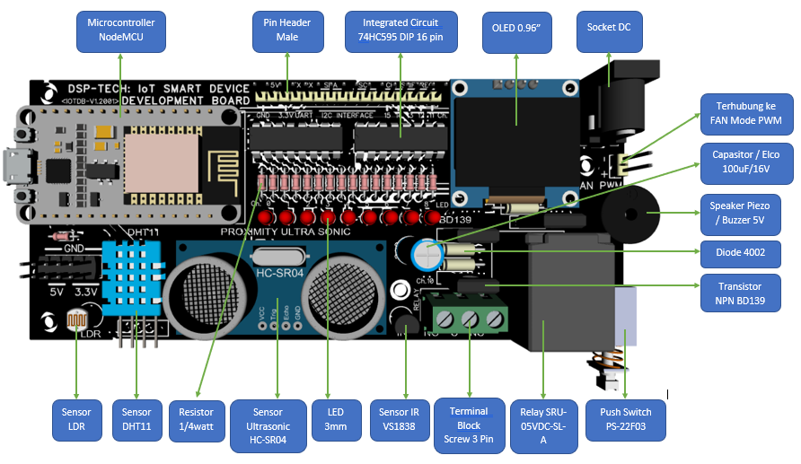

# IoT DEVELOPMENT BOARD DSP-TECH

**Perangkat Modul IoT Development Board terintegrasi, terdiri dari:**

* Microcontroller Unit + Komunikasi WiFi
* 4 Aktuator 
  * FAN \(atau diganti yang lain\) mode PWM 5V
  * 9x LED mode shift register 
  * 1x Relay 5V
  * Layar OLED 0.96"
* 4 Sensor
  * Sensor intensitas cahaya LDR
  * Sensor suhu dan kelembaban DHT11 
  * Sensor jarak Ultrasonic HC-SR04
  * Sensor kontrol jarak jauh Infra Red \(IR remote control\) VS1838

**Link Artikel & Source Code terupdate:**

* [https://doditsuprianto.gitbook.io/internet-of-things/](https://doditsuprianto.gitbook.io/internet-of-things/) 
* [https://github.com/doditsuprianto/IoT-Development-Board-DSP-TECH](https://github.com/doditsuprianto/IoT-Development-Board-DSP-TECH)

**Link untuk sitasi:**

* DOI: [10.13140/RG.2.2.21493.91368](https://www.researchgate.net/publication/351776333_Best_Practice_Pengembangan_Aplikasi_Internet_of_Things?channel=doi&linkId=60a9137092851ca9dcdabaf4&showFulltext=true)
* [Download Artikel PDF](https://www.researchgate.net/profile/Dodit-Suprianto-2/publication/351776333_Best_Practice_Pengembangan_Aplikasi_Internet_of_Things/links/60a9137092851ca9dcdabaf4/Best-Practice-Pengembangan-Aplikasi-Internet-of-Things.pdf?_sg%5B0%5D=WHG3g3MG9wFL7Q0QETTXw6gG5Yu1aX89d8rf6WNoDKqUBrYbbcyhvhi13THwbDCO6wreIv_rnlI7YAYz2H1T7A.tcqpuXudsg3fcYQGEdIRxX2S5mZeXH5hGl4q3gyxDv7JcoqeSVj36A6PLK4wvMfHwYxu6NK9QJnAcREm0ZDYHg&_sg%5B1%5D=s3iG-Ew5huX3fTdMMTyo17Mf_744wZPVlNmrsHUebcPcAPg9OedqrQzIe-AIu68pPH8gw68v5AuHgR4F1sSrvdloT_rIwSHegvpvc8Tb-Z9h.tcqpuXudsg3fcYQGEdIRxX2S5mZeXH5hGl4q3gyxDv7JcoqeSVj36A6PLK4wvMfHwYxu6NK9QJnAcREm0ZDYHg&_iepl=)

