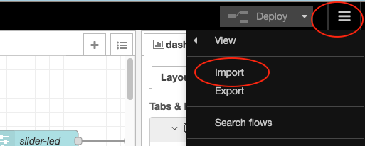
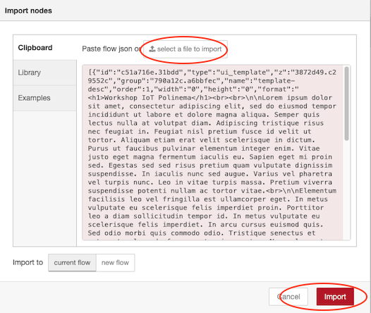

# Menghubungkan Smart Device dengan Node-RED

Setelah kode program berhasil dijalankan, yang selanjutnya buat flows dengan melakukan design pada Node-RED yang kurang
akan menghasilkan tampilan seperti pada gambar berikut

Sedangkan untuk desgin buatlah tampilan yang menyerupai tampilan di bawah ini

> Jika terjadi kesulitan untuk membuat tampilan, file flows.json dapat didapatkan di [sini](../images/flows.json).
> 
Setelah file *.json berhasil didownlad perlu dilakukan import ke dalam Node-RED, cara yang dapat dilakukan import yaitu
sebagai berikut
+ Klik menu di bagian pojok kanan atas, kemudian pilih `Import`. Dapat dilihat pada gambar di bawah ini

  

+ Akan muncul sebuah dialog import node, pilih `select a file to import` untuk mencari file *.json di komputer Anda. 
  Jika sudah menemukan file *.json bisa klik tombol `import`. Untuk lebih jelasnya bisa melihat tampilan berikut ini
  
  

+ Jika selesai dilakukan, seharusnya akan menapilkan node-node pada lembar kerja Node-RED. 
