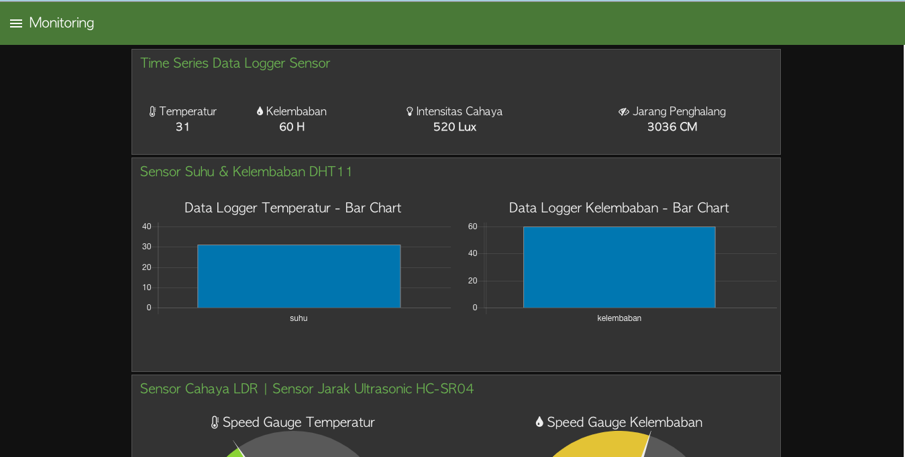
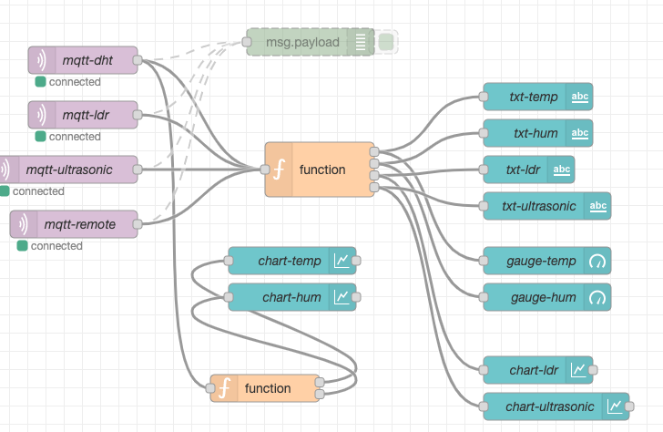

# Menghubungkan Smart Device dengan Node-RED

Setelah kode program berhasil dijalankan, yang selanjutnya buat flows dengan melakukan design pada Node-RED yang kurang
akan menghasilkan tampilan seperti pada gambar berikut

Sedangkan untuk desgin buatlah tampilan yang menyerupai tampilan di bawah ini

> Jika terjadi kesulitan untuk membuat tampilan, file flows.json dapat didapatkan di [sini](../images/flows.json) 
