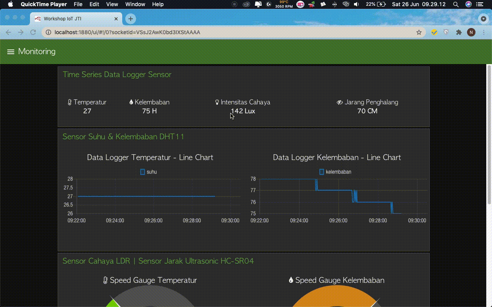
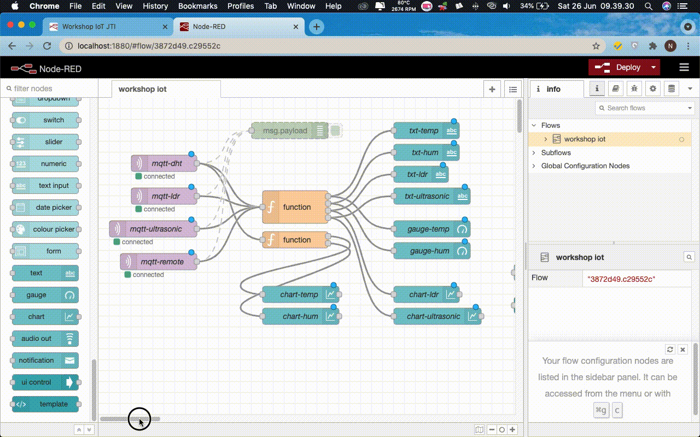

# Menghubungkan Smart Device dengan Node-RED

Setelah kode program berhasil dijalankan pada ujicoba [sebelumnya](pengembangan-aplikasi-publisher-subscriber-pada-smart-device-mcu.md), 
yang selanjutnya buat flows dengan melakukan design pada Node-RED yang kurang akan menghasilkan tampilan dashboard 
seperti pada gambar berikut

> Dashboard yang dihasilkan akan dijalankan pada EC2, sehingga untuk proses pembuatan flows juga menggunakan EC2 yang sebelumnya
> telah dikonfigurasi. Silakan masuk ke EC2 atau masuk halaman AWS management console jika belum dijalankan service untuk 
> Node-RED tersebut

Kemudian yang perlu dilakukan adalah membuat sebuah flow pada Node-RED editor seperti pada gambar berikut

Dari tampilan di atas layout pada dashboard terdapat spesifikasi sebagai berikut
+ Layout terdiri dari 3 tab yaitu `Monitoring, Controlling, dan Contact`.
+ `Monitoring` adalah sebuah menu untuk menampilkan data-data sensor seperti DHT11, LDR, dan Ultrasonic.
+ `Controlling` adalah sebuah untuk melakukan control aktuator seperti LED, Buzzer, dan Relay.
+ `Contact` adalah menu utnuk menampilkan teks biasa.

[comment]: <> (> Jika terjadi kesulitan untuk membuat tampilan, file `flows.json` dapat didapatkan di [sini]&#40;../images/flows.json&#41;.)

[comment]: <> (Setelah file *.json berhasil didownlad perlu dilakukan import ke dalam Node-RED, cara yang dapat dilakukan import yaitu)

[comment]: <> (sebagai berikut)

[comment]: <> (+ Klik menu di bagian pojok kanan atas, kemudian pilih `Import`. Dapat dilihat pada gambar di bawah ini)

[comment]: <> (  ![Proses import]&#40;../images/01.png&#41;)

[comment]: <> (+ Akan muncul sebuah dialog import node, pilih `select a file to import` untuk mencari file *.json di komputer Anda. )

[comment]: <> (  Jika sudah menemukan file *.json bisa klik tombol `import`. Untuk lebih jelasnya bisa melihat tampilan berikut ini)
  

[comment]: <> (  ![Browser file]&#40;../images/02.png&#41;)

[comment]: <> (+ Jika selesai dilakukan, seharusnya akan menapilkan node-node pada lembar kerja Node-RED. )

[comment]: <> (> Silakan cek hasil deploy Node-RED pada browser Anda, jika tidak terjadi error dan masalah seharusnya dapat menampilkan)

[comment]: <> (> tampilan dashbaord seperti pada panduan di atas.)
