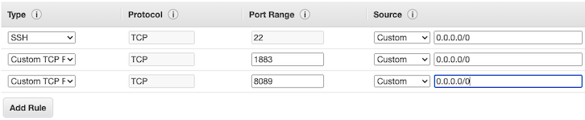

# Installasi dan Konfigurasi Message Broker MQTT

IoT Gateway dan message broker kaitannya sangat erat yang tidak dapat dipisahkan pada sebuah infrasturktur IoT, untuk lebih jelaskan dapat dilihat pada gambar di bawah ini


Dari gambar di atas terlihat bahwa IoT gateway menjembatani sensor dan controller untuk melakukan komunikasi dengan internet, sehingga sebuah IoT gateway penyedia layanan diantara lokal koneksi parangkat IoT dan cloud/internet, perangkat IoT mampu berkomuniasi dengan perangkat IoT yang lain, dan jaringan yang lebih luas.

Biasanya IoT gateway adalah sebuah perangkat hardware dengan kemampuan konektivitas dan komputasi yang tinggi untuk meneruskan data ke cloud untuk diolah menjadi informasi yang lebih bermanfaat. Beberapa perangkat yang bisa digunakan IoT gateway misalkan Raspberry atau model industrial komputer.

Sementara message broker sebuah penyedia pertukaran data antara iot device dengan cloud, message broker dipasang pada sebuah IoT gateway. Beberapa protokol yang digunakan oleh message broker ini misalkan AMQP, CoAP, dan MQTT. Konsep dari prokol AMQP dan MQTT adalah dengan menerapkan teknik publish dan subscribe dan CoAP mirip dengan REST API dengan design konsumsi low power, publish berarti mengirimkan data ke message broker dengan topik tertentu sedangkan subscribe sendiri berarti berlangganan ke message broker pada sebuah topik.

Pada kesempatan kali ini kita akan melakukan installasi message broker menggunakan mosquitto di instance EC2 yang kita miliki. Silakan mengikuti langkah-langkah di bawah ini 

* Buatlah sebuah instance baru, kemudian untuk langkah `3. Configure Instance` pada bagian `User Data` tambahkan baris perintah sebagai berikut

```text
   #!/bin/bash
   apt-add-repository ppa:mosquitto-dev/mosquitto-ppa -y
   apt-get update
   apt-get install mosquitto mosquitto-clients -y
```

Baris di atas digunakan untuk melakukan installasi mosquitto sebagai message broker sekaligus install mosquitto client untuk melaukan pengujian publish dan subscribe. Atau dapat melihat pada gambar berikut


* Tambahkan 2 port yang perlu dibuka selain port 22 untuk ssh, misalkan port 1883 dan 8089 pada langkah `6. Configure Security Group`. Perhatikan gambar di bawah ini



* Ketika instance sudah jalan, silakan remote menggunakan putty atau tool yang lain. Kemudian jalankan perintah di bawah ini untuk mengecek apakah installasi mosquitto sudah berhasil.

```text
ubuntu@ip-172-31-16-8:~$ telnet localhost 1883
Trying 127.0.0.1...
Connected to localhost.
Escape character is '^]'.
^]

telnet> Connection closed.
```

Perintah di atas menandakan bahwa proses installasi mosquitto telah berhasil, kemudian silakan dicoba untuk melakukan publish dan subscribe message. Buka windows baru lagi atau duplicate session, selanjutkan lakukan perintah seperti pada gambar berikut


Terlihat bahwa proses subscribe dan publish berhasil dilakukan pada localhost. Parameter `-t` menandakan nama topiknya, `-m` berarti messagenya yang akan dikirimkan. Kemudian misalkan untuk mencoba pada host atau server yang lain tambahkan parameter `-h` diikuti nama host atau ip. Misalkan `mosquitto_sub -h broker.sinaungoding.com -t test`, dan untuk melakukan subscribe `mosquitto_pub -h broker.sinaungoding.com -t test -m "mqtt test".`

