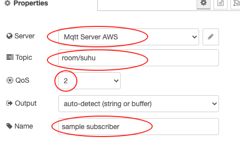

# Konfigurasi Message Broker MQTT pada Node-RED

Pada 2 pertemuan sebelumnya kita telah belajar cara menggunakan Node-RED dan membuat sebuah dashboard untuk memvisuaslisasikan sebuah data dari berbagai inputan atau dummy data, tentunya sama sekali kita belum menyentuh smart device atau perangkat IoT yang kita miliki.

Untuk menghubungkan Node-RED ke perangkat IoT, langkahnya pun sangat sederhana yaitu benar-benar kita tidak dipusingkan dengan konfigurasi di perangkat IoT. Yang perlu dilakukan adalah membuat sebuah node di dashboard Node-RED yang fungsinya untuk menangkap data dari perangkat IoT, protokol yang bisa digunakan juga lumayan banyak mulai dari MQTT ataupun http.

Walaupun beberapa protokol yang dapat disupport oleh Node-RED, akan tetapi pada kesempatan kali ini protokol yang digunakan MQTT. Untuk menggunakan protokol MQTT, pada Node-RED dashboard ketika melakukan installasi sudah termasuk di dalamnya. Ikut langkah-langkah di bawah ini untuk mulai praktikum 

* Silakan seret `node inject` ke worksheet, kemudian ubahlah nilai properties seperti pada gambar berikut

* Seret juga `node function` ke worksheet, sesuaikan propertiesnya seperti pada gambar berikut

* Jangan lupa seret juga `node mqtt out` pada kategori network, tambahkan server broker agar bisa publish data dengan cara klik `icon pensil`. Konfigurasinya adalah sebagai berikut adalah sebagai berikut

> Pada bagian `Name` isikan `Mqtt Server AWS`, `Server` diisikan `broker.sinaungoding.com` dan `port` isikan `1883`. Untuk `node mqtt out` kira-kira seperti berikut

Perhatian gambar berikut untuk flow lengkapnya, setelah semua node dihubungkan.

* Tambahkan `node mqtt in` ke worksheet, sesuaikan konfigurasi sebagai berikut

Pada bagian `Server, Topic dan Qos` disamakan dengan `node mqtt out` sedangkan `Name` silakan isikan dengan `sample subscriber`.

* Tambahkan node terakhir yaitu `node debug`, sementara untuk kongifigurasinya tidak perlu disesuaikan. Hubungkan kedua node tersebut sehingga menjadi sebagai berikut

Sehingga flow lengkap dari langkah awal sampai akhir adalah sebagai berikut

Setelah dilakukan deploy, kemudian klik `tab debug atau icon kutu` seharusnya adalah sebagai berikut. Adapun untuk nilainya pasti berbeda

