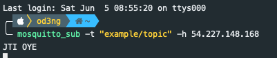

# Basis Console

Untuk menguji message broker salah satu tool console yang bisa digunakan adalah dengan menggunakan mosquitto yang support untuk beberapa sistem operasi baik Windows ataupun UNIX. silakan install terlebih dahulu mosquitto, untuk langkahnya bisa menggunakan dokumentasi resmi di [https://mosquitto.org/download/](https://mosquitto.org/download/). Ketika proses installasi selesai dilakukan, silakan menggunakan terminal atau command prompt dengan mengetik perintah seperti berikut

```text
mosquitto_pub -t "example/topic" -m "JTI OYE" -h 54.227.148.168
```

Perintah di atas digunakan untuk mengirimkan pesan "JTI OYE" pada topik "example/topic" di host 54.227.148.168. Kemudian untuk menerima atau consume data bisa menggunakan perintah berikut

```text
mosquitto_sub -t "example/topic" -h 54.227.148.168
```

Hasil dari perintah di atas bisa dilhat seperti pada gambar di bawah ini



