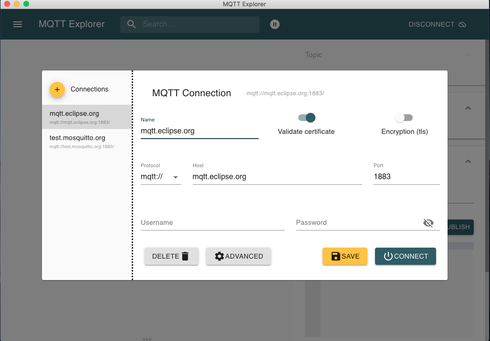
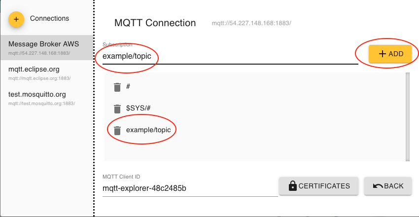
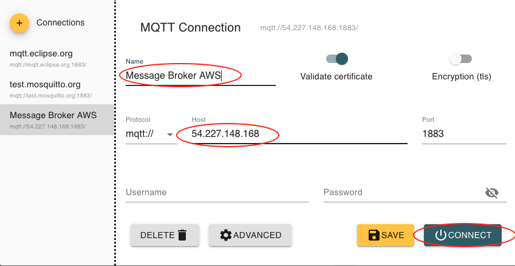
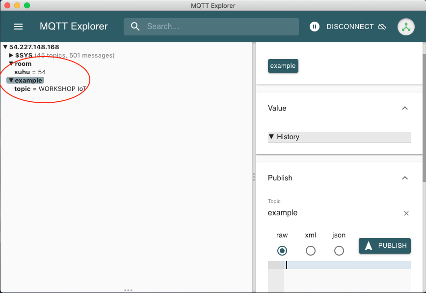
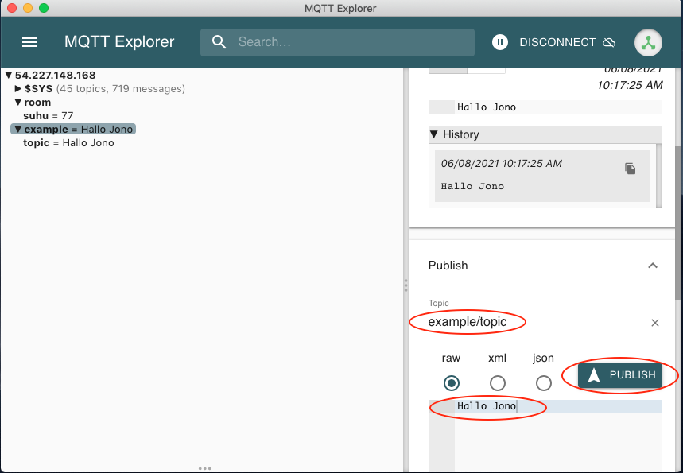

# Basis Windows, MQTTBOX / MQTT Explorer

Selain menggunakan tool basis console, ada alternative tool yang lain untuk menguji komunikasi message broker yang berbasis antarmuka. Salah satu tool yang bisa digunakan adalah MQTT Explorer, hampir semua platform bisa menggunakannya. Untuk download dan proses penggunaannya dapat didapatkan di [http://mqtt-explorer.com/](http://mqtt-explorer.com/)

Ketika pertama kali menjalankan antarmuka dari MQTT Explorer dapat dilihat seperti gambar berikut

Silakan tambahkan konfigurasi dengan memasukan host dengan ip ataupun DNS serta klik tombol **ADVANCED** untuk mengkonfigurasi topik yang akan dilakukan subscribe kemudikan klik tombol **CONNECT**. Hasilnya seperti berikut

Masukkan nama topik, jika sudah klik tombol **ADD** dan kembali ke halaman koneksi dengan klik tombol **BACK**.

Setelah melakukan konfigurasi untuk melakukan subscribe atau menerima data, pada panel sebelah kiri MQTT Explorer akan muncul topik yang di-subcribe dan nilai yang di-publish kelak. Dapat dilihat pada gambar berikut

Silakan mencoba melakukan publish atau mengirimkan pesan, bisa menggunakan console atau dengan MQTT Explorer itu sendiri. Untuk mengirimkan data atau publish, tentukan topik dan jenis data yang akan dikirimkan kemudian klik tombol PUBLISH. Jenis data bisa menggunakan raw, xml, dan json. Untuk lebih jelasnya bisa dilihat pada gambar di bawah ini

