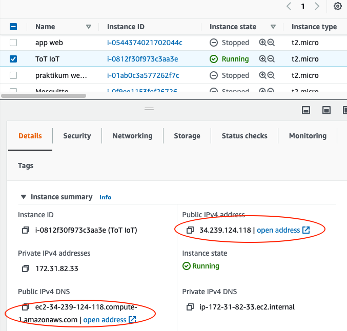
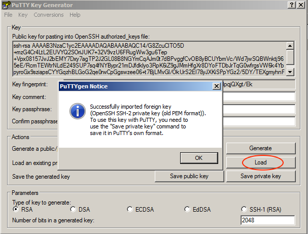
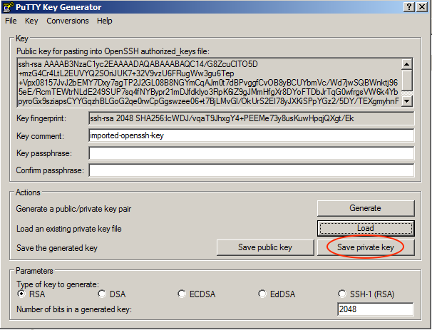
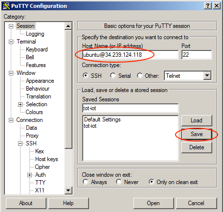
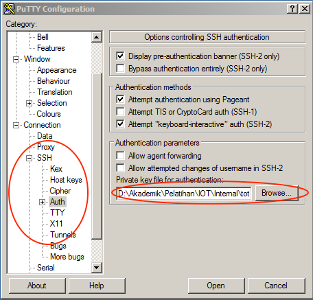
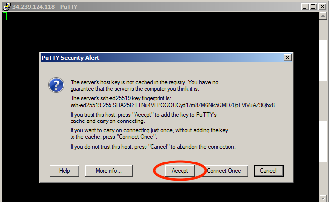
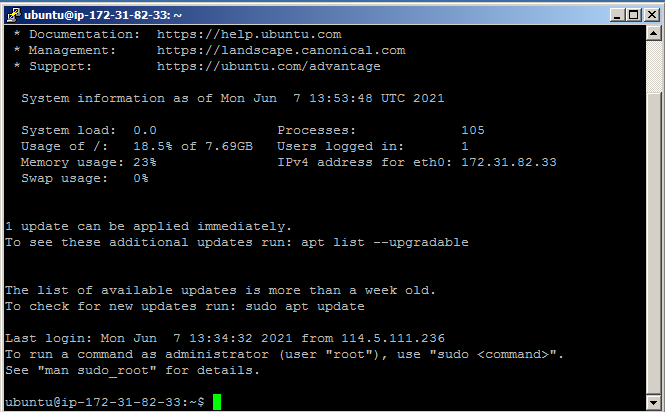
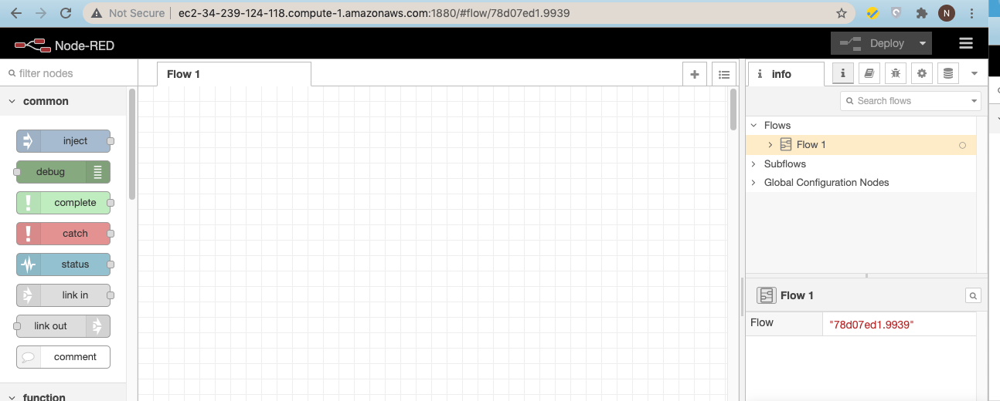

# Instalasi dan Konfigurasi Awal Node-Red

Node-red menyediakan sebuah editor berbasis browser sehingga mudah untuk dioperasikan pada waktu merangkai sebuah flow dari sebuah node pada pallete dan dapat di-deploy hanya dengan sekali klik. Node-red dibangun pada sebuah Node.js yang terkenal dengan ringan untuk dijalankan, konsep _event-driven_, dan menggunakan model non-blocking. Node-red dapat diinstall dalam sebuah jaringan dengan spesifikasi hardware yang murah seperti raspberry maupun di cloud. Pada kesempatan kali ini akan diinstall pada sebuah layanan cloud yaitu AWS.

> Misalnya belum mendaftar sebagai AWS Educate bisa diganti dengan install di Raspberry Pi atau di komputer local. Tentunya ketika install di local dengan sistem operasi windows sangat berbeda dengan langkah yang disajikan pada workshop ini, Untuk lebih jelasnya bisa melihat dokumentasinya di [https://nodered.org/docs/getting-started/](https://nodered.org/docs/getting-started/)

Berikut ini adalah langkah-langkahnya yang dapat digunakan untuk proses installasi node

* Silakan login ke akun aws educate, [https://www.awseducate.com/educator/s/](https://www.awseducate.com/educator/s/). Jika berhasil akan diarahkan ke halaman AWS educate seperti pada gambar di bawah ini 


* Pilih menu `AWS Account - AWS Educate Started Account`, selanjutnya muncul halaman seperti ditunjukkan pada gambar berikut


* Pilih `AWS Console` dan muncul halaman `AWS Management Console` seperti berikut ini


* Selanjutkan akan diarahkan pada halaman EC2 Dashboard seperti pada tampilan di bawah ini, pilih `Launch Instance - Launch instance.`


* Langkah yang selanjutnya dengan melakukan konfigurasi instance yang akan dibuat, ada 7 langkah yang perlu dilewati untuk membuat sebuah instance tetapi karena beberapa batasan dari akun educate. Kita fokuskan langkah 1 dan langkah 6, untuk langkah yang lain dibuat default saja. Untuk langkah yang pertama yaitu memilih sistem operasi yang akan kita gunakan, silakan ketik `"ubuntu"` pada text search kemudian pilih **Ubuntu Server 20.04 LTS\(HVM\), SSD Volume Type** dengan klik tombol **Select**. Untuk lebih jelasnya silakan perhatikan gambar di bawah ini


* Setelah selesai pada langkah 1, silakan loncat atau beralih ke langkah 6 yaitu `Configure Security Group`. Tambahkan port 1880, port tersebut digunakan untuk kebutuhan komunikasi Node-RED dengan cara klik tombol **Add Rule**. Isikan `Port Rage` _**1880**_ dan `Source` _**0.0.0.0/0**_, jika klik tombol **Review and Launch** seperti pada gambar di bawah ini ``


* Langkah yang terakhir silakan klik tombol **Launch**, pada halaman ini adalah summary dari konfigurasi langkah-langkah sebelumnya. Antarmuka pada langkah 7 kurang lebih seperti gambar di bawah ini


Setelah tombol **Launch** diklik, akan muncul dialog untuk membuat sebuah Key Pair. Key Pair digunakan untuk memudahkan akses atau berkomunikasi dengan instance yang kita buat tanpa melakukan memasukkan user password setiap kali akan mengakses instance. Pilih `Create a new key pair` dan berikan nama key pair tersebut dan selanjutnya download key pair tersebut dengan klik tombol **Download Key Pair** dan klik **Launch Instance**. Untuk lebih jelaskan dapat dilihat pada gambar di bawah ini


Untuk melihat instance yang telah kita buat, klik tombol **View Instance** dan tunggu statusnya pada kolom `Instance state` menjadi **Running** seperti pada gambar berikut


Untuk menghubungkan ke instance yang telah kita buat, ada beberapa langkah yang dapat kita lakukan tergantung dengan sistem operasi yang digunakan. Misalkan menggunakan sistem operasi windows biasanya menggunakan tool putty, sedangkan jika menggunakan sistem operasi UNIX cukup mengetika perintah ssh pada terminal. Terlebih dahulu klik atau checklist instance yang telah kita buat, kemudian scrooll ke bawah atau ke kanan untuk mengetahui ip public atau domain agar kita bisa mengaksesnya. Perhatikan gambar di bawah ini



Untuk menghubungkan menggunakan sistem operasi UNIX bisa mengikuti langkah di bawah ini

```text
chmod 400 tot-iot-keypair.pem
ssh -i "tot-iot-keypair.pem" ubuntu@34.239.124.118
```

Pada baris pertama digunakan untuk mengubah permisi dari file pem yang sebelumnya kita download, lokasi dan nama file key pair silakan disesuaikan dengan yang Anda miliki. Sedangkan langkah kedua perintah untuk remote atau menghubungkan ke EC2, **34.239.124.118** adalah ip public EC2 kita atau bisa diganti dengan DNS. Ip atau DNS silakan disesuaikan dengan EC2 Anda. Jika berhasil akan menampilkan keluaran seperti di bawah ini

```text
The authenticity of host '34.239.124.118 (34.239.124.118)' can't be established.
ECDSA key fingerprint is SHA256:1ExscKho0XX9/pBCW2USR5xjnE4+02gN/DUKZEhWn+Q.
Are you sure you want to continue connecting (yes/no)? yes
Warning: Permanently added '34.239.124.118' (ECDSA) to the list of known hosts.
Welcome to Ubuntu 20.04.2 LTS (GNU/Linux 5.4.0-1045-aws x86_64)
...
ubuntu@ip-172-31-82-33:~$
```

Kemudian ketika kita ingin remote atau mengakses menggunakan tool putty, langkahnya adalah sebagai berikut

* Silakan download putty di [https://www.putty.org/](https://www.putty.org/) dan lakukan installasi
* Setelah proses installasi selesai, cari **PuTTYgen** pada sistem menu dan klik tombol **Load** untuk mencari fille \*.pem yang sebelumnya kita download ketika membuat instance EC2. Tampilan lengkapnya seperti gambar berikut



* Setelah file \*.pem berhasil diload, kita perlu menyimpan file tersebut dengan klik tombol **Save private key**. Pada bagian Key passphrase dan Confirm passphrase dikosongkan saja sehingga ketika login ke instance EC2 kelak tidak meminta password. Gambar yang lebih jelas bisa dilihat seperti di bawah ini



* Selanjutnya buka aplikasi **PuTTY** pada sistem menu, isikan host sesuai dengan ip atau dns instance EC2 Anda. Bisa dilihat pada gambar di bawah ini



* Kemudian kita perlu menambakan file \*.ppk yang sebelumnya telah dibuat, caranya adalah pada bagian **PuTTY Configuration** pilih **SSH** dan **Auth** kemudian masukkan file \*.ppk dengan cara klik tombol **Browse** seperti pada gambar di bawah ini



* Jika sudah selesai konfigurasi, silakan klik tombol Open seharusnya akan muncul Dialog seperti berikut.



Ketika berhasil, seharusnya akan muncul tampilan seperti berikut ini



Node-RED basisnya adalah nodejs sehingga perlu diinstall terlebih dahulu paket-paket untuk kebutuhan nodejs. Jalan perintah di bawah ini untuk memasang paket yang dibutuhkan

```text
sudo apt-get update
sudo apt-get install -y nodejs build-essential npm
sudo npm install -g --unsafe-perm node-red
```

Jika 3 baris perintah di atas selesai dijalankan, terakhir jalankan perintah di bawah ini untuk menjalankan Node-RED.

```text
ubuntu@ip-172-31-82-33:~$ node-red
7 Jun 14:27:25 - [info]

Welcome to Node-RED
===================

7 Jun 14:27:25 - [info] Node-RED version: v1.3.5
7 Jun 14:27:25 - [info] Node.js  version: v10.19.0
....
7 Jun 14:27:27 - [info] Server now running at http://127.0.0.1:1880/
7 Jun 14:27:27 - [info] Starting flows
7 Jun 14:27:27 - [info] Started flows
```

Terakhir, silakan buka browser Anda dan ketika alamat ip atau DNS diikuti dengan port 1880, sebagai contoh adalah [http://ec2-34-239-124-118.compute-1.amazonaws.com:1880/](http://ec2-34-239-124-118.compute-1.amazonaws.com:1880/). Seharusnya akan menampilkan halaman Node-RED seperti berikut ini



