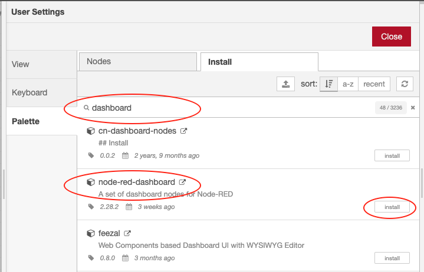

# Instalasi dan Konfigurasi Awal Node-Red

Node-red menyediakan sebuah editor berbasis browser sehingga mudah untuk dioperasikan pada waktu merangkai sebuah flow dari sebuah node pada pallete dan dapat di-deploy hanya dengan sekali klik. Node-red dibangun pada sebuah Node.js yang terkenal dengan ringan untuk dijalankan, konsep _event-driven_, dan menggunakan model non-blocking. Node-red dapat diinstall dalam sebuah jaringan dengan spesifikasi hardware yang murah seperti raspberry maupun di cloud. Pada kesempatan kali ini akan diinstall pada sebuah layanan cloud yaitu AWS.

> Misalnya belum mendaftar sebagai AWS Educate bisa diganti dengan install di Raspberry Pi atau di komputer local. Tentunya ketika install di local dengan sistem operasi windows sangat berbeda dengan langkah yang disajikan pada workshop ini, Untuk lebih jelasnya bisa melihat dokumentasinya di [https://nodered.org/docs/getting-started/](https://nodered.org/docs/getting-started/)

Berikut ini adalah langkah-langkahnya yang dapat digunakan untuk proses installasi node

* Silakan login ke akun aws educate, [https://www.awseducate.com/educator/s/](https://www.awseducate.com/educator/s/). Jika berhasil akan diarahkan ke halaman AWS educate seperti pada gambar di bawah ini 

* Pilih menu `AWS Account - AWS Educate Started Account`, selanjutnya muncul halaman seperti ditunjukkan pada gambar berikut

* Pilih `AWS Console` dan muncul halaman `AWS Management Console` seperti berikut ini

* Selanjutkan akan diarahkan pada halaman EC2 Dashboard seperti pada tampilan di bawah ini, pilih `Launch Instance - Launch instance.`

* Langkah yang selanjutnya dengan melakukan konfigurasi instance yang akan dibuat, ada 7 langkah yang perlu dilewati untuk membuat sebuah instance tetapi karena beberapa batasan dari akun educate. Kita fokuskan langkah 1 dan langkah 6, untuk langkah yang lain dibuat default saja. Untuk langkah yang pertama yaitu memilih sistem operasi yang akan kita gunakan, silakan ketik `"ubuntu"` pada text search kemudian pilih **Ubuntu Server 20.04 LTS\(HVM\), SSD Volume Type** dengan klik tombol **Select**. Untuk lebih jelasnya silakan perhatikan gambar di bawah ini

* Setelah selesai pada langkah 1, silakan loncat atau beralih ke langkah 6 yaitu `Configure Security Group`. Tambahkan port 1880, port tersebut digunakan untuk kebutuhan komunikasi Node-RED dengan cara klik tombol **Add Rule**. Isikan `Port Rage` _**1880**_ dan `Source` _**0.0.0.0/0**_, jika klik tombol **Review and Launch** seperti pada gambar di bawah ini ``

* Langkah yang terakhir silakan klik tombol **Launch**, pada halaman ini adalah summary dari konfigurasi langkah-langkah sebelumnya. Antarmuka pada langkah 7 kurang lebih seperti gambar di bawah ini

Setelah tombol **Launch** diklik, akan muncul dialog untuk membuat sebuah Key Pair. Key Pair digunakan untuk memudahkan akses atau berkomunikasi dengan instance yang kita buat tanpa melakukan memasukkan user password setiap kali akan mengakses instance. Pilih `Create a new key pair` dan berikan nama key pair tersebut dan selanjutnya download key pair tersebut dengan klik tombol **Download Key Pair** dan klik **Launch Instance**. Untuk lebih jelaskan dapat dilihat pada gambar di bawah ini

Untuk melihat instance yang telah kita buat, klik tombol **View Instance** dan tunggu statusnya pada kolom `Instance state` menjadi **Running** seperti pada gambar berikut

