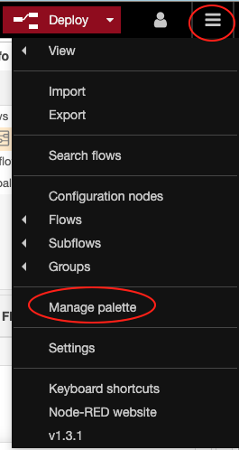
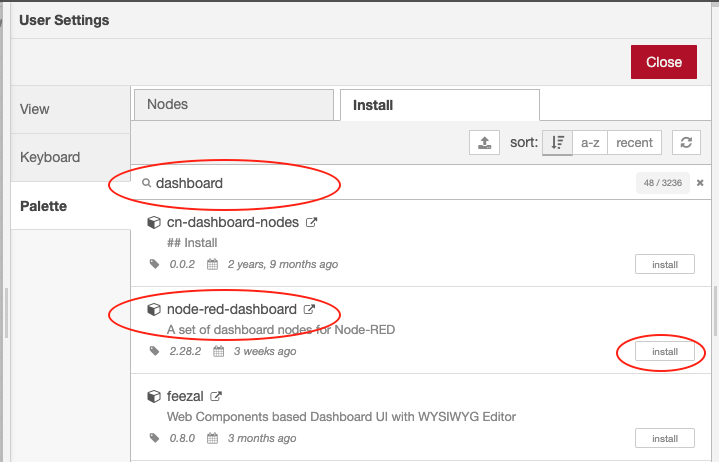
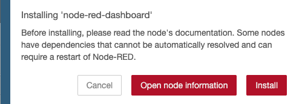
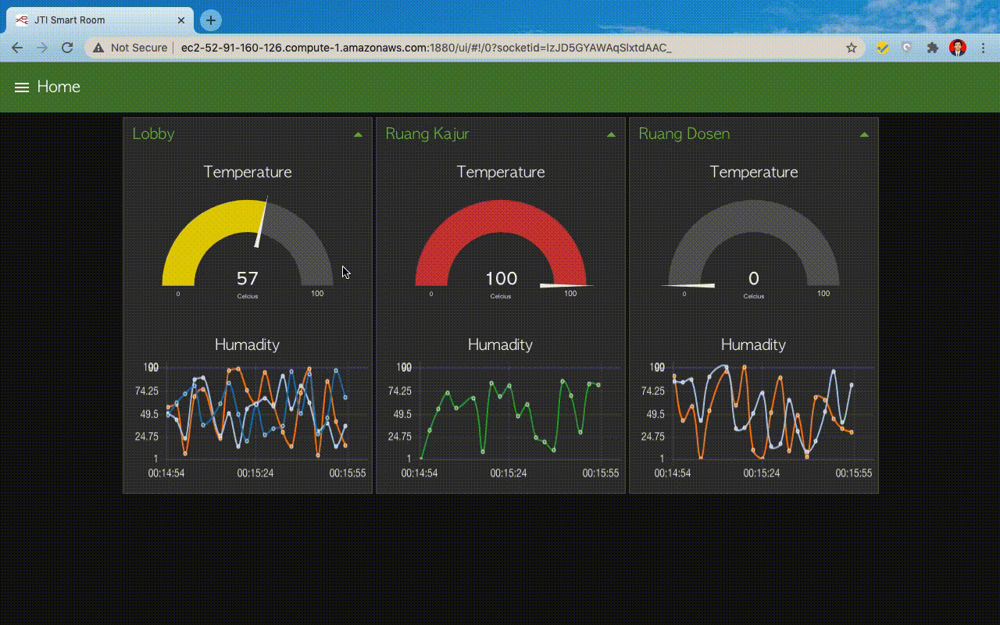
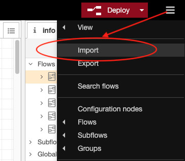

# Memanfaatkan widget interface Node-Red

Layaknya sebuah IoT platform yang mempermudah pengguna dalam memvisualisaikan atau menyajikan data kepada pengguna, Node-RED juga menyediakan sebuah dashboard agar kita dapat dengan mudah untuk menyajikan data secara live atau real time.

Untuk menggunakan atau membuat tampilan dashhboard menggunakan Node-RED juga sangat mudah, yaitu tinggal melakukan drag and drop pada worksheet untuk setiap komponen.

### Install Dashboard Node-RED

Untuk menggunakan dashboard Node-RED, kita harus install terlebih dahulu modulnya terlebih dahulu. Dapat dilakukan menggunakan 2 cara untuk installasinya, sebagai berikut

#### Menggunakan perintah `npm`.

Langkah-langkah yang dapat dilakukan adalah sebagai berikut

1. Masuk ke direktori installasi Node-RED, ketika menggunakan EC2 terdapat di `/home/ubuntu/.node-red`. Jalankan perintah

   `cd /home/ubuntu/.node-red` di EC2 Anda.

2. Selanjutnya jalankan perintah `npm i node-red-dashboard`.

#### Menggunakan menu Manage pallete pada Node-RED

Langkah yang dapat dilakukan adalah sebagai berikut

* Silakan akses Node-RED via browser, misalkan [`http://ec2-52-91-160-126.compute-1.amazonaws.com:1880/`](http://ec2-34-239-124-118.compute-1.amazonaws.com:1880/).
* Klik button yang terdapat di pojok kanan atas dan cari menu `Manage pallete`. Perhatikan gambar di bawah ini

* Sehingga akan muncul jendela `User Settings`, pilih tab `install` dan ketik `dashboard` sehingga akan muncul modul-modul yang bisa kita install dan klik `tombol install`. Untuk lebih jelasnya perhatikan gambar di bawah ini

* Akan muncul pop notifikasi proses install seperti gambar di bawah ini, silakan pilih atau klik `tombol install`.

* Silakan cek dengan melihat pada Node-RED via browser, seharusnya sudah bertambah komponen-komponen dashboard pada pallete yang terdapat di sebelah kanan. 

### Membuat Dashboard Node-RED

Pada praktikum yang kedua akan dibuat sebuah tampilan seolah-olah menyalakan lampu dari internet, ikutilah langkah-langkah sebagai berikut

* Terlebih dahulu pilih menu `dashboard`, yang terdapat di pojok kanan bawah. dashbaord ini adalah untuk mengkonfigurasi website yang akan kita buat misalkan dari sistem menu/hirarki menu ataupun title website. Perhatikan gambar di bawah ini dan setelah ditambahkan

Setelah ditambahkan

> Terdapat 3 buah tab yaitu `Layout, Site, dan Theme`.
> + `Layout` digunakan untuk melakukan konfigurasi sistem menu pada dashboard yang akan kita buat.
> + `Site` digunakan untuk mengkonfigurasi atau membuat deskripsi pada tampilan dashboard, misalkan judul dashboard.
> + `Theme` digunakan untuk mengatur warna atau tema tampilan dashboard.

* Pada bagian `Tabs & Links` klik tombol `tab` sehingga akan ditambahkan tab baru di bawahnya, pada tab baru yang terbentuk yaitu `Tab 1` klik tombol `edit` sehingga akan muncul jendela `Edit dashboard tab node` seperti berikut

Pada bagian `Name` isikan `Home` dan `Icon` diganti dengan `fa-home` dan klik tombol `Update` untuk mengakhiri.

> Untuk mengganti icon dengan yang lain bisa menggunakan `Material Design Icon, Font Awesome Icon, atau Weather Icon.`Contoh di atas menggunakan style dari icon `Font Awesome Icon.`

* Selanjutnya tambahkan `Group` pada `Tab Home` tersebut dengan klik tombol `group`. Selanjutnya klik `edit` pada group yang baru ditambahkan sehingga akan muncul jendela `Edit dashboard tab node` kembali. Sesuaikan nilai-nilai seperti pada gambar berikut

* Ulangi langkah sebelumnya sehingga tampilannya menjadi seperti berikut

* Drag ke worksheet/flow node `switch` kemudian double klik sehingga akan menampilkan jendela seperti di bawah, sesuaikan bagian seperti `Group, Label, dan Name` seperti pada gambar di bawah ini.

* Ulangi langkah sebelumnya, tetapi yang ditambahkan adalah node `text`, sesuaikan property seperti pada gambar berikut

* Hubungkan `node switch` dan `node text`, hasil akhirnya adalah sebagai berikut. Kemudian silakan lakukan deploy dengan klik tombol `Deploy`. Untuk melihat tampilannya silakan akses Node-RED, misalnya [http://ec2-100-24-24-217.compute-1.amazonaws.com:1880/ui](http://ec2-100-24-24-217.compute-1.amazonaws.com:1880/ui)

Hasil akhirnya adalah sebagai berikut

### Tugas

Buatlah sebuah dashboard website untuk memonitoring dan control pada sebuah ruang lobby, ruang kajur, dan ruang dosen. Masing-masing ruang dengan detail node yang dibutuhkan pada node dashboard sebagai berikut;

1. Tab Home memiliki group Lobby, Ruang Kajur, dan Ruang Dosen.
   * Group Lobby terdapat 2 node inject, 2 function, gauge, dan chart.
   * Group Ruang Kajur terdapat 2 node inject, 2 function, gauge, dan chart.
   * Group Ruang Dosen terdapat 2 node inject, 2 function, gauge, dan chart.

     > Jika diperhatikan node gauge dan chart bisa otomatis berjalan, hal tersebut diaktifkan saja pada bagian otomatis pada node inject.
     >
     > Sedangkan nilai yang selalu muncul acak itu menggunakan node funcion, `Math.floor(Math.random()*101)`
     >
     > Jumlah line antara node chart pada Lobby, Ruang Kajur, dan Ruang Dosen berbeda bisa dilakukan dengan cara mengubah `Setup Outputs` pada function.
2. Tab Room Control terdiri dari group Lampu dan AC.
   * Group Lampu memiliki 3 switch, 3 function, dan 3 text.
   * Group AC memiliki 3 slider dan 3 text.

     > function digunakan untuk parsing boolean ke string, "nyala atau mati".
3. Tab About hanya terdiri dari text biasa.

Hasil akhirnya adalah sebagai berikut

> Dicoba terlebih dahulu untuk menyelesaikan pertanyaan di atas, tetapi jika memang sudah tidak punya banyak waktu silakan
> menggunakan file flows-smart-room.json yang terlampir.
>
> Import file flow tersebut dengan cara klik icon pojok kanan atas sebelah deploy, kemudian lakukan import dengan cara
> klik tombol `select a file to import`. Proses ini nanti akan dijelaskan secara detail pada bab selanjutnya.

