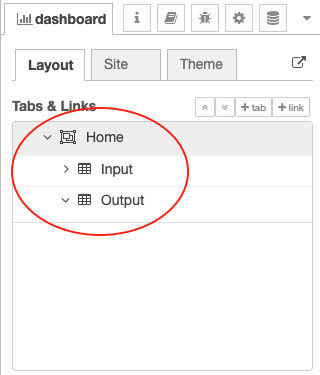

# Mengenal Interface pada Node-Red

Setelah proses installasi selesai dilakukan, kemudian kita akan melihat bagaimana cara untuk menggunakan Node-RED itu sendiri. Dan memahami mengenali bagian-bagian Node-RED agar ke depan lebih familiar. Secara umum antarmuka dari Node-RED ditunjukkan seperti pada gambar berikut

Secara umum Node-RED dibagi ke dalam 3 jendela yaitu

1. Node, terletak disebelah paling kiri berisi kumpulan node-node yang memiliki fungsi-fungsi tertentu. Node-node ini nantinya akan didrag atau diletakkan pada sebuah Flow\(jendela di tengah\). Selanjutnya pada node ini dibagi menjadi beberapa kategori seperti common, function, network, sequence, parser, dan storage.
2. Flow, berfungsi untuk meletakkan node atau sebuah lembar kerja yang berisi node-node yang saling terhubung, terletak di bagian tengah berdasarkan gambar di atas.
3. Bisa disebut sebagai Properties, karena fungsi untuk mengkonfigurasi sebuah flow yang akan kita buat. Pada bagian ini juga dapat digunakan untuk debugging atau mengeluarkan pesan console seperti pada bahasa pemrograman yang lain.

Kita akan mencoba memanfaatkan Node-RED untuk request ke url tertentu dan menampilkan response dalam sebuah mode debug. Silakan mengikuti langkah-langkah di bawah ini 

* Drag sebuah pallete node `inject` pada kategori `network` ke worksheet, perhatikan gambar berikut ini

* Selanjutnya double klik node `inject` yang terdapat pada worksheet sehingga menampilkan jendela properties seperti berikut

Ubah name menjadi `make request` dan hapus properti `msg.payload` serta `msg.topic` menggunakan icon `cross`, jika sudah jangan lupa klik tombol `Done`.

* Tambahkan juga node `http request` pada worksheet, sesuaikan properties pada nilai `URL dan name`. Isikan `URL` dengan `https://raw.githubusercontent.com/prust/wikipedia-movie-data/master/movies.json` dan sedangkan `name` diisi dengan `movie request`. Untuk lebih jelasnya dapat dilihat pada gambar berikut ini

* Hubungkan node `make reqeust (inject)` dan `movie request (http request)` dengan cara klik dan drag antar ujung node, hasilnya dapat dilihat pada gambar berikut ini

* Tambahkan node `debug` yang terdapat pada kategori `common`, jangan lupa diubah name dengan nama msg. Terakhir hubungkan node tersebut dengan node `movie request`. Hasil akhirnya adalah sebagai berikut

* Langkah terakhir, silakan klik tombol `Deploy` yang terletak di pojok kanan atas sampai muncul popup `successfully deployed`. Jika sudah, klik `make request` dan amati hasilnya pada bagian `debug` \(klik icon kutu\) di jendela sebelah kanan. Untuk lebih jelasnya dapat dilihat pada gambar di bawah ini

#### Pertanyaan

1. Tambahkan kembali `node function` dan `node debug`, yang masing-masing fungsinya adalah untuk memfilter dimana movie yang akan tampil hanya movie dengan tahun &gt; 2000 dan untuk menampilkan data filter tersebut.
2. Flow dan output pada debug dapat dilihat seperti berikut ini

