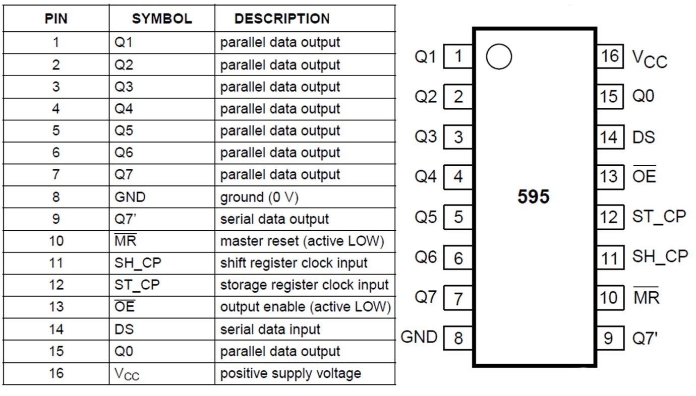

# IoT Development Board \[DSP-TECH\]

### **Rancangan Jalur Pengkabelan**

Berikut ini adalah rancangan pengkabelan IoT Development Board. Dimana pengkabelan hubungan antara 2x IC register 74HC595 dan 9x LED tidak tergambar semua, bertujuan untuk penyerdahanaan saja.

### **Pemetaan Alamat Pin IoT Development Board**

Berikut pendefinisian alamat pin pada IoT Development Board:

| Penamaan pada kode program | Alamat pin pada NodeMCU | Alamat pin pada NodeMCU \(mode label\) | Penggunaan pada komponen |
| :--- | :--- | :--- | :--- |
| \#define pinDHT | 10 | SDD3 | Sensor DHT \(Suhu & Kelembaban\) |
| \#define pinEcho | 12 | D6 | Sensor HC-SR04 Ultrasonic, pin echo |
| \#define pinTrigger | 14 | D5 | Sensor HC-SR04 Ultrasonic, pin trigger |
| \#define pinLDR | A0 |  | Sensor cahaya LDR |
| \#define pinFan | 15 | D8 | Actuator kipas dengan mode PWM |
| \#define pinIR | 13 | D7 | Sensor remote infrared |
| \#define pinData | 16 | D0 | Kebutuhan IC 74HC595, pin clock |
| \#define pinClock | 2 | D4 | Kebutuhan IC 74HC595, pin data |
| \#define pinLatch | 0 | D3 | Kebutuhan IC 74HC595, pin latch |

### **Alamat Shift Registry IC 74HC595**

Rancangan IoT Board Development menggunakan 2 IC shift registry 74HC595 yang bertindak sebagai perluasan kanal output. Hal ini bermanfaat untuk menghemat jumlah penggunaan pin pada Microcontroller NodeMCU. Setiap IC shift registry 74HC595 menghasilkan 8 kanal output tambahan yang dapat dirangkai secara berantai/cascading menjadi 2x8 kanal, atau total sebanyak 16 kanal output \(bisa dirangkai lebih panjang lagi\).

#### Konsep dasar rantai rangkaian IC shift registry 74HC595 adalah sebagai berikut:

#### Penjelasan dari setiap pin IC 74HC595:

Contoh rangkain dasar IC Shift Register yang disusun berantai:

#### Berikut alamat kanal yang digunakan pada shift registry:

| Alamat Channel | Penggunaan |
| :--- | :--- |
| Channel 0 | LED 1 |
| Channel 1 | LED 2 |
| Channel 2 | LED 3 |
| Channel 3 | LED 4 |
| Channel 4 | LED 5 |
| Channel 5 | LED 6 |
| Channel 6 | LED 7 |
| Channel 7 | LED 8 |
| Channel 8 | LED 9 |
| Channel 9 | Buzz/Piezo Speaker |
| Channel 10 | Relay |
| Channel 11 – 15 | Kanal perluasan |

### **Bagian-bagian Dari IoT Development Board**

IoT Development Board menyediakan perluasan pin antarmuka, antara lain UART \(TX, RX\), I2C \(SDA, SCL\) dan kanal shift register dengan alamat mulai chanel 11 sampai channel 15. Disamping itu pada sisi kirim juga disediakan pin tegangan 5V, 3.3V dan ground.

Gambar di atas menunjukkan 9 LED yang dikendalikan melalui IC Shift register dengan alamat mulai channel 0 sampai channel 8.

Gambar di atas menunjukkan komponen speaker buzz/piezo yang dikendalikan melalui IC shift register dengan alamat channel 9. Sedangkan komponen FAN PWM dikendalikan melalui pin 15/D8 dari NodeMCU. \(silahkan cek pada tabel sebelumnya\).

