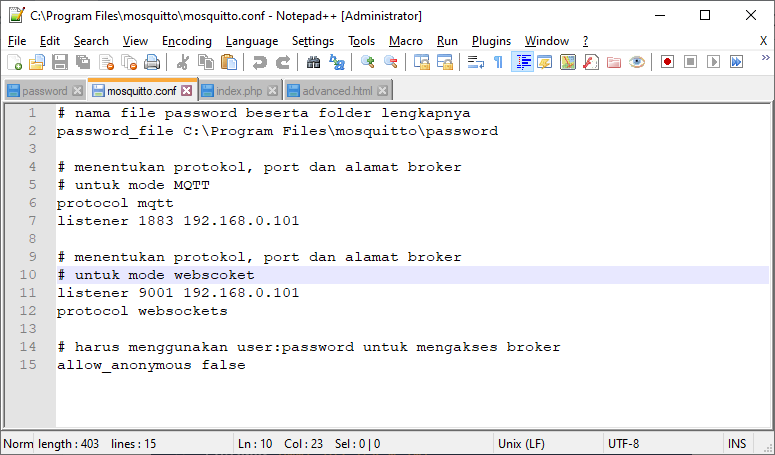
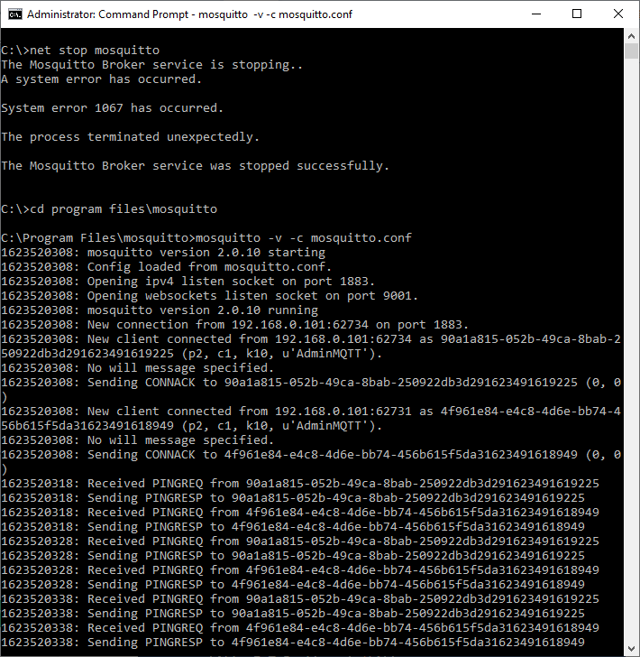

# Aplikasi Web IoT Dashboard

### Pengantar

Pada bagian ini kita akan mengembangkan aplikasi web. Aplikasi web bertindak sebagai IoT Dahsboard untuk memonitor data logger beberapa sensor dari IoT Development Board, antara lain:

* Sensor suhu & kelembaban DHT11
* Sensor intensitas cahaya LDR
* Sensor jarak penghalang Ultrasonic

Aplikasi web IoT Dashboard juga berisi beberapa widget untuk mengendalikan beberapa aktuator yang berada di IoT Development Board, antara lain:

* Widget kontrol slider untuk mengaktifkan dan menonaktifkan 9x LED .
* Widget kontrol chcekbox untuk mengaktifkan dan menonaktifkan Relay.
* Widget kontrol checkbox untuk mengaktifkan dan menonaktifkan speaker piezo.
* Widget kontrol slider untuk mengatur kecepatan putar FAN dengan mode PWM.

Jika ditinjau dari konsep client-server message broker maka aplikasi web IoT Dashboard bisa bertidak sebagai subscriber maupun publisher. 

* Ia akan menjadi subscriber apabila aplikasi web IoT Dashboard menampilkan data logger sensor-sensor yang berada di IoT Development board.
* Ia akan menjadi publisher apabila aplikasi web IoT Dashoard memerintahkan aktuator-aktuator yang berada di IoT Development Board.


Konsep subscriber dan publisher di atas juga berlaku sama pada aplikasi yang di embed-kan ke IoT Dashboard. Dimana dalam [kode program tersebut](https://dsp-tech.gitbook.io/internet-of-things/membangun-aplikasi-iot-create-from-scratch/mengkomunikasikan-antara-iot-development-board-dengan-message-broker-mosquitto#kode-program) juga disertai publisher dan subscriber sekaligus.


### Mockup Web IoT Dashboard

Sebagai gambaran target pengembangan aplikasi web IoT Dashboard yang akan dicapai adalah sebagai berikut:


Serupa dengan IoT Dashboard, IoT Development Board juga bisa bertindak sebagai publisher dan subscriber. 

* Aktuator-aktuator pada IoT Development Board diasumsikan bertindak sebagai subscriber yang menunggu publisher mengirim data sebagai fungsi triger \(callback function\). Dalam hal ini adalah widget event dari aplikasi web IoT Dashboard.
* Sensor-sensor pada IoT Development Board diasumsikan bertindak sebagai publisher yang secara periodik interval tertentu mengirim data ke message broker untuk dikonsumsi oleh aplikasi web IoT Dashboard.

### Konfigurasi Mosquitto Yang Mendukung Web Socket

Pada bagian ini ada sedikit perubahan konfigurasi **mosquitto.conf** dari sebelumnya. Perubahan ini berkaitan dengan difungsikannya komunikasi antara aplikasi web IoT Dashboard dan message broker MQTT Mosquitto melalui protokol web socket yang bekerja secara asynchrounus. 

Adapun library MQTT client yang akan digunakan pada aplikas web IoT Dashboard berbasis java script, yaitu Paho MQTT Client \(**mqttws31.min.js**\). 

```javascript
<script src="https://cdnjs.cloudflare.com/ajax/libs/paho-mqtt/1.0.1/mqttws31.min.js" type="text/javascript"></script>
```

Lakukan backup terlebih dahulu file **mosquitto.conf** yang terdapat di dalam folder **C:\Program Files\mosquitto**. Buka file mosquitto.conf dengan editor Notepad++ mode Administrator, kemudian timpa isi file  tersebut dengan konfigurasi berikut:

```javascript
# nama file password beserta folder lengkapnya
password_file C:\Program Files\mosquitto\password

# menentukan protokol, port dan alamat broker
# untuk mode MQTT
protocol mqtt
listener 1883 192.168.0.101 

# menentukan protokol, port dan alamat broker
# untuk mode webscoket
listener 9001 192.168.0.101 
protocol websockets

# harus menggunakan user:password untuk mengakses broker
allow_anonymous false
```

hasilnya kurang lebih tampak seperti berikut ini



Hentikan terlebih dahulu message broker MQTT Mosquitto jika memang masih aktif. Aktifkan layanan websocket pada message broker MQTT Mosquitto untuk pertama kalinya dengan perintah console berikut:

```cpp
mosquitto -v -c mosquitto.conf
```

Adapun kode lengkapnya adalah:


Jika hasilnya tampak seperti dibawah, berarti websocket message broker berjalan dengan baik.



Setelah itu untuk perintah menghentikan atau me-restart layanan message broker dapat menggunakan perintah sebelumnya:

```bash
net stop mosquitto
net start mosquitto
```

### Kode Program

```javascript
<!DOCTYPE html>
<html lang="en">
<head>
  <meta charset="utf-8">
  <meta name="viewport" content="width=device-width, initial-scale=1">
  <title>IoT Dashboard</title>

  <!-- Google Font: Source Sans Pro -->
  <link rel="stylesheet" href="https://fonts.googleapis.com/css?family=Source+Sans+Pro:300,400,400i,700&display=fallback">
  <!-- Font Awesome Icons -->
  <link rel="stylesheet" href="https://cdnjs.cloudflare.com/ajax/libs/font-awesome/5.15.3/css/all.min.css">
  <!-- overlayScrollbars -->
  <link rel="stylesheet" href="https://cdnjs.cloudflare.com/ajax/libs/overlayscrollbars/1.13.1/css/OverlayScrollbars.min.css">  
  <!-- ion slider -->
  <link rel="stylesheet" href="https://cdnjs.cloudflare.com/ajax/libs/ion-rangeslider/2.3.1/css/ion.rangeSlider.min.css">  
  <!-- Theme style -->
  <link rel="stylesheet" href="https://cdnjs.cloudflare.com/ajax/libs/admin-lte/3.1.0/css/adminlte.min.css">

  <link href="https://cdn.jsdelivr.net/gh/gitbrent/bootstrap4-toggle@3.6.1/css/bootstrap4-toggle.min.css" rel="stylesheet">
</head>
<body class="hold-transition dark-mode sidebar-mini layout-fixed layout-navbar-fixed layout-footer-fixed">
<div class="wrapper">

  <!-- Preloader -->
  <div class="preloader flex-column justify-content-center align-items-center">
    
  </div>

  <!-- Navbar -->
  <nav class="main-header navbar navbar-expand navbar-dark">
    <!-- Left navbar links -->
    <ul class="navbar-nav">
      <li class="nav-item">
        <a class="nav-link" data-widget="pushmenu" href="#" role="button"><i class="fas fa-bars"></i></a>
      </li>
      <li class="nav-item d-none d-sm-inline-block">
        <a href="index.html" class="nav-link">Home</a>
      </li>
      <li class="nav-item d-none d-sm-inline-block">
        <a href="#" class="nav-link">Contact</a>
      </li>
    </ul>

    <!-- Right navbar links -->
    <ul class="navbar-nav ml-auto">
      <!-- Navbar Search -->
      <li class="nav-item">
        <a class="nav-link" data-widget="navbar-search" href="#" role="button">
          <i class="fas fa-search"></i>
        </a>
        <div class="navbar-search-block">
          <form class="form-inline">
            <div class="input-group input-group-sm">
              <input class="form-control form-control-navbar" type="search" placeholder="Search" aria-label="Search">
              <div class="input-group-append">
                <button class="btn btn-navbar" type="submit">
                  <i class="fas fa-search"></i>
                </button>
                <button class="btn btn-navbar" type="button" data-widget="navbar-search">
                  <i class="fas fa-times"></i>
                </button>
              </div>
            </div>
          </form>
        </div>
      </li>      
    </ul>
  </nav>
  <!-- /.navbar -->

  <!-- Main Sidebar Container -->
  <aside class="main-sidebar sidebar-dark-primary elevation-4">
    <!-- Brand Logo -->
    <a href="" class="brand-link">
      
      <span class="brand-text font-weight-light">Polinema - HAB</span>
    </a>

    <!-- Sidebar -->
    <div class="sidebar">
      <!-- Sidebar Menu -->
      <nav class="mt-2">
        <ul class="nav nav-pills nav-sidebar flex-column" data-widget="treeview" role="menu" data-accordion="false">
          <li class="nav-item">
            <a href="" class="nav-link active">
              <i class="nav-icon fas fa-chart-pie"></i>
              <p>Dashboard IoT</p>
            </a>
          </li>                   
        </ul>
      </nav>
      <!-- /.sidebar-menu -->
    </div>
    <!-- /.sidebar -->
  </aside>

  <!-- Content Wrapper. Contains page content -->
  <div class="content-wrapper">
    <!-- Content Header (Page header) -->
    <div class="content-header">
      <div class="container-fluid">
        <div class="row mb-2">
          <div class="col-sm-12">
            <h1 class="m-0">Time Series Data Logger Sensor</h1>
          </div><!-- /.col -->
        </div><!-- /.row -->
      </div><!-- /.container-fluid -->
    </div>
    <!-- /.content-header -->

    <!-- Main content -->
    <section class="content">
      <div class="container-fluid">
        <!-- Info boxes -->
        <div class="row">
          <div class="col-12 col-sm-6 col-md-3">
            <div class="info-box">
              <span class="info-box-icon bg-info elevation-1"><i class="fas fa-temperature-high"></i></span>

              <div class="info-box-content">
                <span class="info-box-text">Temperatur</span>
                <span class="info-box-number" id="hitTEMP"></span>
              </div>
              <!-- /.info-box-content -->
            </div>
            <!-- /.info-box -->
          </div>
          <!-- /.col -->
          <div class="col-12 col-sm-6 col-md-3">
            <div class="info-box mb-3">
              <span class="info-box-icon bg-danger elevation-1"><i class="fas fa-tint"></i></span>

              <div class="info-box-content">
                <span class="info-box-text">Kelembaban</span>
                <span class="info-box-number" id="hitHUM"></span>
              </div>
              <!-- /.info-box-content -->
            </div>
            <!-- /.info-box -->
          </div>
          <!-- /.col -->

          <!-- fix for small devices only -->
          <div class="clearfix hidden-md-up"></div>

          <div class="col-12 col-sm-6 col-md-3">
            <div class="info-box mb-3">
              <span class="info-box-icon bg-success elevation-1"><i class="fas fa-lightbulb"></i></span>

              <div class="info-box-content">
                <span class="info-box-text">Intensitas Cahaya</span>                
				<span class="info-box-number" id="hitLDR"></span>
              </div>
              <!-- /.info-box-content -->
            </div>
            <!-- /.info-box -->
          </div>
          <!-- /.col -->
          <div class="col-12 col-sm-6 col-md-3">
            <div class="info-box mb-3">
              <span class="info-box-icon bg-warning elevation-1"><i class="fas fa-low-vision"></i></span>

              <div class="info-box-content">
                <span class="info-box-text">Jarak Penghalang</span>
                <span class="info-box-number" id="hitSR04"></span>
              </div>
              <!-- /.info-box-content -->
            </div>
            <!-- /.info-box -->
          </div>
          <!-- /.col -->
        </div>		
        <!-- /.row -->
				
		<div class="row">
          <div class="col-md-12">
			<div class="alert alert-success alert-dismissible">
                <button type="button" class="close" data-dismiss="alert" aria-hidden="true">&times;</button>
                <h5><i class="icon fas fa-info"></i> <strong>Status Koneksi Broker MQTT</strong></h5>
                <div id="messages"></div>
            </div>			
          </div>          
        </div>		

		<div class="row">
          <div class="col-md-12">
            <div class="card">
              <div class="card-header">
                <h5 class="card-title">Sensor Suhu & Kelembaban DHT11</h5>
                <div class="card-tools">
                  <button type="button" class="btn btn-tool" data-card-widget="collapse">
                    <i class="fas fa-minus"></i>					
                  </button>                  
                  <button type="button" class="btn btn-tool" data-card-widget="remove">
                    <i class="fas fa-times"></i>
                  </button>
                </div>
              </div>
              <!-- /.card-header -->
              <div class="card-body">
                <div class="row">
                  <div class="col-sm-6">
                    <p class="text-center">
                      <strong>Data Logger Temperatur - Bar Chart</strong>
                    </p>
                    <div class="chart">                      
                      <canvas id="chartTEMP" height="180" style="height: 180px;"></canvas>					  
                    </div>                    
                  </div>
				  <div class="col-sm-6">
                    <p class="text-center">
                      <strong>Data Logger Kelembaban - Bar Chart</strong>
                    </p>
                    <div class="chart">                      
                      <canvas id="chartHUM" height="180" style="height: 180px;"></canvas>					  
                    </div>                    
                  </div>				  
                  <!-- /.col -->                  
                </div>
				
				<style>
					#chartdivtemp {
					  width: 100%;
					  height: 300px;
					  background-color: #FFFFFF;
					}
					
					#chartdivhumi {
					  width: 100%;
					  height: 300px;
					  background-color: #FFFFFF;
					}
				</style>
	
				<div class="row">
				  <div class="col-sm-6">
					<div class="card ">
					  <div class="card-header">
						<h3 class="card-title"><i class="fas fa-temperature-high"></i> Speed Gauge Temperatur</h3>
					  </div>
					  <div class="card-body">
						<div id="chartdivtemp"></div>   
					  </div>
					</div>                                 
                  </div>				 				 
				  <div class="col-sm-6">
					<div class="card">
					  <div class="card-header">
						<h3 class="card-title"><i class="fas fa-tint"></i> Speed Gauge Kelembaban</h3>
					  </div>
					  <div class="card-body">
						<div id="chartdivhumi"></div>
					  </div>
					</div>
                  </div>
                </div>
              </div>
            </div>            
          </div>          
        </div>

		<div class="row">
          <div class="col-md-12">
            <div class="card">
              <div class="card-header">
                <h5 class="card-title">Sensor Cahaya LDR | Sensor Jarak Ultrasonic HC-SR04</h5>
                <div class="card-tools">
                  <button type="button" class="btn btn-tool" data-card-widget="collapse">
                    <i class="fas fa-minus"></i>
                  </button>                  
                  <button type="button" class="btn btn-tool" data-card-widget="remove">
                    <i class="fas fa-times"></i>
                  </button>
                </div>
              </div>
              <!-- /.card-header -->
              <div class="card-body">
                <div class="row">
                  <div class="col-sm-6">
                    <p class="text-center">
                      <strong>Data Logger Intensitas Cahaya</strong>
                    </p>
                    <div class="chart">                      
                      <canvas id="chartLDR" height="180" style="height: 180px;"></canvas>					  
                    </div>                    
				  </div>
				  <div class="col-sm-6">
                    <p class="text-center">
                      <strong>Data Logger Jarak Penghalang</strong>
                    </p>

                    <div class="chart">                      
                      <canvas id="chartUltrasonic" height="180" style="height: 180px;"></canvas>					  
                    </div>                
                  </div>
                  <!-- /.col -->                  
                </div>
                <!-- /.row -->
              </div>
              <!-- ./card-body -->              
            </div>
            <!-- /.card -->
          </div>
          <!-- /.col -->
        </div>
        <!-- /.row -->
		        
        <!-- Main row -->
        <div class="row">
          <!-- Left col -->
          <div class="col-md-12">
            <!-- MAP & BOX PANE -->
            <div class="card">
              <div class="card-header">
                <h3 class="card-title">Kendali Aktuator</h3>
                <div class="card-tools">
                  <button type="button" class="btn btn-tool" data-card-widget="collapse">
                    <i class="fas fa-minus"></i>
                  </button>
                  <button type="button" class="btn btn-tool" data-card-widget="remove">
                    <i class="fas fa-times"></i>
                  </button>
                </div>
              </div>
			  
              <!-- /.card-header -->
              <div class="card-body">	
				<div class="row">				  
				  <div class="col-md-8">
					<div class="card ">
					  <div class="card-header">
						<h3 class="card-title">
						  <i class="fas fa-lightbulb"></i> LED Aktif / Non Aktif
						</h3>
					  </div>
					  <div class="card-body">
						<input type="text" class="sliderLED" name="nLED" value="" 
						data-type="single"
						data-min="0"
						data-max="9"
						data-from="0"
						data-step="1"/>
					  </div>
					</div>
				  </div>
				  <div class="col-md-4">
					<div class="card ">
					  <div class="card-header">
						<h3 class="card-title">
						  <i class="fas fa-toggle-off"></i> Relay
						</h3>
					  </div>
					  <div class="card-body">								
						<input type="checkbox" onclick="RelayONOFF(this)"> Relay ON/OFF
					  </div>
					</div>
				  </div>
				</div>  
				<div class="row">				  
				  <div class="col-md-8">
					<div class="card ">
					  <div class="card-header">
						<h3 class="card-title">
						  <i class="fas fa-fan"></i>
						  Putaran FAN
						</h3>
					  </div>
					  <div class="card-body">
						<input type="text" class="sliderFAN" name="nFAN" value="" 
						data-type="single"
						data-min="0"
						data-max="100"
						data-from="0"
						data-step="5"
						data-grid="true"/>	
					  </div>
					</div>
				  </div>
				  <div class="col-md-4">
					<div class="card ">
					  <div class="card-header">
						<h3 class="card-title">
						  <i class="fas fa-volume-up"></i> Speaker Piezo
						</h3>
					  </div>
					  <div class="card-body">
						<input type="checkbox" onclick="PiezoONOFF(this)"> Speaker Buzzer ON/OFF						
					  </div>
					</div>
				  </div>
				</div>  

              </div>	
            </div>
          </div>
          <!-- /.col -->
        </div>        
      </div>
    </section>
    <!-- /.content -->
  </div>
  <!-- /.content-wrapper -->

  <!-- Main Footer -->
  <footer class="main-footer">
    <strong>Copyright &copy; 2021 <a href="https://dsp-tech.gitbook.io/internet-of-things/">DSP-TECH</a>.</strong>
    Workshop IoT Smart Device Development Board POLINEMA.
    <div class="float-right d-none d-sm-inline-block">
      <b>Version</b> 1.0.0
    </div>
  </footer>
</div>
<!-- ./wrapper -->

<!-- REQUIRED SCRIPTS -->
<!-- jQuery -->
<script src="https://cdnjs.cloudflare.com/ajax/libs/jquery/3.6.0/jquery.min.js"></script>
<!-- Bootstrap -->
<script src="https://cdn.jsdelivr.net/npm/bootstrap@4.5.3/dist/js/bootstrap.bundle.min.js"></script>
<!-- overlayScrollbars -->
<script src="https://cdnjs.cloudflare.com/ajax/libs/overlayscrollbars/1.13.1/js/OverlayScrollbars.min.js"></script>
<!-- AdminLTE App -->
<script src="https://cdnjs.cloudflare.com/ajax/libs/admin-lte/3.1.0/js/adminlte.min.js"></script>
<!-- Chart timeseries -->
<script src="https://cdn.jsdelivr.net/npm/moment@2.29.1/min/moment.min.js"></script>
<script src="https://cdn.jsdelivr.net/npm/chart.js@2.9.4"></script>
<script src="https://cdn.jsdelivr.net/npm/chartjs-plugin-streaming@1.9.0"></script>
<!-- Chart Speed DHT11 -->
<script src="https://cdn.amcharts.com/lib/4/core.js"></script>  
<script src="https://cdn.amcharts.com/lib/4/charts.js"></script>
<script src="https://cdn.amcharts.com/lib/4/themes/dataviz.js"></script>  
<script src="https://cdn.amcharts.com/lib/4/themes/animated.js"></script>
<!-- ion Slider -->
<script src="https://cdnjs.cloudflare.com/ajax/libs/ion-rangeslider/2.3.1/js/ion.rangeSlider.min.js"></script>  

<script src="https://cdn.jsdelivr.net/gh/gitbrent/bootstrap4-toggle@3.6.1/js/bootstrap4-toggle.min.js"></script>


<!-- Paho MQTT Client -->
<script src="https://cdnjs.cloudflare.com/ajax/libs/paho-mqtt/1.0.1/mqttws31.min.js" type="text/javascript"></script>


<script>
/*-----------------------------------------------------
	BAGIAN MQTT YANG TERKONEKSI DENGAN MESSAGE BROKER
  -----------------------------------------------------*/		
// Menentuan alamat IP dan PORT message broker
var host = "192.168.0.101";  
var port = 9001; 

// Konstruktor koneksi antara client dan message broker
var client = new Paho.MQTT.Client(host, port, "/ws",
            "myclientid_" + parseInt(Math.random() * 100, 10));		

// Menjalin koneksi antara client dan message broker
client.onConnectionLost = function (responseObject) {            
	document.getElementById("messages").innerHTML += "Koneksi Ke Broker MQTT Putus - " + responseObject.errorMessage + "<br/>";
};

// variabel global data sensor IoT Development Board
// website berposisi sebagai subscriber
var humi = 0;
var temp = 0;
var sr04 = 0;
var ldr = 0;

// Mendapatkan payload dari transimisi data IoT Development Board
// kemudian memilah dan melimpahkanya ke varibael berdasarkan TOPIC.
client.onMessageArrived = function (message) {		
	if (message.destinationName == "/ldr") {
		ldr = message.payloadString;
	} else if (message.destinationName == "/sr04") {
		sr04 = message.payloadString;
	} else if (message.destinationName == "/dht") {
		var dht = JSON.parse(message.payloadString);
		humi = dht.kelembaban;
		temp = dht.suhu;
	}
	
	document.getElementById("hitTEMP").innerHTML = temp + " °C";
	document.getElementById("hitHUM").innerHTML = humi + " H";
	document.getElementById("hitLDR").innerHTML = ldr + " Lux";
	document.getElementById("hitSR04").innerHTML = sr04 + " cm";	
};

// Option mqtt dengan mode subscribe dan qos diset 1
var options = {
    timeout: 3,
    keepAliveInterval: 30,
    onSuccess: function () {
		document.getElementById("messages").innerHTML += "Koneksi Ke Broker MQTT Sukses" + "<br/>";				
        client.subscribe("/dht", {qos: 1});
		client.subscribe("/ldr", {qos: 1});
		client.subscribe("/sr04", {qos: 1});
    },

    onFailure: function (message) {
		document.getElementById("messages").innerHTML += "Koneksi ke Broker MQTT Gagal - " + message.errorMessage + "<br/>";                
    },
			
	userName:"AdminMQTT",
	password:"pwd123"
};

if (location.protocol == "https:") {
    options.useSSL = true;
}
        
document.getElementById("messages").innerHTML += "Koneksi Ke Broker MQTT - Alamat: " + host + ":" + port + "<br/>";
client.connect(options);
</script>

<script>
/*------------------------------------------------------------
	BAGIAN CHART CANVAS
	https://nagix.github.io/chartjs-plugin-streaming/latest/
  ------------------------------------------------------------*/  
// Enumerasi tipe warna  
var chartColors = {
	red: 'rgb(255, 99, 132)',
	orange: 'rgb(255, 159, 64)',
	yellow: 'rgb(255, 205, 86)',
	green: 'rgb(75, 192, 192)',
	blue: 'rgb(54, 162, 235)',
	purple: 'rgb(153, 102, 255)',
	grey: 'rgb(201, 203, 207)'
};

var color = Chart.helpers.color;
var saiki = new Date();
var dinoiki = saiki.toString();

/*--------------------------
	CHART TEMPERATUR DHT11
  --------------------------*/ 
// Update data sensor dht11
function onRefreshTEMP(chart) {
	chart.data.datasets[0].data.push({
		x: Date.now(),
		y: temp
	});
}

var configTEMP = {
	type: 'bar',
	data: {
		datasets: [			
		{
			label: 'Temperatur (°C)',
			backgroundColor: color(chartColors.red).alpha(0.6).rgbString(),
			borderColor: chartColors.red,
			borderWidth: 1,			
			data: []
		}]
	},
	
	options: {
		title: {
			display: true,
			text: dinoiki
		},

		scales: {
			xAxes: [{
				type: 'realtime',
				realtime: {
					duration: 10000,
					refresh: 1500,
					delay: 2000,
					onRefresh: onRefreshTEMP
				}
				}],
				
				yAxes: [{
					type: 'linear',
					display: true,
					scaleLabel: {
					display: true,
					labelString: 'value'
				}
			}]
		},

		tooltips: {
			mode: 'nearest',
			intersect: false
		},

		hover: {
			mode: 'nearest',
			intersect: false
		}			
	}
};

/*--------------------------
	CHART KELEMBABAN DHT11
  --------------------------*/ 
// Update data sensor dht11
function onRefreshHUM(chart) {
	chart.data.datasets[0].data.push({
		x: Date.now(),
		y: humi
	});
}

var configHUM = {
	type: 'bar',
	data: {
		datasets: [			
		{
			label: 'Kelembaban (H)',
			backgroundColor: color(chartColors.blue).alpha(0.6).rgbString(),
			borderColor: chartColors.blue,
			borderWidth: 1,			
			data: []
		}]
	},
	
	options: {
		title: {
			display: true,
			text: dinoiki
		},

		scales: {
			xAxes: [{
				type: 'realtime',
				realtime: {
					duration: 10000,
					refresh: 1500,
					delay: 2000,
					onRefresh: onRefreshHUM
				}
				}],
				
				yAxes: [{
					type: 'linear',
					display: true,
					scaleLabel: {
					display: true,
					labelString: 'value'
				}
			}]
		},

		tooltips: {
			mode: 'nearest',
			intersect: false
		},

		hover: {
			mode: 'nearest',
			intersect: false
		}			
	}
};


/*--------------------------------------
	CHART INTENSITAS CAHAYA SENSOR LDR
  --------------------------------------*/ 
// Update data sensor LDR
function onRefreshLDR(chart) {
	chart.data.datasets[0].data.push({
		x: Date.now(),
		y: ldr
	});
}

// Chart canvas & konfigurasi
// Mode line sensor LDR
var configLDR = {
	type: 'line',
	data: {
		datasets: [{
			label: 'Level Cahaya (Lux)',
			backgroundColor: color(chartColors.yellow).alpha(0.5).rgbString(),
			borderColor: chartColors.yellow,
			fill: false,
			lineTension: 0,
			borderDash: [8, 4],
			data: []
		}]
	},
	options: {
		title: {
			display: true,
			text: dinoiki
		},
		scales: {
			xAxes: [{
				type: 'realtime',
				realtime: {
					duration: 10000,
					refresh: 300,
					delay: 500,
					onRefresh: onRefreshLDR
				}
			}],
			yAxes: [{
				scaleLabel: {
					display: true,
					labelString: 'value'
				}
			}]
		},
		tooltips: {
			mode: 'nearest',
			intersect: false
		},
		hover: {
			mode: 'nearest',
			intersect: false
		}
	}
};

/*-----------------------------------------
	CHART JARAK SENSOR ULTRASONIC HC-SR04
  -----------------------------------------*/ 
// Update data sensor ultrasnic HC-SR04  
function onRefreshsr04(chart) {
	chart.data.datasets[0].data.push({
		x: Date.now(),
		y: sr04
	});
}

// Chart canvas & konfigurasi
// Mode line sensor HC-SR04  
var configSR04 = {
	type: 'line',
	data: {
		datasets: [{
			label: 'Jarak (cm)',
			backgroundColor: color(chartColors.purple).alpha(0.5).rgbString(),
			borderColor: chartColors.purple,
			fill: false,
			cubicInterpolationMode: 'monotone',
			data: []
		}]
	},
	options: {
		title: {
			display: true,
			text: dinoiki
		},
		scales: {
			xAxes: [{
				type: 'realtime',
				realtime: {
					duration: 10000,
					refresh: 500,
					delay: 2000,
					onRefresh: onRefreshsr04
				}
			}],
			yAxes: [{
				scaleLabel: {
					display: true,
					labelString: 'value'
				}
			}]
		},
		tooltips: {
			mode: 'nearest',
			intersect: false
		},
		hover: {
			mode: 'nearest',
			intersect: false
		}
	}
};

//Onload semua Chart
window.onload = function() {
	// onload chart temperatur sensor DHT11
	var ctxTEMP = document.getElementById('chartTEMP').getContext('2d');
	window.chartTEMP = new Chart(ctxTEMP, configTEMP);
	
	// onload chart kelembaban sensor DHT11
	var ctxHUM = document.getElementById('chartHUM').getContext('2d');
	window.chartHUM = new Chart(ctxHUM, configHUM);
	
	// onload chart intensitas cahaya sensor LDR
	var ctxLDR = document.getElementById('chartLDR').getContext('2d');
	window.chartLDR = new Chart(ctxLDR, configLDR);
	
	// onload chart jarak penghalang sensor Ultrasonic
	var ctxSR04 = document.getElementById('chartUltrasonic').getContext('2d');
	window.chartUltrasonic = new Chart(ctxSR04, configSR04);
};
</script>

<script>
/*----------------------------
	BAGIAN SPEED CHART DHT11
  ----------------------------*/
	am4core.ready(function() {
	
	// Themes begin
	am4core.useTheme(am4themes_dataviz);
	am4core.useTheme(am4themes_animated);
	// Themes end
	
	//------------------------------------------
	//                Temperature
	//------------------------------------------
	
	// create chart
	var charttemp = am4core.create("chartdivtemp", am4charts.GaugeChart);
	charttemp.innerRadius = am4core.percent(82);
	
	/**
	 * Normal axis
	 */
	
	var axistemp = charttemp.xAxes.push(new am4charts.ValueAxis());
	axistemp.min = 0;
	axistemp.max = 100;
	axistemp.strictMinMax = true;
	axistemp.renderer.radius = am4core.percent(80);
	axistemp.renderer.inside = true;
	axistemp.renderer.line.strokeOpacity = 1;
	axistemp.renderer.ticks.template.disabled = false
	axistemp.renderer.ticks.template.strokeOpacity = 1;
	axistemp.renderer.ticks.template.length = 10;
	axistemp.renderer.grid.template.disabled = true;
	axistemp.renderer.labels.template.radius = 40;
	axistemp.renderer.labels.template.adapter.add("text", function(text) {
	  return text + "°C";
	})
	
	/**
	 * Axis for ranges
	 */
	
	var colorSet = new am4core.ColorSet();
	
	var axis2temp = charttemp.xAxes.push(new am4charts.ValueAxis());
	axis2temp.min = 0;
	axis2temp.max = 100;
	axis2temp.strictMinMax = true;
	axis2temp.renderer.labels.template.disabled = true;
	axis2temp.renderer.ticks.template.disabled = true;
	axis2temp.renderer.grid.template.disabled = true;
	
	var range0temp = axis2temp.axisRanges.create();
	range0temp.value = 0;
	range0temp.endValue = 50;
	range0temp.axisFill.fillOpacity = 1;
	range0temp.axisFill.fill = colorSet.getIndex(0);
	
	var range1temp = axis2temp.axisRanges.create();
	range1temp.value = 50;
	range1temp.endValue = 100;
	range1temp.axisFill.fillOpacity = 1;
	range1temp.axisFill.fill = colorSet.getIndex(2);
	
	/**
	 * Label
	 */
	
	var labeltemp = charttemp.radarContainer.createChild(am4core.Label);
	labeltemp.isMeasured = false;
	labeltemp.fontSize = 45;
	labeltemp.x = am4core.percent(50);
	labeltemp.y = am4core.percent(100);
	labeltemp.horizontalCenter = "middle";
	labeltemp.verticalCenter = "bottom";
	labeltemp.text = "50%";
	
	
	/**
	 * Hand
	 */
	
	var handtemp = charttemp.hands.push(new am4charts.ClockHand());
	handtemp.axis = axis2temp;
	handtemp.innerRadius = am4core.percent(20);
	handtemp.startWidth = 10;
	handtemp.pin.disabled = true;
	handtemp.value = 50;
	
	handtemp.events.on("propertychanged", function(ev) {
	  range0temp.endValue = ev.target.value;
	  range1temp.value = ev.target.value;
	  labeltemp.text = axis2temp.positionToValue(handtemp.currentPosition).toFixed(1);
	  axis2temp.invalidate();
	});

	//------------------------------------------
	//                Humidity
	//------------------------------------------	

	// create chart
	var charthumi = am4core.create("chartdivhumi", am4charts.GaugeChart);
	charthumi.innerRadius = am4core.percent(82);
	
	/**
	 * Normal axis
	 */
	
	var axishumi = charthumi.xAxes.push(new am4charts.ValueAxis());
	axishumi.min = 0;
	axishumi.max = 100;
	axishumi.strictMinMax = true;
	axishumi.renderer.radius = am4core.percent(80);
	axishumi.renderer.inside = true;
	axishumi.renderer.line.strokeOpacity = 1;
	axishumi.renderer.ticks.template.disabled = false
	axishumi.renderer.ticks.template.strokeOpacity = 1;
	axishumi.renderer.ticks.template.length = 10;
	axishumi.renderer.grid.template.disabled = true;
	axishumi.renderer.labels.template.radius = 40;
	axishumi.renderer.labels.template.adapter.add("text", function(text) {
	  return text + "H";
	})
	
	/**
	 * Axis for ranges
	 */	
	
	var axis2humi = charthumi.xAxes.push(new am4charts.ValueAxis());
	axis2humi.min = 0;
	axis2humi.max = 100;
	axis2humi.strictMinMax = true;
	axis2humi.renderer.labels.template.disabled = true;
	axis2humi.renderer.ticks.template.disabled = true;
	axis2humi.renderer.grid.template.disabled = true;
	
	var range0humi = axis2humi.axisRanges.create();
	range0humi.value = 0;
	range0humi.endValue = 50;
	range0humi.axisFill.fillOpacity = 1;
	range0humi.axisFill.fill = colorSet.getIndex(0);
	
	var range1humi = axis2humi.axisRanges.create();
	range1humi.value = 50;
	range1humi.endValue = 100;
	range1humi.axisFill.fillOpacity = 1;
	range1humi.axisFill.fill = colorSet.getIndex(2);
	
	/**
	 * Label
	 */
	
	var labelhumi = charthumi.radarContainer.createChild(am4core.Label);
	labelhumi.isMeasured = false;
	labelhumi.fontSize = 45;
	labelhumi.x = am4core.percent(50);
	labelhumi.y = am4core.percent(100);
	labelhumi.horizontalCenter = "middle";
	labelhumi.verticalCenter = "bottom";
	labelhumi.text = "50%";
	
	
	/**
	 * Hand
	 */
	
	var handhumi = charthumi.hands.push(new am4charts.ClockHand());
	handhumi.axis = axis2humi;
	handhumi.innerRadius = am4core.percent(20);
	handhumi.startWidth = 10;
	handhumi.pin.disabled = true;
	handhumi.value = 50;
	
	handhumi.events.on("propertychanged", function(ev) {
	  range0humi.endValue = ev.target.value;
	  range1humi.value = ev.target.value;
	  labelhumi.text = axis2humi.positionToValue(handhumi.currentPosition).toFixed(1);
	  axis2humi.invalidate();
	});

	//------------------------------------------
	//             Animasi & Data
	//------------------------------------------
	setInterval(function() {	  
	  var valuetemp = Math.round(temp);
	  var valuehumi = Math.round(humi);

	  var animationtemp = new am4core.Animation(handtemp, {
		property: "value",
		to: valuetemp
	  }, 1000, am4core.ease.cubicOut).start();

	  var animationhumi = new am4core.Animation(handhumi, {
		property: "value",
		to: valuehumi
	  }, 1000, am4core.ease.cubicOut).start();

	}, 1500);
	
	}); 	
</script>

<script>
/*---------------------------
	BAGIAN KONTROL AKTUATOR
  ---------------------------*/
  
/*----------------------------------------
	MENGAKTIFKAN DAN MENONAKTIFKAN LED X9
  ----------------------------------------*/
$(".sliderLED").ionRangeSlider({
	onFinish: function (data) {			
		var valled = data.from;			
		var clientPub = new Paho.MQTT.Client(host, port, "/ws", "myclientidPub_" + parseInt(Math.random() * 100, 10));
			
		var optionsPub = {
			userName:"AdminMQTT",
			password:"pwd123",
			timeout: 3,
			keepAliveInterval: 30,
			onSuccess: function () {											
				ledanimPub = new Paho.MQTT.Message(valled.toString());
				ledanimPub.destinationName = "/ledanim";			
				clientPub.send(ledanimPub);				
				clientPub.disconnect();
			},				
		};									
		clientPub.connect(optionsPub);            		
    },
});

/*------------------------------------
	MENGATUR KECEPATAN PUTAR FAN-PWM
  ------------------------------------*/
$(".sliderFAN").ionRangeSlider({
	onFinish: function (data) {			
	var valfan = data.from;			
	var clientPub = new Paho.MQTT.Client(host, port, "/ws", "myclientidPub_" + parseInt(Math.random() * 100, 10));
			
	var optionsPub = {
		userName:"AdminMQTT",
		password:"pwd123",
		timeout: 3,
		keepAliveInterval: 30,
		onSuccess: function () {
			fanpwmPub = new Paho.MQTT.Message(valfan.toString());
			fanpwmPub.destinationName = "/fanpwm";
			clientPub.send(fanpwmPub);
			clientPub.disconnect();									
			},				
		};									
	clientPub.connect(optionsPub);            		
    },
});

/*-------------------
	RELAY ON / OFF
  -------------------*/
function RelayONOFF(checkbox)
{
	var statusRelay;
	if (checkbox.checked)
	{
		statusRelay = "ON";			
	} else {
		statusRelay = "OFF";			
	}		
		
	var clientPub = new Paho.MQTT.Client(host, port, "/ws", "myclientidPub_" + parseInt(Math.random() * 100, 10));
	var optionsPub = {
		userName:"AdminMQTT",
		password:"pwd123",
		timeout: 3,
		keepAliveInterval: 30,
		onSuccess: function () {								
			relayPub = new Paho.MQTT.Message(statusRelay);
			relayPub.destinationName = "/relay";
			clientPub.send(relayPub);		
			clientPub.disconnect();
		},				
	};									
	clientPub.connect(optionsPub);
}

/*------------------
	PIEZO ON / OFF
  ------------------*/
function PiezoONOFF(checkbox)
{
	var statusBuzz;
	if (checkbox.checked)
	{
		statusBuzz = "ON";
	} else {
		statusBuzz = "OFF";
	}		
		
	var clientPub = new Paho.MQTT.Client(host, port, "/ws", "myclientidPub_" + parseInt(Math.random() * 100, 10));
	var optionsPub = {
		userName:"AdminMQTT",
		password:"pwd123",
		timeout: 3,
		keepAliveInterval: 30,
		onSuccess: function () {								
			var buzzPub = new Paho.MQTT.Message(statusBuzz);
			buzzPub.destinationName = "/piezo";
			clientPub.send(buzzPub);		
			clientPub.disconnect();
		},				
	};									
	clientPub.connect(optionsPub);
}

</script>
</body>
</html>

```

