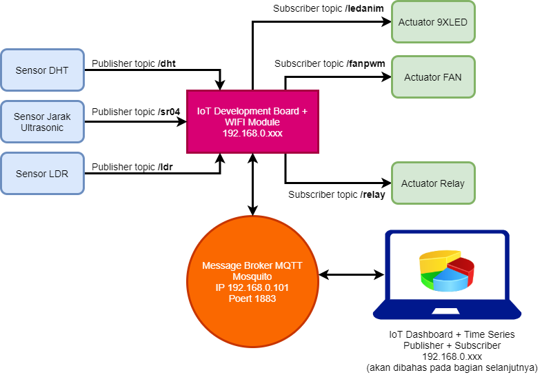

# Mengkomunikasikan Antara IoT Development Board Dengan Message Broker Mosquitto

### Rancangan Arsitektur Komunikasi IoT Development Board dan Message Broker MQTT Mosquitto

Kelanjutan dari materi sebelumnya tentang [message broker](https://dsp-tech.gitbook.io/internet-of-things/membangun-aplikasi-iot-create-from-scratch/instalasi-and-konfigurasi-message-broker-mqtt-mosquitto) adalah bagaimana membangun aplikasi di sisi embedded system \(IoT Development Board\) agar dapat berkomunikasi satu sama lain, antara IoT Development Board dan Message Broker MQTT Mosquitto.

Bagaimana mekanisme subscriber, publisher dan topic diimplementasikan pada IoT Development Board.

Materi yang akan dibahas mengasumsikan bahwa pembaca telah menguasai dan telah mencoba beberapa projek microcontroller yang terdapat di dalam bab "[Membangun Aplikasi Microcontroller dengan NodeMCU](https://dsp-tech.gitbook.io/internet-of-things/membangun-aplikasi-microcontroller-dengan-nodemcu)", sehingga kami tidak perlu membahas berulang-ulang untuk hal yang sama atau serupa.

Ditinjau dari sisi IoT Development Board \(embedded system\) dapat dianalogikan bahwa:

* Publisher merupakan sensor \(meskipun tidak selalu sensor\)
* Subscriber merupakan actuator \(meskipun tidak selalu actuator\)
* Laptop bisa bertindak sebagai subscriber ketika ia akan menampilkan data time series sensor-sensor, baik berupa angka atau chart. 
* Laptop juga bisa bertindak sebagai publisher ketika ia hendak mengendalikan actuator-actuator yang terdapat di dalam IoT Development Board, seperti relay, fan atau LED.

Rancangan arsitektur pada IoT Development Board yang akan dibangun tampak sebagai berikut:



> Namun untuk saat ini tidak kita belum membahas aplikasi di sisi laptop yang menggunakan aplikasi web dan java script.

Secara konsep client-server message broker, IoT Development Board akan bertindak sebagi publisher dan subscriber sekaligus. Untuk penjelasan detil tentang ini silahkan baca pada [bab berikut](https://dsp-tech.gitbook.io/internet-of-things/membangun-aplikasi-iot-create-from-scratch/aplikasi-web-iot-dashboard#pengantar).

### Kebutuhan Library

Beberapa library  baru dan belum pernah digunakan pada projek-projek sebelumnya adalah sebagai berikut:

* **ArduinoJson.h**, dapat di-dowload di [https://github.com/bblanchon/ArduinoJson](https://github.com/bblanchon/ArduinoJson). Library ini bertujuan untuk memudahkan serialisasi \(encode\) dan deserialisasi \(decode\) format data.


* **PubSubClient.h**, dapat di-download di [https://github.com/knolleary/pubsubclient](https://github.com/knolleary/pubsubclient). Library ini bertujuan untuk memudahkan kita saat mengirim dan atau menerima data dari atau menuju message borker MQTT dengan mekanisme publish atau subscribe.


* **ESP8266WiFi.h**, merupakan library internal NodeMCU ESP8266-12E, sehingga Anda tidak perlu menginstal library tersebut dari luar. Silahkan cek di menu **Sketch &gt; Include Library &gt; ESP8266WiFi.**


> Bagaimana teknik instalasi library baru ke dalam projek? silahkan baca kembali bagian [https://dsp-tech.gitbook.io/internet-of-things/membangun-aplikasi-microcontroller-dengan-nodemcu/projek-pergerakkan-led\#kode-program](https://dsp-tech.gitbook.io/internet-of-things/membangun-aplikasi-microcontroller-dengan-nodemcu/projek-pergerakkan-led#kode-program)

### Kode Program

Dalam kode program telah diupayakan agar setiap baris kode disertai dengan penjelasan singkat. Sehingga dirasa tidak perlu menjelaskan maksud dari kode program tersebut berulang-ulang .

```cpp
/*-----------------------------------------------
  IoT Smart Device Development Board
  by Dodit Suprianto | DSP-TECH
  https://doditsuprianto.blogspot.com/
  https://doditsuprianto.gitbook.io/dsp-tech/
  https://github.com/doditsuprianto
  Email: doditsuprianto@gmail.com

  Library Link & Credit:
  1. https://github.com/bblanchon/ArduinoJson
  2. https://github.com/Simsso/ShiftRegister74HC595
  3. https://github.com/winlinvip/SimpleDHT
  4. https://github.com/adafruit/Adafruit_SSD1306
  5. https://github.com/adafruit/Adafruit-GFX-Library
  6. https://github.com/crankyoldgit/IRremoteESP8266
  7. https://github.com/kiryanenko/SimpleTimer
  8. https://github.com/knolleary/pubsubclient
  --------------------------------------------------------*/

/*------------------------
  Library yang diperlukan
  ------------------------*/
#include <ArduinoJson.h>
#include <ESP8266WiFi.h>            // library ESP8266 Wifi
#include <PubSubClient.h>           // library MQTT Message
#include <ShiftRegister74HC595.h>   // library shift register 74HC595
#include <SimpleDHT.h>              // library sensor suhu & kelembaban DHT
#include <Wire.h>
#include <Arduino.h>
#include <Adafruit_GFX.h>           // library OLED
#include <Adafruit_SSD1306.h>       // library font OLED
#include <IRremoteESP8266.h>        // library remote infrared
#include <IRrecv.h>
#include <IRutils.h>
#include <SimpleTimer.h>            // library timer (milles) / thread

/*-------------------------------------
   Buffering memory untuk
   Serialisasi String ke JSON Library
  --------------------------------------*/
#define MSG_BUFFER_SIZE  (50)
char msg[MSG_BUFFER_SIZE];
DynamicJsonDocument dhtData(1024);

/*-------------------------------
  Alamat Kanal Shift Register:
  -------------------------------
  Kanal  0 = LED 1
  Kanal  1 = LED 2
  Kanal  2 = LED 3
  Kanal  3 = LED 4
  Kanal  4 = LED 5
  Kanal  5 = LED 6
  Kanal  6 = LED 7
  Kanal  7 = LED 8
  Kanal  8 = LED 9
  Kanal  9 = Buzz Piezo Speaker
  Kanal 10 = Relay
  Kanal 11 - 15 = Kanal expansi
  -------------------------------*/

/*-----------------------------------------
  Mendefinisikan pin kanal shift register
  -----------------------------------------*/
#define pinBuzz        9
#define pinRelay      10

/*------------------------------
  Pin Microcontroller NodeMCU
  ------------------------------*/
#define pinDHT        10 // pin SDD3
#define pinEcho       12 // pin D6
#define pinTrigger    14 // pin D5
#define pinLDR        A0 // pin A0
#define pinFan        15 // pin D8
#define pinIR         13 // pin D7
#define pinData       16 // pin D0
#define pinClock       2 // pin D4
#define pinLatch       0 // pin D3

/*---------------------------------------------------
  Login dan Password Access Point jaringan internet
  Sesuaikan nama WIFI dan PASSWORD Access Point Anda
  ----------------------------------------------------*/
const char* wifiName = "Tenda";
const char* wifiPass = "88888888";

/*------------------------------------------------------------------------------
  Login dan Password ke Message Broker Mosquitto
  User dan Password harus sesuai dengan setting pada Mosquitto
  Alamat IP Message Broker harus disesuaikan, di sini menggunakan 192.168.0.101
  ------------------------------------------------------------------------------*/
const char* brokerUser = "AdminMQTT";
const char* brokerPass = "pwd123";
const char* brokerHost = "192.168.0.101";

/*----------------------------------------------------
  Daftar nama Topic MQTT sebagai Publisher:
  1. Sebagai Publisher DHT11: Suhu & Kelembaban
  2. Sebagai Publisher LDR: Intensitas Cahaya
  3. Sebagai Publisher HC-SR04: Proximity Ultrasonic
  ----------------------------------------------------*/
const char* outTopicDHT  = "/dht";  // suhu dan kelembaban
const char* outTopicLDR  = "/ldr";  // intensitas cahaya
const char* outTopicSR04 = "/sr04"; // jarak penghalang dengan ultrasonic

/*---------------------------------------------
  Daftar nama Topic MQTT sebagai Subscriber:
  1. Sebagai Subscriber FAN PWM
  2. Sebagai Subscriber Relay
  3. Sebagai Subscriber LED
  4. Sebagai Subscriber Buzzer / SPK Piezo
  ---------------------------------------------*/
const char* inTopicFAN   = "/fanpwm";
const char* inTopicRelay = "/relay";
const char* inTopicLED   = "/ledanim";
const char* inTopicPiezo = "/piezo";

/*------------------------------
  Inisialisasi instance/object &
  Deklarasi varibale global
  -------------------------------*/
// OLED 0.96"
Adafruit_SSD1306 display(128, 64, &Wire, -1);

// Konstruktor instance Shift register
ShiftRegister74HC595<2> srChannel(pinData, pinClock, pinLatch);

// Konstruktor instance Sensor DHT11
SimpleDHT11 dht11(pinDHT);

// Konstruktor instance Sensor IR Remote
IRrecv PenerimaIR(pinIR);
decode_results hasil;

// Varibale simpletimer / Timer interval
SimpleTimer TimerDHT, TimerLDR, TimerSR04;

// Deklarasi variable suhu dan kelembaban
byte humValid, tempValid;

// Deklarasi kode tombol remote
unsigned int KodeTombolRemote;  

 // Deklaasi client wifi
WiFiClient espClient;          

// Deklarasi MQTT Client
PubSubClient client(espClient); 
long lastReconnectAttempt = 0;

/*-----------------------------------
  Mode Running LED dengan type enum
  -----------------------------------*/
typedef enum {
  AnimKiriKanan,
  AnimKiriKananSendirian,
  AnimTengahSamping,
  AnimSampingTengah
} animLED;

void setup() {
  /*----------------------------------------------------
    Mengatur baudrate serial MCU.
    Baurate disesuaikan dengan baudrate serial monitor)
    ----------------------------------------------------*/
  Serial.begin(115200);
  Wire.begin();

  /*-------------------------
    Inisialisasi layar OLED
    -------------------------*/
  display.begin(SSD1306_SWITCHCAPVCC, 0x3C);
  display.setTextSize(1);
  display.setTextColor(WHITE);
  display.clearDisplay();

  /*------------------------------------------------
    Membentuk koneksi ke jaringan WIFI Access Point
    ------------------------------------------------*/
  KoneksiWIFI();

  /*--------------------------------
    Koneksi TCP ke Broker MQTT
    port message broker adalah 1883
    --------------------------------*/
  client.setServer(brokerHost, 1883);
  client.setCallback(callback);

  // Mengaktifkan infra red receiver
  // kondisi listen
  PenerimaIR.enableIRIn();

  /*---------------------------------
    Mode pin sensor jarak ultrasonic
    ---------------------------------*/
  pinMode(pinTrigger, OUTPUT);
  pinMode(pinEcho, INPUT);

  /*-------------------
    Mode pin fan/kipas
    -------------------*/
  pinMode(pinFan, OUTPUT);

  /*-------------------
    Mode pin sensor DHT
    -------------------*/
  pinMode(pinDHT, INPUT);

  /*---------------------------------------------
    Set seluruh kanal shift register menjadi OFF
    ---------------------------------------------*/
  srChannel.setAllLow();

  /*----------------------------------------------------
    Atur interval pengecekan LDR, DHT, Jarak Ultrasonic
    ----------------------------------------------------*/
  TimerDHT.setInterval(1500);   // interval 1,5 detik
  TimerLDR.setInterval(300);    // interval 300 mili detik
  TimerSR04.setInterval(500);   // interval 0,5 detik
}

void loop() {
  /*---------------------------------------
    Koneksi ulang ke broker jika terputus
    ---------------------------------------*/
  if (!client.connected()) {
    reconnect();
  }
  client.loop();

  /*--------------------------------------------------------
    pembacaan sensor cahaya sesuai interval yang ditentukan
    kemudian mengirim datanya ke message broker
    --------------------------------------------------------*/
  if (TimerLDR.isReady()) {
    // kirim data LDR ke message broker
    snprintf (msg, MSG_BUFFER_SIZE, "%d", SensorLDR());
    client.publish(outTopicLDR, msg);

    // update tampilan ke OLED setelah terjadi perubahan nilai
    updateOLED();

    TimerLDR.reset();
  }

  /*-----------------------------------------
    pembacaan sensor jarak sesuai interval,
    kemudian mengirim data ke message broker
    -----------------------------------------*/
  if (TimerSR04.isReady()) {
    // Memanfaatkan memory buffer untuk mempercepat proses fetch data
    // dan  mengurangi waktu tunda saat data dikirim dari microcontroller
    // ke message broker MQTT mosquitto
    snprintf (msg, MSG_BUFFER_SIZE, "%d", SensorJarakUltraSonic());

    // Kirim data yang berada di dalam memory buffer ke message broker
    // sesuai dengan topic yag telah ditentukan dengan peritah client.publish
    client.publish(outTopicSR04, msg);

    // update tampilan ke OLED setelah terjadi perubahan nilai
    updateOLED();

    // timer di reset kembali ke counter 0
    TimerSR04.reset();
  }

  /*---------------------------------------------
    Membaca sensor suhu dan kelembaban DHT11
    sesuai interval yang ditetapkan.
    Kemudian mengirim datanya ke message broker
    sesuai dengan topic yang ditentukan
    ---------------------------------------------*/
  if (TimerDHT.isReady()) {

    // memanggil prosedur SensorDHT()
    // membaca suhu & kelembaban
    SensorDHT();

    // update tampilan ke OLED setelah terjadi perubahan nilai
    updateOLED();

    // Format data dibah menjadi sebuah bentuk array.
    // Hal ini karena dalam satu siklus waktu sensor DHT11
    // menghasilkan 2 nilai sekaligus, yaitu suhu dan kelembaban
    dhtData["suhu"] = tempValid;
    dhtData["kelembaban"] = humValid;

    // Untuk menghemat sumberdaya maka dalam sekali transmisi data ke message broker
    // nilai suhu dan kelembaban dikirim sekaligus, sehingga digunakan serialisasi data.
    // Format data semula berupa array menjadi format JSON dengan menggunakan fungsi serializeJson
    char buffer[256];
    size_t n = serializeJson(dhtData, buffer);

    // Kirim data yang berada di dalam memory buffer ke message broker
    // sesuai dengan topic yag telah ditentukan dengan peritah client.publish
    client.publish(outTopicDHT, buffer, n);

    // Timer di-reset kembali ke counter 0
    TimerDHT.reset();
  }
}

/*--------------------------------------------
  Fungsi mengendalikan kecepatan putaran FAN
  dengan cara PWM (pulse with modulation)
  --------------------------------------------*/
void KontrolKecepatanFan() {
  /*------------------------------------------------------------------------------------------------------------------
    referensi https://www.electronicwings.com/nodemcu/nodemcu-pwm-with-arduino-ide
    analogWriteFreq(500); secara default adalah 500
    analogWriteRange(100); secara default max bernilai 1023

    Memetakan antara jarak objek yang dideteksi oleh ultrasonic dengan RPM Fan
    Semakin dekat antara objek dengan sensor ultrasonic makan RPM Fan akan semakin cepat
    Di sini dipetakan jarak antara 1-30cm menjadi 1023-0 pwm analogread
    Sebagai pembuktian, silahkan dekat dan jauhkan benda dengan ultrasonic, kemudian perhatikan RPM Fan yang terjadi
    -------------------------------------------------------------------------------------------------------------------*/

  int speedfan = map(SensorJarakUltraSonic(), 30, 1, 0, 1023);
  analogWrite(pinFan, speedfan);
  Serial.println("Speed FAN: " + String(speedfan));
}

void SpeedFANSub(int speedFAN) {
  int speedfan = map(speedFAN, 1, 100, 0, 1023);
  analogWrite(pinFan, speedfan);
}

/*-------------------------------------
  Fungsi menghitung intensitas cahaya
  dengan sensor LDR secara analog
  -------------------------------------*/
int SensorLDR() {
  int nilaiAnalogLDR = analogRead(pinLDR);
  /*--------------------------------------------------------------------------------
    Referensi perhitung Lux
    https://arduinodiy.wordpress.com/2013/11/03/measuring-light-with-an-arduino/
    https://emant.com/316002
    VOut = nilaiAnalogLDR * (3.3 / 1023) = nilaiAnalogLDR * ‭‭0.0032258064516129‬
    Perhitungan ini tidak dikalibrasi
    ----------------------------------------------------------------------------------*/

  double Vout = nilaiAnalogLDR * 0.0032258064516129;
  int lux = 330 / (10 * ((3.3 - Vout) / Vout));
  Serial.println("Lux Intensity= " + String(int(lux)));
  return lux;
}

/*------------------------------------------
  Fungsi menghitung jarak benda penghalang
  Dengan Sensor Ultrasonic HR-SR04
  ------------------------------------------*/
int SensorJarakUltraSonic() {

  // Membersihkan pin pinTrigger selama 2 microdetik
  digitalWrite(pinTrigger, LOW);
  delayMicroseconds(2);

  // Set pinTrigger menjadi HIGH selama 10 microdetik
  digitalWrite(pinTrigger, HIGH);
  delayMicroseconds(10);
  digitalWrite(pinTrigger, LOW);

  // Menghitng jarak berdasarkan  waktu perjalanan
  // gelombang suara dalam mikrodetik
  long Durasi = pulseIn(pinEcho, HIGH);
  int JarakCM = Durasi * 0.034 / 2;    // Jarak dalam satuan CM
  int JarakInch = Durasi * 0.0133 / 2; // Jarak dalam satuan INCH

  Serial.println("Jarak Cm=" + String(JarakCM) + " Inch=" + String(JarakInch));
  return JarakCM;
}

/*------------------------------------
  Fungsi membaca suhu dan kelembaban
  dengan sensor DHT11
  ------------------------------------*/
void SensorDHT() {
  byte suhu = 0;
  byte hum = 0;
  
  int err = SimpleDHTErrSuccess;
  if ((err = dht11.read(&suhu, &hum, NULL)) != SimpleDHTErrSuccess)
  {
    Serial.print("Read DHT11 failed, err="); Serial.println(err);
    delay(100);
    return;
  }

  // Memastikan suhu dan kelembaban valid
  // bila bernilai 0 maka diambil dari nilai sebelumnya
  if (suhu != 0 || hum != 0) {
    tempValid = suhu;
    humValid = hum;
  }

  Serial.print("Sample OK: ");
  Serial.print((int)tempValid); Serial.print(" *C, ");
  Serial.print((int)humValid); Serial.println(" H");
}

/*-------------------------
  Fungsi suara Buzz Piezo
  --------------------------*/
void beepBuzz(unsigned char delayms) {
  srChannel.set(pinBuzz, HIGH);
  delay(delayms);
  srChannel.set(pinBuzz, LOW);
  delay(delayms);
}

/*----------------------
  Function Running LED
  -----------------------*/
void runningLED(animLED al, int tunda) {
  MematikanSemuaLED();
  switch (al) {
    //LED hidup dari kiri ke kanan
    case AnimKiriKanan:
      for (uint8_t i = 0; i <= 8; i++) {
        srChannel.set(i, HIGH);
        delay(tunda);
      }
      break;

    //LED hidup dari kanan ke kiri
    case AnimKiriKananSendirian:
      for (uint8_t i = 0; i <= 8; i++) {
        if (i > 0) srChannel.set(i - 1, LOW);
        srChannel.set(i, HIGH);
        delay(tunda);
      }
      break;

    case AnimTengahSamping:
      srChannel.set(4, HIGH);
      delay(tunda);
      srChannel.set(3, HIGH);
      srChannel.set(5, HIGH);
      delay(tunda);
      srChannel.set(2, HIGH);
      srChannel.set(6, HIGH);
      delay(tunda);
      srChannel.set(1, HIGH);
      srChannel.set(7, HIGH);
      delay(tunda);
      srChannel.set(0, HIGH);
      srChannel.set(8, HIGH);
      delay(tunda);
      break;

    //LEH hidup dari samping ke tengah
    case AnimSampingTengah:
      srChannel.set(0, HIGH);
      srChannel.set(8, HIGH);
      delay(tunda);
      srChannel.set(1, HIGH);
      srChannel.set(7, HIGH);
      delay(tunda);
      srChannel.set(2, HIGH);
      srChannel.set(6, HIGH);
      delay(tunda);
      srChannel.set(3, HIGH);
      srChannel.set(5, HIGH);
      delay(tunda);
      srChannel.set(4, HIGH);
      delay(tunda);
      break;
  }

  MematikanSemuaLED();
}

/*-----------------------------------------------------------------------------------
  Fungsi memetakan kode tombol/keypad remote IR
  berdasarkan kode yang dicatat tsb akan menjadi dasar pengecekkan
  pada contoh ini saya menggunakan remote USEE TV (Anda dapat menyoba yang lainnya)
  ------------------------------------------------------------------------------------*/
void BacaKodeRemoteIR() {
  if (PenerimaIR.decode(&hasil)) {
    //unsigned int nilaitombol = hasil.value;
    //KodeTombolRemote = String(nilaitombol);
    KodeTombolRemote = hasil.value;
    Serial.println("Kode Tombol: " + String(KodeTombolRemote));
    PenerimaIR.resume();
  }
  delay(100);
}

/*--------------------
  Mematikan semua LED
  ---------------------*/
void MematikanSemuaLED() {
  //Set seluruh kanal LED 0 - LED 8 menjadi OFF
  for (uint8_t i = 0; i <= 8; i++) {
    srChannel.set(i, LOW);
  }
}

/*-----------------------------------------
  Mengendalikan LED menggunakan Remote IR
  ------------------------------------------*/
void HidupkanLEDDenganIR() {
  MematikanSemuaLED();

  if (KodeTombolRemote == 1303529910) {
    // hidupkan LED 1
    // dengan tombol 1
    srChannel.set(0, HIGH);
  } else if (KodeTombolRemote == 1303562550) {
    // hidupkan LED 1, 2
    // dengan tombol 2
    srChannel.set(0, HIGH);
    srChannel.set(1, HIGH);
  } else if (KodeTombolRemote == 1303524300) {
    // hidupkan LED 1, 2, 3
    // dengan tombol 3
    srChannel.set(0, HIGH);
    srChannel.set(1, HIGH);
    srChannel.set(2, HIGH);
  } else if (KodeTombolRemote == 1303540110) {
    // hidupkan LED 1, 2, 3, 4
    // dengan tombol 4
    srChannel.set(0, HIGH);
    srChannel.set(1, HIGH);
    srChannel.set(2, HIGH);
    srChannel.set(3, HIGH);
  } else if (KodeTombolRemote == 1303572750) {
    // hidupkan LED 1, 2, 3, 4, 5
    // dengan tombol 5
    srChannel.set(0, HIGH);
    srChannel.set(1, HIGH);
    srChannel.set(2, HIGH);
    srChannel.set(3, HIGH);
    srChannel.set(4, HIGH);
  } else if (KodeTombolRemote == 1303516140) {
    // hidupkan LED 1, 2, 3, 4, 5, 6
    // dengan tombol 6
    srChannel.set(0, HIGH);
    srChannel.set(1, HIGH);
    srChannel.set(2, HIGH);
    srChannel.set(3, HIGH);
    srChannel.set(4, HIGH);
    srChannel.set(5, HIGH);
  } else if (KodeTombolRemote == 1303531950) {
    // hidupkan LED 1, 2, 3, 4, 5, 6, 7
    // dengan tombol 7
    srChannel.set(0, HIGH);
    srChannel.set(1, HIGH);
    srChannel.set(2, HIGH);
    srChannel.set(3, HIGH);
    srChannel.set(4, HIGH);
    srChannel.set(5, HIGH);
    srChannel.set(6, HIGH);
  } else if (KodeTombolRemote == 1303564590) {
    // hidupkan LED 1, 2, 3, 4, 5, 6, 7, 8
    // dengan tombol 8
    srChannel.set(0, HIGH);
    srChannel.set(1, HIGH);
    srChannel.set(2, HIGH);
    srChannel.set(3, HIGH);
    srChannel.set(4, HIGH);
    srChannel.set(5, HIGH);
    srChannel.set(6, HIGH);
    srChannel.set(7, HIGH);
  } else if (KodeTombolRemote == 1303520220) {
    // hidupkan LED 1, 2, 3, 4, 5, 6, 7, 8, 9
    // dengan tombol 9
    srChannel.set(0, HIGH);
    srChannel.set(1, HIGH);
    srChannel.set(2, HIGH);
    srChannel.set(3, HIGH);
    srChannel.set(4, HIGH);
    srChannel.set(5, HIGH);
    srChannel.set(6, HIGH);
    srChannel.set(7, HIGH);
    srChannel.set(8, HIGH);
  }
}

/*----------------------------------------
  Fungsi koneksi jaringan ke Access Point
  ----------------------------------------*/
void KoneksiWIFI() {
  Serial.print("Connecting to ");
  Serial.println(wifiName);

  display.clearDisplay();

  display.setCursor(0, 0);
  display.println("Connecting to WiFi...");
  display.display();

  // Memposisikan NodeMCU sebagai station
  // NodeMCU dihubungkan ke Access Point
  WiFi.mode(WIFI_STA);
  WiFi.begin(wifiName, wifiPass);
  while (WiFi.status() != WL_CONNECTED) {
    delay(500);
    Serial.print(".");
  }

  // NodeMCU telah terhubung ke Access Point
  Serial.println();
  Serial.println("WiFi connected");
  Serial.print("IP address: ");
  Serial.println(WiFi.localIP());

  // Tampilkan informasi IP
  display.setCursor(0, 12); display.println("WiFi connected");
  display.display(); delay(1000);
  display.setCursor(0, 24); display.println(WiFi.localIP());
  display.display(); delay(1000);
  display.setCursor(0, 36); display.println("IoT Smart Device");
  display.display(); delay(1000);
  display.setCursor(0, 48); display.println("Development Board");
  display.display(); delay(3000);
}

void reconnect() {
  while (!client.connected()) {
    Serial.print("Attempting MQTT connection...");
    // Attempt to connect
    if (client.connect("ESP8266Client", brokerUser, brokerPass)) {

      Serial.println("connected");

      // memastikan bahwa IoT Development Board
      // telah meng-subscribe semua aktuator
      client.subscribe(inTopicFAN);
      client.subscribe(inTopicRelay);
      client.subscribe(inTopicLED);
      client.subscribe(inTopicPiezo);
    } else {
      Serial.print("failed, rc=");
      Serial.print(client.state());
      Serial.println(" try again in 5 seconds");

      delay(5000);
    }
  }
}

/*-------------------------------------------------------------
   Fungsi callback adalah 'listen' jika ada data
   yang diterima oleh server(NodeMCU). Kemudian menyimpan data
   ke variable berdasarkan nama TOPIC yang bersesaian
  -------------------------------------------------------------*/
void callback(char* topic, byte* payload, unsigned int length) {
  // variable StringPayload untuk menyimpan konten paket data yang diterima
  String StringPayload = "";

  // Menjadikan setiap character yang diterima menjadi string utuh
  // melalui proses penggabungan character
  for (int i = 0; i < length; i++) {
    StringPayload += (char)payload[i];
  }

  Serial.println("TOPIC: " + String(topic));
  Serial.println("PAYLOAD: " + String(StringPayload));

  // Mem-filter data berdasarkan nama topic nya masing-masing
  if (strcmp(topic, inTopicFAN) == 0) {
    // Topic: "/fanpwm"
    SpeedFANSub(StringPayload.toInt());
  } else if (strcmp(topic, inTopicRelay) == 0) {
    // Topic: "/relay"
    if (StringPayload == "ON") {
      // Mengaktifkan Relay jika StringPayload = "ON"
      srChannel.set(pinRelay, HIGH);
    } else {
      // Menonaktifkan Relay jika StringPayload = "OFF"
      srChannel.set(pinRelay, LOW);
    }
  } else if (strcmp(topic, inTopicPiezo) == 0) {
    // Topic: "/piezo"
    if (StringPayload == "ON") {
      // Mengaktifkan Buzz jika StringPayload = "ON"
      srChannel.set(pinBuzz, HIGH);
    } else {
      // Menonaktifkan Buzz jika StringPayload = "OFF"
      srChannel.set(pinBuzz, LOW);
    }
  } else if (strcmp(topic, inTopicLED) == 0) {
    // Topic: "/ledanim"
    for (int i = 0; i <= 8; i++) {
      // Menset status channel shift register mulai dari 0-8 menjadi LOW
      srChannel.set(i, LOW);
    }

    for (int i = 1; i <= StringPayload.toInt(); i++) {
      // Menset status channel shift register mulai dari 0
      // sampai nilai maks yang diterima dari payload menjadi HIGH
      srChannel.set(i - 1, HIGH);
    }
  }
}

void updateOLED() {
  display.clearDisplay();
  display.setTextSize(1);
  display.setTextColor(WHITE);

  display.setCursor(0, 0);    display.print("Light");
  display.setCursor(75, 0);   display.print(String(SensorLDR()));
  display.setCursor(100, 0);  display.print("Lux");  

  display.setCursor(0, 14);   display.print("Temperature");
  display.setCursor(75, 14);  display.print(String(tempValid));
  display.drawCircle(100, 13, 2, SSD1306_WHITE);
  display.setCursor(105, 14); display.print("C");

  display.setCursor(0, 28);   display.print("Humidity");
  display.setCursor(75, 28);  display.print(String(humValid));
  display.setCursor(100, 28); display.print("H");

  display.setCursor(0, 42);   display.print("Distance");
  display.setCursor(75, 42);  display.print(String(SensorJarakUltraSonic()));
  display.setCursor(100, 42); display.print("CM");

  display.display();
}
```

### Pengujian Aplikasi IoT Development Board dan Message Broker MQTT Mosquitto





