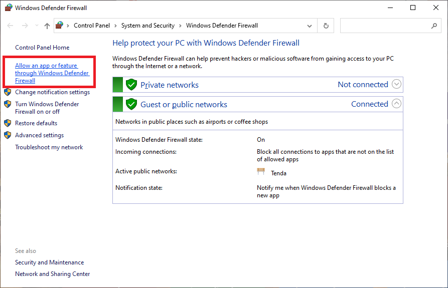
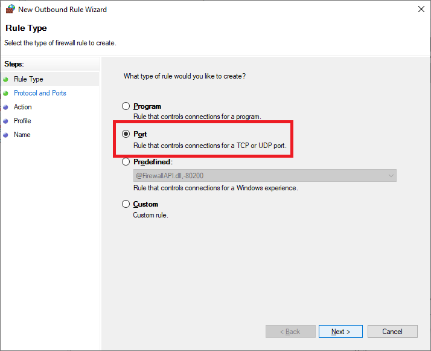
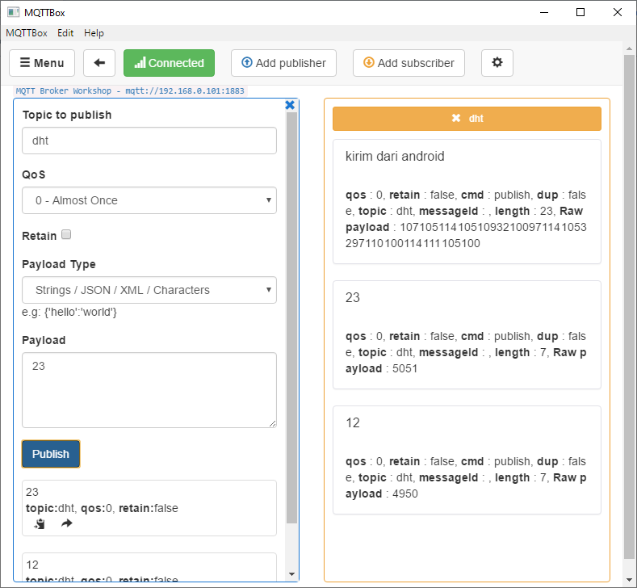

# Message Broker MQTT

### Pengantar

Seperti dijelaskan pada bagian sebelumnya, bahwa di dalam konsep _client-server_, message broker merupakan entitas tersendiri yang berjalan pada protokol TCP/IP, ia bertindak sebagai _server message_ yang melayani _client message_ dengan konsep _publish/subscribe_ dan _topic_. 

Di beberapa jenis produk message broker disertai dengan mekanisme routing queue \(antrian\) dengan berbagai jenis model broadcast message seperti yang terdapat pada [RabbitMQ](https://www.rabbitmq.com).

Terdapat beberapa protokol message broker yang bisa digunakan, misalnya AMQP, CoAP, EMQ, MQTT dan lain-lain. Namun pada kesempatan ini kita akan menggunakan message broker MQTT, dimana secara defacto message broker MQTT banyak diimplementasikan pada saat ini.

### Instalasi Message Broker MQTT Mosquitto

Pada bagian ini kita akan menginstalasi dan mengkonfigurasi message broker MQTT dengan konfigurasi minimal. Salah satu message broker MQTT yang populer adalah Mosquitto. Anda dapat men-downloadnya di [https://mosquitto.org/download/](https://mosquitto.org/download/) atau [download di sini](https://drive.google.com/file/d/10fGD8_2RmLTw9uk5Ij5C385gFCZlJKaO/view?usp=sharing).

Pilih file mosquitto yang sesuai dengan mesin Anda untuk di-download

Lakukan instalasi message broker MQTT Mosquitto sesuai tahapan berikut

Lakukan pengujian apakah Mosquitto telah terinstall dan berfungsi benar, dengan cara  masuk ke window command sebagai Administrator

Kemudian jalankan service message broker MQTT Mosquitto dengan perintah berikut **net start mosquitto**. Jika diperoleh pesan "_**The Mosquitto service was started successfully**_", berarti instalasi mosquitto sukses dan siap digunakan.

### Instalasi Aplikasi MQTT Client Tools

Aplikasi MQTT Client Tools berguna untuk menguji apakah transmisi data \(baik publisher /subscriber dan topic\) antara device dan message broker bekerja dengan benar. Hal ini akan mempersempit tingkat kesalahan bila arsitektur yang dibangun melibatkan perangkat embedded system. 

Ada 2 aplikasi MQTT Client Tools yang direkomendasikan, yaitu:

* **MQTTBox**, silahkan download [MQTTBox di sini](https://drive.google.com/file/d/1JysiDtmRBNcoarwzurwLZcEnK6EBL42D/view?usp=sharing)
* **MQTT Explorer**, silahkan download MQTT Explorer di [http://mqtt-explorer.com](http://mqtt-explorer.com) atau [download di sini](https://drive.google.com/file/d/1i3yJb8TOqqeSdqwzH8wo_vV8nm7oLolF/view?usp=sharing).

#### Instalasi & Konfigurasi MQTT Explorer

Saya asumsikan bahwa file diperleh dari [http://mqtt-explorer.com](http://mqtt-explorer.com) maka tahap instalasinya adalah sebagai berikut

Buat koneksi baru antara MQTT Explorer dan Message Broker Mosquitto dengan kofigurasi berikut:

* Name : MQTT Local Host
* Protocol: mqtt://
* Host: localhost
* Port: 1883 \(default\)
* Username: &lt;kosong&gt;
* Password: &lt;kosong&gt;

Kemudian klik tombol CONNECT untuk memastikan koneksi dengan mosquito terjalin. Jika tidak ada masalah lanjutkan dengan klik tombol SAVE.

#### Instalasi & Konfigurasi MQTTBox

Instalasi dan konfigurasi MQTTBox serupa dengan cara sebelumnya

Isikan konfigurasi MQTTBox, kemudian klik tombol **Save**.

* MQTT Client Name: MQTT Broker Workshop
* Protocol: mqtt/tcp
* Host: localhost:1883
* Username: &lt;kosong&gt; default
* Password: &lt;kosong&gt; default

Jika tidak terjadi masalah koneksi dengan mosquitto berarti semua berjalan normal. 

### Konfigurasi User & Password Akses Message Broker Mosquitto

Pada bagian ini kita akan mengkonfigurasi message broker mosquitto dengan tambahan keamanan user dan password. Serta konfigurasi agar message broker mosquitto dapat diakses remote oleh perangkat jarak jauh pada jaringan lokal.

Buka aplikasi editor Notepad++ sebagai Administrator untuk membuat user dan password untuk di hashing.

Buat teks berisi user:password misalnya **AdminMQTT:pwd123**, kemudian simpan file tanpa disertai tipe file dengan nama **password**. Dalam kasus komputer saya, letakkan file di **C:\Program Files\mosquitto**

Lakukan hashing terhadap file password tersebut dengan perintah pada command **mosquitto\_passwd -U password**. Parameter "password" yang terakhir adalah nama file yang dibuat sebelumnya.

Untuk membuktikann apak password telah di-hashing, silahkan buka kembali file **password** yang berada di C:\Program Files\mosquitto dengan editor Notepad++.

Pengujian akses service message broker mosquitto dengan user dan password dengan cara mengubah konfigurasi koneksi pada MQTTBox. Isikan parameter berikut:

* Host: localhost:1883 atau 192.168.0.101:1883
* Username: AdminMQTT
* Password: pwd123

Anda juga mengakses service message broker mosquitto menggunakan host alamat IP, dalam hal ini adalah 192.168.0.101

Jika koneksi antara MQTT Client \(MQTTBox\) dan MQTT Broker \(mosquitto\), saatnya sekarang membuat entitas publisher yang dibernama **dht**. kolom payload adalahdata yang dikirk ke message broker mosquitto.

Subscriber adalah sisi yang meminta me-_request_ data ke publisher, tentunya melalui jembatan message broker yang bertindak sebagai manajer lalu lintas data antara subscriber dan publisher. 

Nama topic antara subscriber dan publisher harus sesuai agar komunikasi keduanya bisa terjalin. Sebagai contoh nama topic subsciber adalah **dht** \(sama dengan topic pada publisher\).

Ketika tombol publish dipilih, maka data pada kolom payload akan dikirim ke subscriber dengan topic dht.

### Konfigurasi Akses Service Message Broker Mosquitto Secara Remote

Banyak kasus ditemui bahwa komunikasi antara Client MQTT dan Broker MQTT berada pada mesin berbeda. Misalnya sisi client menggunakan perangkat Embedded System, sedangkan Message Broker berada di laptop. 

Di sini kita perlu mengkonfigurasi MQTT Message Broker Mosquitto terlebih dahulu agar dapat diakses oleh client-client secara remote dalam satu network.

#### Konfigurasi File mosquitto.conf

Pertama dilakukan adalah mengkonfigurasi file **mosquitto.conf** yang berada di folder **C:\Program Files\mosquitto** dengan aplikasi editor Notepad++.

Cek alamat IP komputer lokal Anda dimana aIP Listener Message Broker Mosquitto berada. Gunakan perintah **ipconfig** pada window command yang akan bertindak. Dalam kasus laptop saya adalah 192.168.0.101.

Selanjutnya lakukan perubahan terhadap 4 parameter pada **mosquitto.conf**:

* listener 1883 192.168.0.101 
* listener 1883 localhost 
* protocol mqtt 
* allow\_anonymous false 
* password\_file C:\Program Files\mosquitto\password

Menghentikan dan me-restart ulang service message broker dengan command sebagai berikut:

* net stop mosquitto 
* net start mosquitto

#### Firewall Rule Aplikasi mosquitto.exe

Tujuan konfigurasi firewall dengan rule aplikasi agar layanan message broker mosquitto tidak diblokir oleh firewall windows defender.

#### Firewall Rule Port

Konfigurasi firewall dengan rule port bertujuan agar firewall windows defender memberi izin message broker mosquitto dengan port 1883 dapat diakses dari luar.

Terdapat dua jenis rule port yang harus dikofigurasi, yaitu:

* Port - Inbound Rule
* Port - Outbound Rule

**Konfigurasi Port Inbound Rule**

**Konfigurasi Port Outbound Rule**

Dengan cara serupa dengan inbound rule, ikuti langkah-langkah berikut untuk membentuk port outbound rule

### Mengakses Message Broker Secara Remote

Setelah semua konfigurasi dijalankan, saatnya kita menguji coba message broker secara remote. Sebagai bahan percobaan akan kita gunakan aplikasi Android MQTT Client bernama **MyMQTT**. Silahkan download aplikasi tersebut  melalui Google Play Store.

Sesuaikan konfigurasi koneksi pada MyMQTT, dimana alamat IP Message Broker adalah **192.168.0.101**. Hal ini tentu harus disesuaikan dengan alamat IP Anda masing-masing. 

Sesuaikan dengan nama user dan password message broker dengan setting sebelumnya, dimana user adalah **AdminMQTT** dan password adalah **pwd123**.

Setelah memilih tombol Save akan muncul notifikasi bahwa koneksi sukses, artinya koneksi antara MyMQTT Android dan Message Broker Mosquitto sukses terjalin.

Selanjutnya pilih menu publish, yang akan mengirim data \(payload\) dari MyMQTT Android ke message broker mosquitto.

Sebagai contoh, kita akan mengirim data string "**kirim dari andoid**", kemudian pilih tombol Publish.

Sekarang cek kembali MQTT client pada MQTTBox. Pada bagian box Subscriber dengan topic **dht** akan diterima data string berupa tulisan "kirim dari Android".

Sampai di sini kita telah memahami bagaimana cara mengkomunikasikan antara MQTT Client dan MQTT Broker, bagaimana teknik instalasi dan konfigurasi message broker, baik bekerja secara lokal maupun remote, bagaimana cara kerja subscriber dan publisher, dan topic.

> Untuk mengkases message broker secara remote, pastikan bahwa perangkat antara message broker dan perangkat message client berada dalam satu network.

