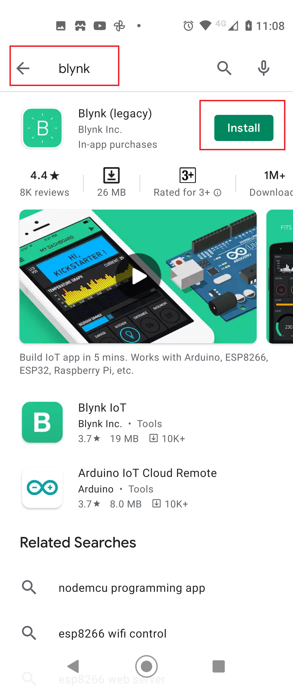
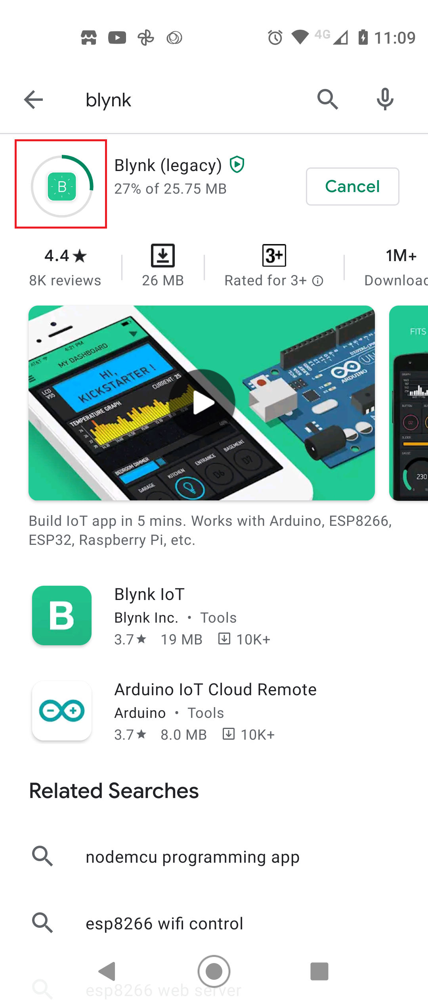
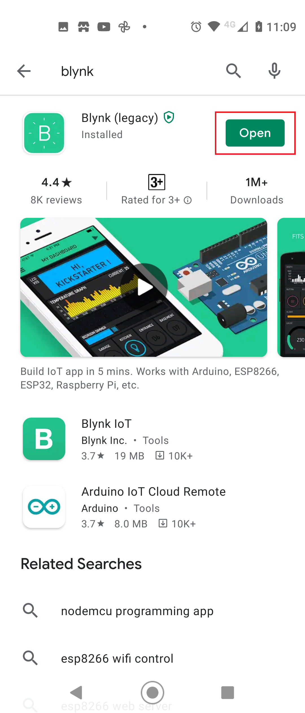
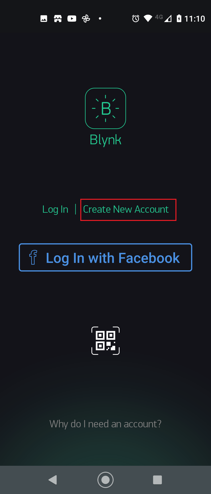
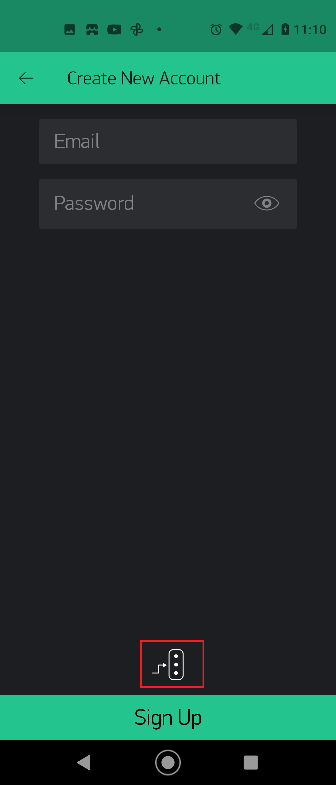
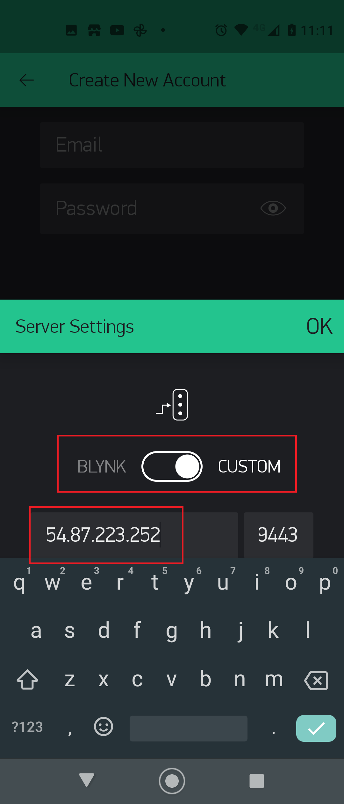
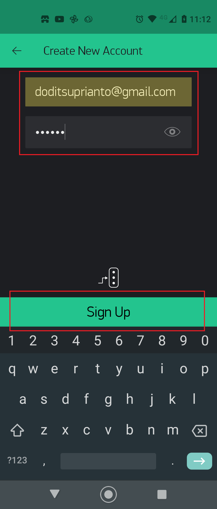
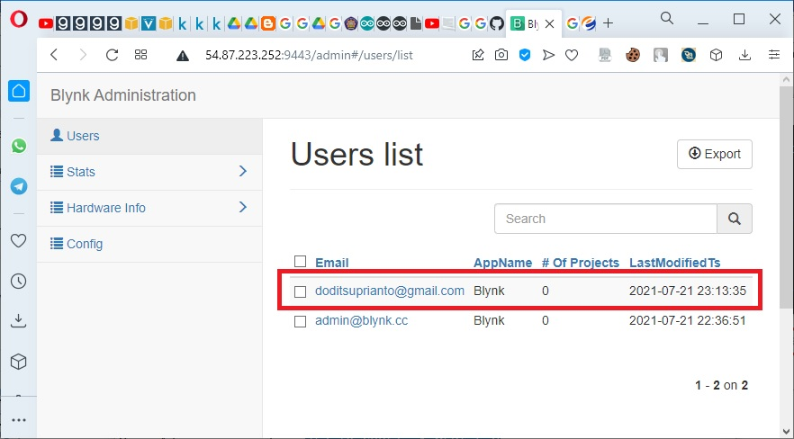
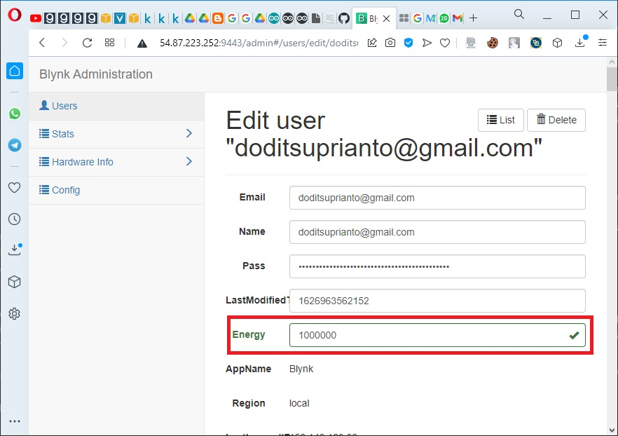

# Instalasi Client Blynk pada Android

Buka aplikasi Play Store Android dengan menuliskan "blynk" pada textbox pencarian.

Buat akun baru dengan memilih "**Create New Account**".

Kemudian ubah alamat IP dimana Blynk Server berada. Secara default, server akan mengarah ke alamat IP Cloud Server Blynk.

Pilih tombol selektor menjadi "**CUSTOM**", tuliskan alamat IP Server IoT Blynk, misal alamat **54.87.223.252**, dan Port defaultnya adalah **9443**. Setelah itu pilih tombol "**OK**".

Pada halaman berikutnya tulis email user dan passwordnya, kemudian klik tombol "**Sign Up**".

Setelah akun Blynk terbentuk maka data tersebut akan disimpan di dalam server Blynk. Untuk mengetahuinya silahkan buka dashboard blynk dari browser internet dengan alamat, misal **https:// 54.87.223.252:9443/admin**. Dapat dilihat bahwa user list dengan akun email **doditsuprianto@gmail.com** telah berhasil ditambahkan.

Agar memperoleh “energy” lebih besar dimana energy tersebut akan menjadi dasar modal penggunaan widget blynk pada Android maka pilih salah user user yang baru saja ditambahkan (misalnya doditsuprianto@gmail.com), kemudian update nilai enery-nya. Secara default energy di set 98.800. Anda bisa mengubahnya menjadi 1.000.000.

> Note.
- Instalasi dan konfigurasi Server IoT Blynk cukup sampai di sini. Kita akan membuat tampilan Dashboard IoT yang dapat memonitor dan mengendalikan device dengan memanfaatkan widget blynk pada Android akan dibahas pada bab selanjutnya.
- Bagaimana mengembangkan kode program di sisi device IoT Development Board yang terkoneksi dengan server IoT Blynk? juga akan dibahas pada bab selanjutnya.