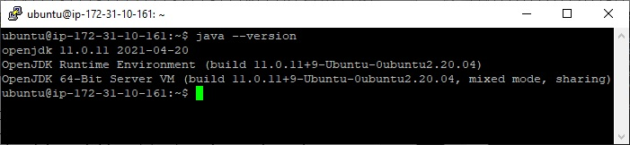

# Server Blynk Pada Komputer Server

Pertama kita akan mencoba untuk menginstall dan mengkonfigurasi server blynk pada komputer PC. Diasumsikan bahwa Anda telah memiliki komputer PC/Laptop yang menggunakan sistem Operasi Linux ya.

Karena kebetulan saya memiliki instance linux ubuntu pada AWS, maka saya akan menggunakan layanan cloud tersebut. Secara teknik tidak ada perbedaan antara instalasi pada cloud maupun PC/Laptop lokal. 

## Instalasi IoT Server Blynk

Blynk membutuhkan runtime java dalam pengoperasiannya, sehingga pastikan komputer OS linux Anda telah diinstall dengan java. Untuk mengetahuinya gunakan perintah java -version. Bila menggunakan aplikasi putty tampak seperti ini:


Bila java belum teriinstall, selanjutnya install java dengan perintah:

```cpp
sudo apt install default-jre
```


Cek kembali instalasi javanya dengan perintah

```cpp
java –version
```



Selanjutnya adalah membuat folder dimana aplikasi Blynk akan diinstall. Gunakan perintah **mkdir blynk** yang berarti membuat folder bernama “blynk”. Kemudian buat folder baru lagi bernama "**server_data**" di dalam folder blynk sebagai tempat penyimpanan data Blynk. 

Berikut perintah lengkapnya:

```cpp
mkdir blynk
cd blynk
mkdir server_data
```


Masih berada dalam folder "blynk", kita akan meng-install aplikasi IoT Server Blynk dengan cara meng-cloning file Blynk dari repository github ke komputer kita. Untuk mengetahui release Blynk versi terbaru, silahkan kunjungi halaman ini https://github.com/blynkkk/blynk-server/releases.


Perintah untuk meng-clone aplikasi Server IoT blynk dari github adalah sebagai berikut:

```cpp
wget https://github.com/blynkkk/blynk-server/releases/download/v0.41.16/server-0.41.16-java8.jar
```


Untuk mengaktifkan Server IoT Blynk gunakan perintah:

```cpp
java -jar server-0.41.16-java8.jar -dataFolder server_data &
```


Jika muncul pesan seperti di atas maka Server IoT Blynk telah aktif dan siap digunakan. Mungkin user dan password perlu Anda catat terlebih dahulu.
Bisa jadi password Anda akan berbeda dengan yang ditampilkan di atas.

```cpp
Your Admin login email is admin@blynk.cc
Your Admin password is 3t7jl0iC8RLlvn1jMEDts5zY
```
Anda bisa menggunakan browser internet untuk mengadministrasi *user*, mengkonfigurasi, dan lain-lain melalui halaman Dashboard Blynk.

Berikut ini cara untuk membuka halaman Dashboard Blynk secara remote. Dimana saya menggunakan browser internet Opera.

- URL remote		: https:// 54.87.223.252:9443/admin (alamat IP adalah IP dimana blynk server diinstall. Silahkan cek alamat IP masing-masing)
- URL lokal			: https://127.0.0.1:9443/admin
- User admin default	: admin@blynk.cc 
- Password admin default	: 3t7jl0iC8RLlvn1jMEDts5zY (sesuaikan dengan milik Anda)

> Note.
- User dan password admin dapat diubah melalui Dashboard Blynk. Tetapi untuk saat ini kita biarkan menggunakan user dan pasword default.
- Jika Anda membuka Dashboard Blynk secara remote di inernet, maka pastikan port 9443 telah dibuka. Namun bila server blynk hanya berjalan di network lokal, biasanya tidak perlu membuka port 9443.

Pastikan server blynk telah aktif. Gunakan perintah sebelumnya pada folder blynk:

```cpp
java -jar server-0.41.16-java8.jar -dataFolder server_data &
```


Tampilan di bawah ini merupakan user yang telah terdaftar dalam Server IoT Blynk. User yang dimaksud adalah user yang memiliki asosiasi dengan device. Satu user bisa memiliki beberapa device. Namun saat ini belum ada user yang terdaftar kecuali **Admin**. Hal ini akan kita bahas dibagian selanjutnya.


## Instalasi Client Blynk pada Android

Buka aplikasi Play Store Android dengan menuliskan "blynk" pada textbox pencarian.


Buat akun baru dengan memilih "**Create New Account**".


Kemudian ubah alamat IP dimana Blynk Server berada. Secara default, server akan mengarah ke alamat IP Cloud Server Blynk.


Pilih tombol selektor menjadi "**CUSTOM**", tuliskan alamat IP Server IoT Blynk, misal alamat **54.87.223.252**, dan Port defaultnya adalah **9443**. Setelah itu pilih tombol "**OK**".


Pada halaman berikutnya tulis email user dan passwordnya, kemudian klik tombol "**Sign Up**".


Setelah akun Blynk terbentuk maka data tersebut akan disimpan di dalam server Blynk. Untuk mengetahuinya silahkan buka dashboard blynk dari browser internet dengan alamat, misal **https:// 54.87.223.252:9443/admin**. Dapat dilihat bahwa user list dengan akun email **doditsuprianto@gmail.com** telah berhasil ditambahkan.


> Note.
- Instalasi dan konfigurasi Server IoT Blynk cukup sampai di sini. Kita akan membuat tampilan Dashboard IoT yang dapat memonitor dan mengendalikan device dengan memanfaatkan widget blynk pada Android akan dibahas pada bab selanjutnya.
- Bagaimana mengembangkan kode program di sisi device IoT Development Board yang terkoneksi dengan server IoT Blynk? juga akan dibahas pada bab selanjutnya.