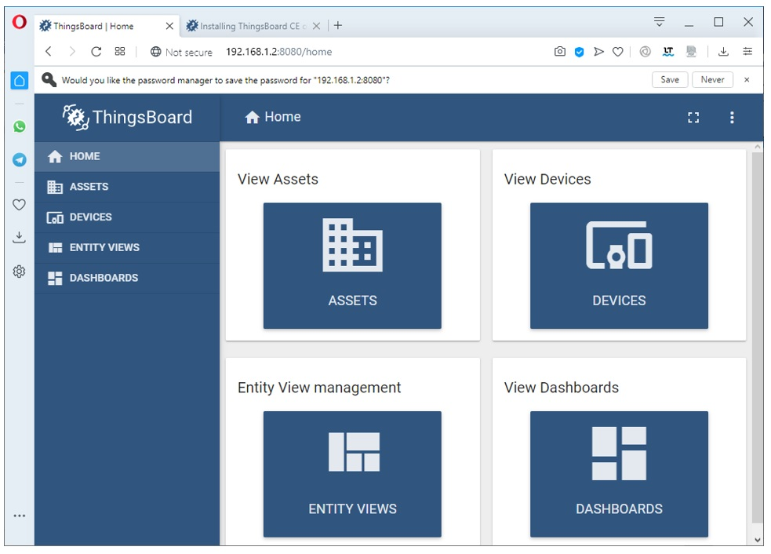

# Instalasi Thingsboard pada Ubuntu

Di sini kita akan memanfaatkan aplikasi server IoT Thingsboard.io yang akan kita komunikasikan dengan IoT Development Board.

Saya asumsikan bahwa Anda telah memahami bagaimana teknik menginstal dan mengkonfigurasi sistem operasi Linux, khususnya yang berbasis UBuntu. Jika Anda mengalami kesulitan dalam mengoperasikan linux ubuntu maka silahkan cari literatur di internet yang cukup  banyak tersedia.

Sebelum mulai menginstal Thingsboard, alangkah baiknya kita menginstall SSH server terlebih dahulu, sehingga kita bisa me-remote Ubuntu Mate saat proses instalasi Thingsboard, meskipun kita jua bisa menginstalnya secara langsung melalui “MATE Terminal”. Untuk menginstall SSH server, silahkan ikut langkah berikut ini:
Buka aplikasi MATE Terminal melalui "**Menu**", kemudian tuliskan "**terminal**" pada kolom pencarian, kemudian klik menu "**MATE Terminal**" atau cara mudahnya menggunakan keyboard shortcut Ctrl+Alt+T.


Tuliskan script berikut:
```cpp
sudo apt update
sudo apt upgrade
sudo reboot
```


```cpp
sudo apt install openssh-server
sudo systemctl enable ssh.service
sudo systemctl start ssh.service
sudo dpkg-reconfigure openssh-server
```


Cek terlebih dahulu alamat IP Ubuntu Mate dengan perintah **ifconfig**. Berdasarkan contoh di bawah ini, didapatkan alamat IP 192.168.1.2. Bisa jadi alamat IP yang Anda dapatkan pada komputer Anda akan berbeda. Karena posisi Ubuntu MATE pada jaringan adalah sebagai client/station DHCP maka bisa jadi alamat IP-nya suatu saat akan berubah. Untuk mengatasinya dijadikan IP statis, namun pada buku ini kita tidak membahasnya.


Sekarang kita uji apakah server SSH telah aktif dan siap digunakan dengan aplikasi remote Putty.

Buka laptop lain atau perangkat lain yang terhubung dengan jaringan, kemudian buka aplikasi Putty, isikan alamat IP (nama host) dengan 192.168.1.2, nomor port SSH adalah 22, jenis koneksi adalah "**SSH**", dan kemudian pilih tombol "**Open**".


Sampai sini kita sudah bisa me-remote Ubuntu MATE dari perangkat lain menggunakan aplikasi Putty.

> **Noted.**
Jika Anda meletakkan server linux pada IP Public maka perlakuannya akan sedikit kompleks. Mungkin Anda perlu mengaktifkan firewall dan membuka beberapa port yang dibutuhkan selain port ssh, seperti port 80, 8080, 443, 22, 5432.

Mari kita lanjutkan dengan menginstall aplikas Thingsboard. Karena Thingsboard membutuhkan Java JDK maka kita perlu mengecek apakah Ubuntu MATE telah terinstall dengan Java JDK. Untuk mengetahuinya gunakan perintah `java --version`.


Bila muncul pesan seperti di atas maka kita perlu menginstall java terlebih dahulu. Gunakan perintah: `sudo apt install default-jre`.


Lanjutkan dengan perintah: `sudo apt install openjdk-11-jre-headless`.


Cek sekali lagi apakaj Java telah terinstall dengan perintah `java --version`.


Untuk mengetahui langkah-langkah instalasi Thingsboard pada Ubuntu silahkan kunjungi halaman https://thingsboard.io/docs/installation/. Kemudian pilih tombol THINGSBOAR COMMUNITY EDITION.


Dari sini kita akan menuju halaman https://thingsboard.io/docs/user-guide/install/ubuntu/ yang berisi alamat download Thingsboard Community dan bagaiama tahapan instalasinya.


Kita lanjutkan sekarang dengan menginstall Thingsboard dengan cara cloning dari github. Repository package Thingsboard diletakkan pada alamat berikut:

```cpp
wget https://github.com/thingsboard/thingsboard/releases/download/v2.4.3/thingsboard-2.4.3.deb
```
atau untuk release terbaru bisa menggunakan:

Kita lanjutkan sekarang dengan menginstall Thingsboard dengan cara cloning dari github. Repository package Thingsboard diletakkan pada alamat berikut:

```cpp
wget https://github.com/thingsboard/thingsboard/releases/download/v3.3/thingsboard-3.3.deb
```


Sekarang masuk lagi ke aplikasi Terminal Ubuntu MATE dengan perintah: 

```cpp
sudo wget https://github.com/thingsboard/thingsboard/releases/download/v2.4.3/thingsboard-2.4.3.deb
```
atau

```cpp
sudo wget https://github.com/thingsboard/thingsboard/releases/download/v3.3/thingsboard-3.3.deb
```


Cek apakah thingsboard sukses di downoad dengan perintah ls, sekaligus lakukan instalasi Thingsboard sebagai service dengan perintah

```cpp
sudo dpkg -i thingsboard-2.4.3.deb
```


Lakukan update sekali lagi dengan perintah

```cpp
sudo apt-get update
```


Instal database PosgreSQL dengan perintah 

```cpp
sudo apt-get install postgresql postgresql-contrib
```

dan sekaligus menjalankan service PosgreSQL dengan perintah

```cpp
sudo service postgresql start
```


Setelah PostgreSQL diinstal, buatlah user dan password untuk user utama. Perintah di bawah ini untuk membuat password sebagai pengguna postgresql utama. Kemudian, tekan "**Ctrl + D**" untuk logout kembali ke konsol user utama.

```cpp
sudo su - postgres
psql
\password
\q

sudo service postgresql start
```


Hubungkan user utama tadi ke database dengan nama “thingsboard” yang akan kita buat dengan perintah berikut:

```cpp
psql -U postgres -d postgres -h 127.0.0.1 -W
CREATE DATABASE thingsboard;
\q
```


Lakukan editing terhadap file konfigurasi `thingsboard.conf` dengan perintah:

```cpp
sudo nano /etc/thingsboard/conf/thingsboard.conf
```

Kemudian tambahkan skrip berikut:

```cpp
# DB Configuration 
export DATABASE_ENTITIES_TYPE=sql
export DATABASE_TS_TYPE=sql
export SPRING_JPA_DATABASE_PLATFORM=org.hibernate.dialect.PostgreSQLDialect
export SPRING_DRIVER_CLASS_NAME=org.postgresql.Driver
export SPRING_DATASOURCE_URL=jdbc:postgresql://localhost:5432/thingsboard
export SPRING_DATASOURCE_USERNAME=postgres
export SPRING_DATASOURCE_PASSWORD=PASSWORD
```

> **Note.**
Khusus "**PASSWORD**" silahkan diganti dengan password user utama database PosgresSQL yang telah kita buat sebelumnya.


Setelah ditambahkan skrip, kemudian gunakan keyboard Ctrl+X, Y dan Enter untuk keluar dari editor dan menyimpannya.
Setelah service ThingsBoard diinstal dan konfigurasi DB diperbarui, Anda dapat menjalankan skrip berikut:

```cpp
# --loadDemo option will load demo data: users, devices, assets, rules, widgets.
sudo /usr/share/thingsboard/bin/install/install.sh --loadDemo
```

Pilihan `--loadDemo` bertujuan untuk memuat data demo, misalnya user, devices, assets, rules dan widget.


Perintah berikut bertujuan agar Thingsboard mulai berkerja:

```cpp
sudo service thingsboard start
```


Untuk mengoeprasikan Dashboard Thingsboard, silahkan buka browser internet dengan alamat:
- Jika browser internet dijalankan secara remote maka gunakan IP dimana Thingsboard diinstall, misalnya http://192.168.1.2:8080
- Jika browser internet dijalankan pada komputer lokal maka bisa menggunakan alamat http://127.0.0.1:8080, http://localhost:8080 atau http://192.168.1.2:8080/

> Note.
Untuk alamat sekedar ilustrasi, sesuaikan dengan alamat IP dimana Thingsboard.io diinstall.


Secara default user dan password ketika `–loadDemo` adalah sebagai berikut:
- Administrator System: `user: sysadmin@thingsboard.org / pwd: sysadmin`
- Administrator Tenant: `user: tenant@thingsboard.org / pwd: tenant`
- Pengguna customer: `user: customer@thingsboard.org / pwd: customer`

Akun Thingsboard dibagi menjadi tiga, posisi tertinggi adalah Administrator System yang bisa memiliki banyak Administrator Tenant dan Administrator bisa memiliki banyak pengguna pelanggan/kustomer. User terebut bisa diganti setiap saat untuk menjaga keamanan.

Pembagian akun tersebut akan kita terapkan saat membangun sistem kontrol dan monitoring smart device NodeMCU dengan Thingsboard melalui aplikasi browser.

Contoh dashboard Thingsboard dengan akun sysadmin:


Contoh dashboard Thingsboard dengan akun **tenant**:


Contoh dashboard dengan akun **customer**:


