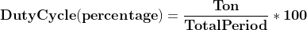

# Projek Aktuator FAN \(Kipas\) Mode PWM

### Dasar Teori

#### Pengenalan

Pulse Width Modulation \(PWM\) adalah teknik di mana lebar pulsa divariasikan sambil menjaga frekuensi gelombang konstan.


#### Generasi PWM

Periode pulsa terdiri dari siklus ON \(VCC\) dan siklus OFF \(GND\). Fraksi yang sinyalnya AKTIF selama suatu periode dikenal sebagai siklus kerja.



Misalnya. Pulsa dengan periode 10ms akan tetap ON \(tinggi\) selama 2ms. Oleh karena itu, duty cycle akan tetap

**D = 2ms / 10ms = 20%**

Melalui teknik PWM, kita dapat mengontrol daya yang dikirim ke beban dengan menggunakan sinyal ON-OFF. Sinyal PWM dapat digunakan untuk mengontrol kecepatan motor DC dan untuk mengubah intensitas LED. Selain itu, ini juga dapat digunakan untuk menghasilkan sinyal sinus. Pulse Width Modulated signal dengan duty cycle berbeda ditunjukkan di bawah ini.


ESP8266 berbasis NodeMCU memiliki fungsionalitas antarmuka PWM melalui pemrograman perangkat lunak. Ini dicapai dengan metode interupsi pengatur waktu. Rentang frekuensi PWM untuk ESP8266 dapat disesuaikan hingga 1KHz.

#### Pin PWM pada NodeMCU Kit


#### Fungsi untuk NodeMCU PWM

* **analogWrite \(pin, dutycycle\)**: Mengaktifkan software PWM pada pin yang ditentukan. siklus tugas dalam kisaran dari 0 hingga PWMRANGE, yaitu 1023 secara default.
* **analogWrite \(pin, 0\)**: Menonaktifkan PWM pada pin yang ditentukan.
* **analogWriteRange \(new\_range\)**: Fungsi ini digunakan untuk mengubah rentang PWM \(duty cycle\).
* **analogWriteFreq \(new\_frequency\)**: Frekuensi PWM adalah 1kHz secara default. Panggil fungsi ini untuk mengubahnya dengan frekuensi baru. Frekuensi PWM berada dalam kisaran 1 - 1000Khz.

#### Contoh

Mari kita tulis sketsa Arduino untuk menyetel PWM pada pin ke-6 NodeMCU dan memvariasikan siklus tugasnya dengan potensiometer yang terhubung ke pin ADC NodeMCU. Di sini kami menghubungkan LED pada pin PWM untuk memvisualisasikan efek \(Kecerahan LED\) dari variasi PWM.


#### Penggunaan Dasar PWM

```cpp
uint8_t LEDpin = D6;

// Secara default frekuensi PWM adalah 1000Hz dan 
// kita menggunakan yang sama.
// untuk aplikasi ini maka tidak perlu mengatur.

void setup(){
  Serial.begin(115200);
  // setel siklus kerja 50% awal
  analogWrite(LEDpin, 512);  
}

void loop(){
  // membaca nilai potensiometer dan atur duty cycle PWM
  uint16_t dutycycle =  analogRead(A0); 
  
  // batasi duty cycle maksimal 1023 jika potensio melewati nilai tersebut
  if(dutycycle > 1023) dutycycle = 1023;
  
  Serial.print("Duty Cycle: ");  
  Serial.println(dutycycle);
  analogWrite(LEDpin, dutycycle);
  delay(100);
}
```

### Tujuan

Projek bertujuan untuk mengendalikan kecepatan putar FAN dengan metode PWM. Perintah yang digunakan adalah analogWrite, sedangkan parameter penentu lainnya seperti frekwensi dan range diset default.

Nilai analogWrite adalah antara 0 sampai 1023 \(tingkat presisi 8 bit, 2^8=1024\) yang ditransformasikan menjadi nilai 1 sampai 9. Hal ini bertujuan agar kecepatan putar FAN dapat dikendalikan oleh remote IR melalui keypad nomor 1 sampai 9, sedangkan keypad nomor 0 berfungsi untuk mengatur putaran FAN menjadi 0.

### Rancangan


### Kode Program

```cpp
/*-----------------------------------------------
  IoT Smart Device Development Board
  by Dodit Suprianto | DSP-TECH

  Projek: Aktuator FAN (Kipas) Mode PWM

  Library:
  https://github.com/Simsso/ShiftRegister74HC595
  https://github.com/adafruit/Adafruit_SSD1306
  https://github.com/adafruit/Adafruit-GFX-Library
  https://github.com/crankyoldgit/IRremoteESP8266  
  -----------------------------------------------*/

/*-------------------------------------
  Menambahkan library yang diperlukan
  -------------------------------------*/
// library shift register 74HC595
#include <ShiftRegister74HC595.h>

// library OLED
#include <Adafruit_GFX.h>
#include <Adafruit_SSD1306.h>

// library remote infrared
#include <IRremoteESP8266.h>
#include <IRrecv.h>
#include <IRutils.h>

#include <Wire.h>

/*-------------------------------
  Alamat Kanal Shift Register:
  -------------------------------
  Kanal  0 = LED 1
  Kanal  1 = LED 2
  Kanal  2 = LED 3
  Kanal  3 = LED 4
  Kanal  4 = LED 5
  Kanal  5 = LED 6
  Kanal  6 = LED 7
  Kanal  7 = LED 8
  Kanal  8 = LED 9
  Kanal  9 = Buzz Piezo Speaker
  Kanal 10 = Relay
  Kanal 11 - 15 = Kanal expansi

  /*------------------------------
  Pin Microcontroller NodeMCU
  ------------------------------*/
// Pin Shift Register
#define pinData       16 // pin D0
#define pinClock       2 // pin D4
#define pinLatch       0 // pin D3

// Pin FAN
#define pinFan        15 // pin D8

// Pin sensor IR
#define pinIR         13 // pin D7

/*------------------------------
  Inisialisasi instance/object &
  Deklarasi varibale global
  -------------------------------*/
// Konstruktor instance Shift register
ShiftRegister74HC595<2> srChannel(pinData, pinClock, pinLatch);

// Konstruktor instance OLED 0.96"
Adafruit_SSD1306 display(128, 64, &Wire, -1);

// Konstruktor instance Sensor IR
IRrecv PenerimaIR(pinIR);
decode_results hasil;

// Deklarasi kode tombol remote
unsigned int KodeTombolRemote;

// level kecepatan FAN
int levelSpeedFan = 0;
int speedfan = 0;

void setup() {
  /*----------------------------------------------------
    Mengatur baudrate serial MCU.
    Baurate disesuaikan dengan baudrate serial monitor)
    ----------------------------------------------------*/
  Serial.begin(115200);
  Wire.begin();

  // Mode pin IR & Sensor IR kondisi listen
  PenerimaIR.enableIRIn();

  // Mode pin kipas
  pinMode(pinFan, OUTPUT);

  /*---------------------------------------------
    Set seluruh kanal shift register menjadi OFF
    ---------------------------------------------*/
  srChannel.setAllLow();

  /*-------------------
    Inisialisasi OLED
    -------------------*/
  display.begin(SSD1306_SWITCHCAPVCC, 0x3C);
  display.setTextSize(1);
  display.setTextColor(WHITE);
  display.clearDisplay();

  /*--------------------------------
    Menampilkan pesan ke layar OLED
    --------------------------------*/
  display.setCursor(0, 0);
  display.println("Selamat datang...");
  display.display();
  delay(1500);

  display.setCursor(0, 12);
  display.println("Projek Kontrol");
  display.display();
  delay(1500);

  display.setCursor(0, 24);
  display.println("Speed FAN");
  display.display();
  delay(2000);
}

void loop() {
  /*----------------------------------------------
    Jika Anda menjalankan program pertamakali,
    namun belum mengerti kode tombol remote IR.
    Tekan setiap tombol keypad yang ada, kemudian
    baca kodenya pada Serial Monitor untuk dicatat.
    -----------------------------------------------*/
  BacaKodeRemoteIR();

  // set kecepatan FAN sesuai levelnya
  KontrolKecepatanFan();

  // update nilai dan tampilkan ke layar OLED
  updateOLED();
}

/*----------------------------------------------
  Fungsi memetakan kode tombol/keypad remote IR
  berdasarkan kode yang dicatat tersebut akan
  menjadi dasar pengecekkan
  ----------------------------------------------*/
void BacaKodeRemoteIR() {
  if (PenerimaIR.decode(&hasil)) {
    // Kualitas remote yang buruk menyebabkan debouncing
    // Decode kode tombol dengan lebar 8 saja yang akan diproses.
    // Setiap remote memiliki lebar kode valid masing-masing
    // Pastikan untuk memetakan kode keypad terlebih dahulu
    String ngatasiDebounce = String((int)hasil.value, (unsigned char)DEC);
    if (ngatasiDebounce.length() == 8) {
      KodeTombolRemote = hasil.value;
      Serial.println("Kode remote: " + String(KodeTombolRemote));

      // Mengendalikan speed FAN dengan remote IR      
      RemoteKontrolSpeedFan();
    } else {
      // proses pemetaan kode tombol ditampilkan pada serial monitor
      // termasuk lebar decode tidak sama dengan 8
      unsigned int kodeGagal = hasil.value;
      Serial.println("Length Decode: " + String(ngatasiDebounce.length()));
      Serial.println("Kode remote tidak diproses: " + String(kodeGagal));
    }
    PenerimaIR.resume();
  }
  delay(100);
}

/*----------------------------------------------
  Mengendalikan Speed FAN Menggunakan Remote IR
  Diindikasikan dengan perubahan LED aktif
  ----------------------------------------------*/
void RemoteKontrolSpeedFan() {  
  // set semua LED OFF
  MematikanSemuaLED();

  // Filtering decode keypad
  if (KodeTombolRemote == 16724175) {
    /*-------------------------------------
      Tombol Angka 1 - Level Speed FAN = 1
      Aktifkan LED ke-1
      -------------------------------------*/
    srChannel.set(0, HIGH);
    levelSpeedFan = 1;
  } else if (KodeTombolRemote == 16718055) {
    /*-------------------------------------
      Tombol Angka 2 - Level Speed FAN = 2
      Aktifkan LED ke-1 s/d ke-2
      -------------------------------------*/
    srChannel.set(0, HIGH);
    srChannel.set(1, HIGH);
    levelSpeedFan = 2;
  } else if (KodeTombolRemote == 16743045) {
    /*-------------------------------------
      Tombol Angka 3 - Level Speed FAN = 3
      Aktifkan LED ke-1 s/d ke-3
      -------------------------------------*/
    srChannel.set(0, HIGH);
    srChannel.set(1, HIGH);
    srChannel.set(2, HIGH);
    levelSpeedFan = 3;
  } else if (KodeTombolRemote == 16716015) {
    /*-------------------------------------
      Tombol Angka 4 - Level Speed FAN = 4
      Aktifkan LED ke-1 s/d ke-4
      -------------------------------------*/
    srChannel.set(0, HIGH);
    srChannel.set(1, HIGH);
    srChannel.set(2, HIGH);
    srChannel.set(3, HIGH);
    levelSpeedFan = 4;
  } else if (KodeTombolRemote == 16726215) {
    /*-------------------------------------
      Tombol Angka 5 - Level Speed FAN = 5
      Aktifkan LED ke-1 s/d ke-5
      -------------------------------------*/
    srChannel.set(0, HIGH);
    srChannel.set(1, HIGH);
    srChannel.set(2, HIGH);
    srChannel.set(3, HIGH);
    srChannel.set(4, HIGH);
    levelSpeedFan = 5;
  } else if (KodeTombolRemote == 16734885) {
    /*-------------------------------------
      Tombol Angka 6 - Level Speed FAN = 6
      Aktifkan LED ke-1 s/d ke-6
      -------------------------------------*/
    srChannel.set(0, HIGH);
    srChannel.set(1, HIGH);
    srChannel.set(2, HIGH);
    srChannel.set(3, HIGH);
    srChannel.set(4, HIGH);
    srChannel.set(5, HIGH);
    levelSpeedFan = 6;
  } else if (KodeTombolRemote == 16728765) {
    /*-------------------------------------
      Tombol Angka 7 - Level Speed FAN = 7
      Aktifkan LED ke-1 s/d ke-7
      -------------------------------------*/
    srChannel.set(0, HIGH);
    srChannel.set(1, HIGH);
    srChannel.set(2, HIGH);
    srChannel.set(3, HIGH);
    srChannel.set(4, HIGH);
    srChannel.set(5, HIGH);
    srChannel.set(6, HIGH);
    levelSpeedFan = 7;
  } else if (KodeTombolRemote == 16730805) {
    /*-------------------------------------
      Tombol Angka 8 - Level Speed FAN = 8
      Aktifkan LED ke-1 s/d ke-8
      -------------------------------------*/
    srChannel.set(0, HIGH);
    srChannel.set(1, HIGH);
    srChannel.set(2, HIGH);
    srChannel.set(3, HIGH);
    srChannel.set(4, HIGH);
    srChannel.set(5, HIGH);
    srChannel.set(6, HIGH);
    srChannel.set(7, HIGH);
    levelSpeedFan = 8;
  } else if (KodeTombolRemote == 16732845) {
    /*-------------------------------------
      Tombol Angka 9 - Level Speed FAN = 9
      Aktifkan LED ke-1 s/d ke-9
      -------------------------------------*/
    srChannel.set(0, HIGH);
    srChannel.set(1, HIGH);
    srChannel.set(2, HIGH);
    srChannel.set(3, HIGH);
    srChannel.set(4, HIGH);
    srChannel.set(5, HIGH);
    srChannel.set(6, HIGH);
    srChannel.set(7, HIGH);
    srChannel.set(8, HIGH);
    levelSpeedFan = 9;
  } else {
    /*---------------------------------------------
      Selain Tombol Angka maka Level Speed FAN = 0
      Matikan semua LED
      ---------------------------------------------*/
    MematikanSemuaLED();
    levelSpeedFan = 0;
  }  
}

/*--------------------------------------------
  Fungsi mengendalikan kecepatan putaran FAN
  dengan mode PWM (pulse with modulation)
  --------------------------------------------*/
void KontrolKecepatanFan() {
  /*------------------------------------------------------------------------------------------------------------------
    referensi https://www.electronicwings.com/nodemcu/nodemcu-pwm-with-arduino-ide
    analogWriteFreq(500); secara default adalah 500
    analogWriteRange(100); secara default max bernilai 1023

    Memetakan antara jarak objek yang dideteksi oleh ultrasonic dengan RPM Fan
    Semakin dekat antara objek dengan sensor ultrasonic makan RPM Fan akan semakin cepat
    Di sini dipetakan jarak antara 1-30cm menjadi 1023-0 pwm analogread
    Sebagai pembuktian, silahkan dekat dan jauhkan benda dengan ultrasonic, kemudian perhatikan RPM Fan yang terjadi
    -------------------------------------------------------------------------------------------------------------------*/

  //secara default adalah 500
  analogWriteFreq(500);

  //secara default max adalah 1023
  analogWriteRange(1023);

  // transformasi nilai jarak menjadi kecepatan putar Fan
  speedfan = map(levelSpeedFan, 1, 9, 0, 1023);

  // kontrol FAN dengan PWM
  analogWrite(pinFan, speedfan);

  Serial.println("Speed FAN: " + String(speedfan));  
}

/*---------------------------------------
  Menampilkan data terbaru ke layar OLED
  ---------------------------------------*/
void updateOLED() {
  display.clearDisplay();
  display.setTextSize(1);
  display.setTextColor(WHITE);  

  // Status FAN
  display.setCursor(0, 14);
  display.print("Kecepatan FAN");
  display.setCursor(65, 14);
  display.print(String(levelSpeedFan));
  
  // gauge speed
  int gaugeSpeed = map(speedfan, 0, 1023, 0, 127);
  display.fillRect(0, 28, gaugeSpeed, 5, SSD1306_INVERSE);  
  
  display.display();
}

/*--------------------
  Mematikan semua LED
  --------------------*/
void MematikanSemuaLED() {
  //Set seluruh kanal LED 0 - LED 8 menjadi OFF
  for (uint8_t i = 0; i <= 8; i++) {
    srChannel.set(i, LOW);
  }
}
```

**Source Code**: [https://github.com/doditsuprianto/IoT-Development-Board-DSP-TECH/blob/main/Projek\_Aktuator\_FAN\_\_Kipas\_\_Mode\_PWM.ino](https://github.com/doditsuprianto/IoT-Development-Board-DSP-TECH/blob/main/Projek_Aktuator_FAN__Kipas__Mode_PWM.ino)

### Video Projek



### Tugas

Buatlah program untuk mengendalikan kecepatan putaran FAN secara otomatis berdasarkan jarak antara benda penghalang dengan sensor Ultrasonic HC-SR04. 

Dimana fitur yang diinginkan adalah:

* Tampilkan jarak antara benda penghalang dengan sensor ultrasonic dalam satuan centimeter apa adanya ke layar OLED. 
* Jika benda penghalang kurang dari sama dengan 30cm maka FAN akan berputar lebih cepat. Kecepatan maksimum tercapai saat benda mendekati 0cm. 
* Sebaliknya ketika benda penghalang lebih dari 30cm maka FAN tidak berputar, namun jarak cm tetap ditampilkan di layar OLED.
* Bila jarak penghalang dengan sensor ultrasonic antara 0-30cm maka LED akan hidup.  Jumlah LED yang hidup tergantung jauh dekatnya penghalang dengan sensor ultrasonic. Bila jarak penghalang mendekati 0cm maka semua LED akan hidup.

> Gunakan fungsi map dengan transformasi nilai terbalik. Misalnya, **map\(jarakCM, 30, 0, 0, 1023\)**


