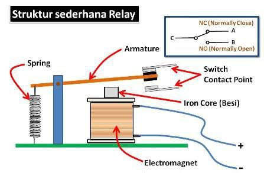
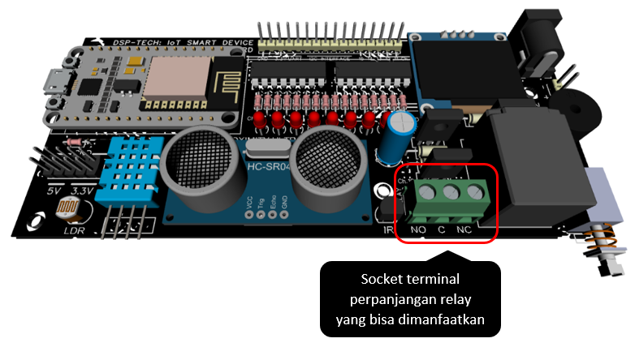
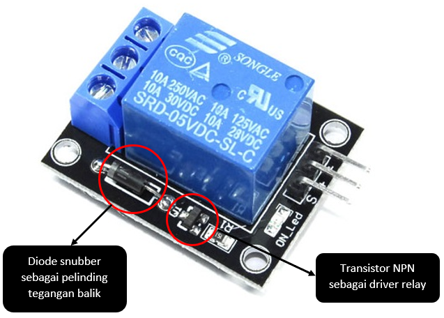
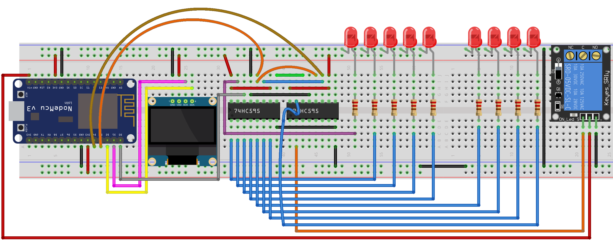
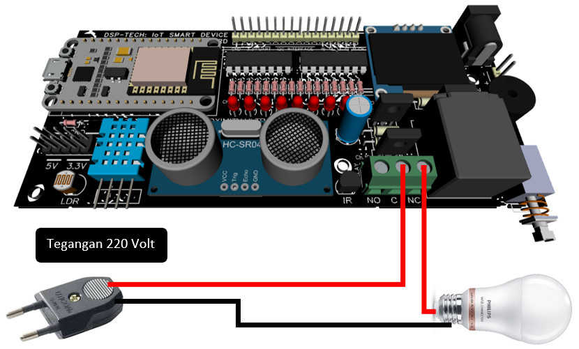

# Projek Aktuator Saklar Elektrik \(Relay\)

### Dasar Teori

#### **Pengertian Relay**

Relay merupakan komponen elektronika berupa saklar atau switch elektrik yang dioperasikan secara listrik dan terdiri dari 2 bagian utama yaitu Elektromagnet \(coil\) dan mekanikal \(seperangkat kontak Saklar/Switch\). Komponen elektronika ini menggunakan prinsip elektromagnetik untuk menggerakan saklar sehingga dengan arus listrik yang kecil \(low power\) dapat menghantarkan listrik yang bertegangan lebih tinggi. Berikut adalah simbol dari komponen relay.


#### Fungsi Relay 

Relay berfungsi sebagai saklar elektrik, namun jika diaplikasikan dalam rangkaian elektronika, relay memiliki beberapa fungsi yang cukup unik. Berikut beberapa fungsi saat di aplikasikan ke sebuah rangkaian elektronika.  

* Mengendalikan sirkuit tegangan tinggi dengan menggunakan bantuan signal tegangan rendah.
* Menjalankan logic function atau fungsi logika.
* Memberikan time delay function atau fungsi penundaan waktu. 
* Melindungi motor atau komponen lainnya dari korsleting atau kelebihan tegangan.

#### Cara Kerja Relay 

Setelah mengetahui pengertian serta fungsi dari relay, anda juga harus mengetahui cara kerja atau prinsip kerja dari relay. Namun sebelumnya anda perlu mengetahui bahwa pada sebuah relay terdapat 4 bagian penting yaitu electromagnet \(coil\), Armature, Switch Contact Point \(saklar\) dan spring. Untuk lebih jelasnya silahkan lihat gambar di bawah ini.



Kontak point relay terdiri dari 2 jenis yaitu:

* Normally Close \(NC\) yaitu kondisi awal sebelum diaktifkan akan selalu berada pada posisi close \(tertutup\). 
* Normally Open \(NO\) yaitu kondisi awal sebelum diaktifkan akan selalu berapa pada posisi open \(terbuka\). 

Berdasarkan gambar diatas, iron core\(besi\) yang dililitkan oleh kumparan coil berfungsi untuk mengendalikan iron core tersebut. Ketika kumparan coil di berikan arus listrik, maka akan timbul gaya elektromagnet sehingga akan menarik Armature berpindah posisi yang awalnya NC \(tertutup\) ke posisi NO \(terbuka\) sehingga menjadi saklar yang dapat menghantarkan arus listrik di posisi NO. Posisi Armature yang tadinya dalam kondisi CLOSE akan menjadi OPEN atau terhubung. Armature akan kembali keposisi CLOSE saat tidak dialiri listrik. Coil yang digunakan untuk menarik Contact Point ke posisi CLOSE umunnya hanyak membutuhkan arus llistrik yang relatif kecil. 

Rangkaian dasar kontrol relay:


### Tujuan

Projek bertujuan untuk mengaktifkan atau menonaktifkan relay, dengan cara mengirimkan signal kontrol bernilai HIGH atau LOW. Pada IoT Development board, signal kontrol memanfaatkan shift register yang beralamat chanel 10. 

Tugas utama program adalah: 

* Mengaktifkan relay sekaligus menghidupkan semua LED. 
* Menonaktifkan relay sekaligus mematikan semua LED. 
* Perubahan status \(Aktif / Non Aktif\) relay ditampilkan pada OLED.
* Setiap transisi pergantian status ditunda selama 2 detik. 
* Jika projek berhasil, maka relay akan berbunyi ‘_**cetak-cetik**_’ yang menandakan relay bekerja. 
* Anda dapat memanfaatkan socket terminal sebagai perpanjangan pin relay untuk dimanfaatkan sebagai saklar.



> Anda dapat mengembangkannya untuk keperluan lain, misalnya mengaktifkan atau menonaktifkan relay aktif berdasarkan input dari sensor.

### Rancangan

Di sini kita menggunakan relay dengan tegangan DC 5volt yang di drive oleh transistor NPN BD139. Tegangan diambil dari VIn microcontroller NodeMCU yang berasal dari tegangan kabel data MicroUSB Laptop.






### Kode Program

```c
/*-----------------------------------------------
  IoT Smart Device Development Board
  by Dodit Suprianto | DSP-TECH

  Projek: Projek Aktuator Saklar Elektrik (Relay)

  Library:
  https://github.com/Simsso/ShiftRegister74HC595
  https://github.com/adafruit/Adafruit_SSD1306
  https://github.com/adafruit/Adafruit-GFX-Library
  -----------------------------------------------*/

/*-------------------------------------
  Menambahkan library yang diperlukan
  -------------------------------------*/
// library shift register 74HC595
#include <ShiftRegister74HC595.h>

// library OLED
#include <Adafruit_GFX.h>
#include <Adafruit_SSD1306.h>
#include <Wire.h>

/*-------------------------------
  Alamat Kanal Shift Register:
  -------------------------------
  Kanal  0 = LED 1
  Kanal  1 = LED 2
  Kanal  2 = LED 3
  Kanal  3 = LED 4
  Kanal  4 = LED 5
  Kanal  5 = LED 6
  Kanal  6 = LED 7
  Kanal  7 = LED 8
  Kanal  8 = LED 9
  Kanal  9 = Buzz Piezo Speaker
  Kanal 10 = Relay
  Kanal 11 - 15 = Kanal expansi
  -------------------------------*/
// pin relay shift register
#define pinRelay      10

/*------------------------------
  Pin Microcontroller NodeMCU
  ------------------------------*/
#define pinData       16 // pin D0
#define pinClock       2 // pin D4
#define pinLatch       0 // pin D3

/*------------------------------
  Inisialisasi instance/object &
  Deklarasi varibale global
  -------------------------------*/
// Konstruktor instance Shift register
ShiftRegister74HC595<2> srChannel(pinData, pinClock, pinLatch);

// Konstruktor instance OLED 0.96"
Adafruit_SSD1306 display(128, 64, &Wire, -1);

// Status LED pertama adalah False
boolean statusRelay = false;

void setup() {
  /*----------------------------------------------------
    Mengatur baudrate serial MCU.
    Baurate disesuaikan dengan baudrate serial monitor)
    ----------------------------------------------------*/
  Serial.begin(115200);
  Wire.begin();

  /*---------------------------------------------
    Set seluruh kanal shift register menjadi OFF
    ---------------------------------------------*/
  srChannel.setAllLow();

  /*-------------------
    Inisialisasi OLED
    -------------------*/
  display.begin(SSD1306_SWITCHCAPVCC, 0x3C);  
  display.setTextSize(1);
  display.setTextColor(WHITE);  
  display.clearDisplay();

  /*-----------------------------------
    Menampilkan pesan OLED pertamakali
    ------------------------------------*/
  display.setCursor(0, 0);
  display.println("Selamat datang...");
  display.setCursor(0, 12);
  display.println("Projek Relay");
  display.setCursor(0, 24);
  display.println("Aktif / Non Aktif");

  // menampilkan pesan string ke OLED
  display.display();

  // tunda tampilan selama 3 detik
  delay(3000);
}

void loop() {
  HidupMatiSemuaLED();
  statusOLED();
}

/*----------------------------------
  Menampilkan status Relay AKTIF /
  NON AKTIF pada layar OLED
  ---------------------------------*/
void statusOLED() {
  display.clearDisplay();
  display.setTextSize(1);
  if (statusRelay == true) {
    display.setCursor(0, 0);
    display.println("Status Relay:");

    display.setTextSize(2);
    display.setCursor(0, 22);
    display.println("AKTIF");
  } else {
    display.setCursor(0, 0);
    display.println("Status Relay:");
    
    display.setTextSize(2);
    display.setCursor(0, 22);
    display.println("NON AKTIF");
  }
  display.display();
}

/*--------------------------------------
  Mematikan atau menghidupkan semua LED
  Menagkatifkan / menonaktifkan relay
  --------------------------------------*/
void HidupMatiSemuaLED() {
  if (statusRelay == true) {
    // Set channel shift register 0-8
    // atau LED 0 - LED 8 menjadi HIGH
    for (uint8_t i = 0; i <= 8; i++) {
      // semua LED hidup
      srChannel.set(i, HIGH);
    }

    // Relay aktif
    srChannel.set(pinRelay, HIGH);

    // ubah status led false
    statusRelay = false;
  } else {
    // Set channel shift register 0-8
    // atau LED 0 - LED 8 menjadi OFF
    for (uint8_t i = 0; i <= 8; i++) {
      // semua LED mati
      srChannel.set(i, LOW);
    }

    // Relay non aktif
    srChannel.set(pinRelay, LOW);

    // ubah status led true
    statusRelay = true;
  }

  // tunda 2 detik untuk setiap transisi
  delay (2000);
}
```

Source Code: [https://github.com/doditsuprianto/IoT-Development-Board-DSP-TECH/blob/main/Projek\_Aktuator\_Saklar\_Elektrik\_\_Relay\_.ino](https://github.com/doditsuprianto/IoT-Development-Board-DSP-TECH/blob/main/Projek_Aktuator_Saklar_Elektrik__Relay_.ino)

### Video Projek



### Tugas

* Tambahkan rangkaian berikut dan perhatikan apa yang terjadi?
* Jelaskan bagaimana pemahamanmu tentang fungsi relay?



> **Note**. Tugas ini sangat berbahaya karena menggunakan tegangan tinggi 220 volt. Bila terjadi kesalahan akan menyebabkan kerusakan alat dan membahayakan operator. Jadi berhati-hatilah

