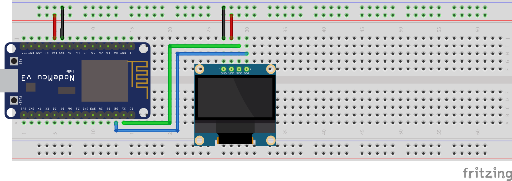
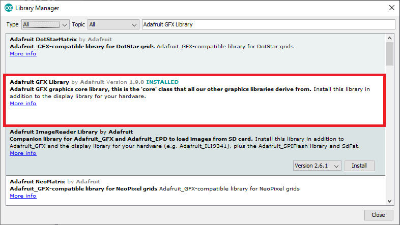
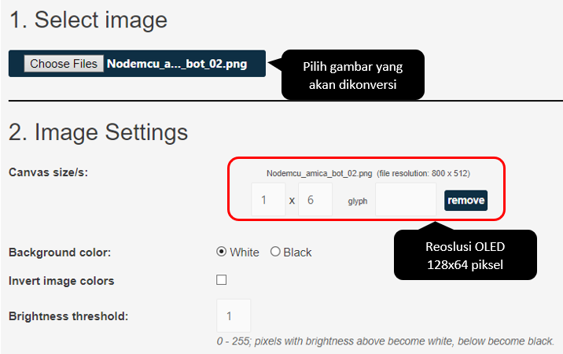
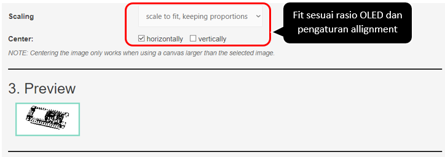
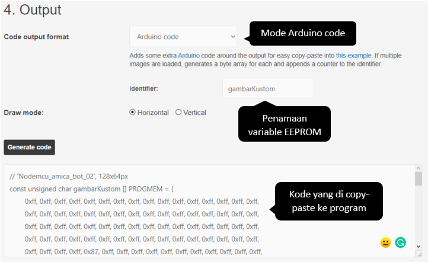

# Projek Layar OLED

### Dasar Teori

OLED \(Organic Light-Emitting Diode\) atau diode cahaya organik adalah sebuah semikonduktor sebagai pemancar cahaya yang terbuat dari lapisan organik. OLED digunakan dalam teknologi elektroluminensi, seperti pada aplikasi tampilan layar. Teknologi ini terkenal fleksibel karena ketipisannya. Berbagai jenis produk OLED dapat diimplementasikan pada Arduino dengan resolusi berbeda-beda. Pada umumnya OLED menggunakan antarmuka/interface I2C seperti tampak pada gambar di bawah ini.


Pada IoT Development Board kita menggunakan OLED 0.96” dengan ukuran 128x64 piksel. Posisi koordinat x dan y dihitung dari pojok kiri atas. Penentuan lokasi x, y dimulai dari index ke-0. Sehingga lebar OLED dimulai dari 0 - 127 pixel, sedangkan tingginya dimulai dari 0 – 63 piksel. Gambar berikut merupakan referensi ukuran dan posisi koordinat OLED 0.96”


### Tujuan

Bagaimana memahami pengoperasian OLED 0.96” sebagai media output microcontroller. Mampu untuk menginisialisasi konstruktor objek OLED untuk digunakan lebih lanjut, menentukan koordinat \(x, y\) string, menggambar image bitmap, menggambar objek \(garis, lingkaran, segitiga, dll\).

### Rancangan

Ingat antarmuka komunikasi I2C menggunakan pin SCL dan SDA. Dalam hal ini pin D2 \(GPIO5\) dan pin D3\(GPIO4\), seperti tampak gambar berikut


Secara keseluruhan rancangan pengkabelannya tampak seperti berikut ini:



### Kode Program

Program membutuhkan dua library tambahan untuk mengoperasikan OLED, yaitu: 

* Library Adafruit-GFX-Library yang dapat didownload di [https://github.com/adafruit/Adafruit-GFX-Library](https://github.com/adafruit/Adafruit-GFX-Library) 
* Library Adafruit\_SSD1306 yang dapat didownload di [https://github.com/adafruit/Adafruit\_SSD1306](https://github.com/adafruit/Adafruit_SSD1306) 

Adapun teknik instalasi library serupa dengan projek pertama. Silahkan cek di halaman [https://doditsuprianto.gitbook.io/internet-of-things/membangun-aplikasi-microcontroller-dengan-nodemcu/projek-pergerakkan-led\#kode-program](https://doditsuprianto.gitbook.io/internet-of-things/membangun-aplikasi-microcontroller-dengan-nodemcu/projek-pergerakkan-led#kode-program). 

Berikut daftar library bila instalasi library dilakukan secara online, buka menu **Sketch &gt; Include Library &gt; Manage Libraries**:




```c
/*-----------------------------------------------
  IoT Smart Device Development Board
  by Dodit Suprianto | DSP-TECH

  Projek: Layar OLED

  Library:
  1. https://github.com/Simsso/ShiftRegister74HC595
  2. https://github.com/adafruit/Adafruit-GFX-Library
  3. https://github.com/adafruit/Adafruit_SSD1306
  -----------------------------------------------*/

/*-------------------------------------
  Menambahkan library yang diperlukan
  -------------------------------------*/
#include <ShiftRegister74HC595.h>   // library shift register 74HC595
#include <Adafruit_GFX.h>           // library OLED
#include <Adafruit_SSD1306.h>       // library OLED Font
#include <Wire.h>

/*----------------------------------
  Pin Shift Register yan gterhubung
  ke Microcontroller NodeMCU
  ----------------------------------*/
#define pinData       16 // pin D0
#define pinClock       2 // pin D4
#define pinLatch       0 // pin D3

/*------------------------------
  Inisialisasi instance/object &
  Deklarasi varibale global
  -------------------------------*/

// Konstruktor instance Shift register
ShiftRegister74HC595<2> srChannel(pinData, pinClock, pinLatch);

// Konstruktor instance OLED 0.96"
// 128 pixel x 64 pixel
// -1 adalah pin reset default
Adafruit_SSD1306 display(128, 64, &Wire, -1);

#define NUMFLAKES     10 // Number of snowflakes in the animation example

#define LOGO_HEIGHT   16
#define LOGO_WIDTH    16

// konversi image ke biner
// gambar snowflake yang disimpan dalam PROGMEM
// gambar biner diberi nama logo_bmp
static const unsigned char PROGMEM logo_bmp[] =
{ B00000000, B11000000,
  B00000001, B11000000,
  B00000001, B11000000,
  B00000011, B11100000,
  B11110011, B11100000,
  B11111110, B11111000,
  B01111110, B11111111,
  B00110011, B10011111,
  B00011111, B11111100,
  B00001101, B01110000,
  B00011011, B10100000,
  B00111111, B11100000,
  B00111111, B11110000,
  B01111100, B11110000,
  B01110000, B01110000,
  B00000000, B00110000
};

void setup() {
  /*----------------------------------------------------
    Mengatur baudrate serial MCU.
    Baurate disesuaikan dengan baudrate serial monitor)
    ----------------------------------------------------*/
  Serial.begin(115200);
  Wire.begin();

  /*---------------------------------------------
    Set seluruh kanal shift register menjadi OFF
    agar tidak mengganggu kinerja lainnya
    ---------------------------------------------*/
  srChannel.setAllLow();

  /*-------------------
    Inisialisasi OLED
    -------------------*/
  // konstuktor awal OLED
  display.begin(SSD1306_SWITCHCAPVCC, 0x3C);
  // membersihkan buffer layar dari tampilan sebelumnya
  display.clearDisplay();
  // OLED ready
  display.display();
  delay(2000);

  // mengatur ukuran font default
  display.setTextSize(1);
  // menentukan warna font
  display.setTextColor(WHITE);
  display.clearDisplay();

  // menentukan koordinat kursor di x=0, y=0 (top, left)
  display.setCursor(0, 0);
  // menulis string "Selamat Datang..."
  display.println("Selamat Datang...");

  // menentukan koordinat kursor di x=0, y=13
  display.setCursor(0, 13);
  // menulis string "Projek Layar OLED"
  display.println("Projek Layar OLED");

  // tampilkan semuanya
  display.display();

  delay(5000); // tunda selama 5 detik

  testdrawline();      // Menggambar banyak garis
  testdrawrect();      // Menggambar kotak (outlines)
  testfillrect();      // Menggambar kotak (filled)
  testdrawcircle();    // Menggambar lingkaran (outlines)
  testfillcircle();    // Menggambar lingkaran (filled)
  testdrawroundrect(); // Menggambar kotak rounded (outlines)
  testfillroundrect(); // menggambar kotak rounded (filled)
  testdrawtriangle();  // Menggambar segitiga (outlines)
  testfilltriangle();  // Menggambar segitiga (filled)
  testdrawchar();      // Menggambar characters dari font default
  testdrawstyles();    // Menggambar 'stylized' characters
  testscrolltext();    // Menggambar scrolling text
  testdrawbitmap();    // Menggambar bitmap image kecil

  // Membalik dan me-restore tampilan,
  // mengehentikan sesaat diantara keduanya
  display.invertDisplay(true);
  delay(1000);
  display.invertDisplay(false);
  delay(1000);
  
  // Animasi bitmaps
  testanimate(logo_bmp, LOGO_WIDTH, LOGO_HEIGHT);
}

void loop() {

}

void testdrawline() {
  int16_t i;

  display.clearDisplay(); // Clear display buffer

  for (i = 0; i < display.width(); i += 4) {
    display.drawLine(0, 0, i, display.height() - 1, SSD1306_WHITE);
    display.display(); // Update screen with each newly-drawn line
    delay(1);
  }
  for (i = 0; i < display.height(); i += 4) {
    display.drawLine(0, 0, display.width() - 1, i, SSD1306_WHITE);
    display.display();
    delay(1);
  }
  delay(250);

  display.clearDisplay();

  for (i = 0; i < display.width(); i += 4) {
    display.drawLine(0, display.height() - 1, i, 0, SSD1306_WHITE);
    display.display();
    delay(1);
  }
  for (i = display.height() - 1; i >= 0; i -= 4) {
    display.drawLine(0, display.height() - 1, display.width() - 1, i, SSD1306_WHITE);
    display.display();
    delay(1);
  }
  delay(250);

  display.clearDisplay();

  for (i = display.width() - 1; i >= 0; i -= 4) {
    display.drawLine(display.width() - 1, display.height() - 1, i, 0, SSD1306_WHITE);
    display.display();
    delay(1);
  }
  for (i = display.height() - 1; i >= 0; i -= 4) {
    display.drawLine(display.width() - 1, display.height() - 1, 0, i, SSD1306_WHITE);
    display.display();
    delay(1);
  }
  delay(250);

  display.clearDisplay();

  for (i = 0; i < display.height(); i += 4) {
    display.drawLine(display.width() - 1, 0, 0, i, SSD1306_WHITE);
    display.display();
    delay(1);
  }
  for (i = 0; i < display.width(); i += 4) {
    display.drawLine(display.width() - 1, 0, i, display.height() - 1, SSD1306_WHITE);
    display.display();
    delay(1);
  }

  delay(2000); // Pause for 2 seconds
}

void testdrawrect(void) {
  display.clearDisplay();

  for (int16_t i = 0; i < display.height() / 2; i += 2) {
    display.drawRect(i, i, display.width() - 2 * i, display.height() - 2 * i, SSD1306_WHITE);
    display.display(); // Update screen with each newly-drawn rectangle
    delay(1);
  }

  delay(2000);
}

void testfillrect(void) {
  display.clearDisplay();

  for (int16_t i = 0; i < display.height() / 2; i += 3) {
    // The INVERSE color is used so rectangles alternate white/black
    display.fillRect(i, i, display.width() - i * 2, display.height() - i * 2, SSD1306_INVERSE);
    display.display(); // Update screen with each newly-drawn rectangle
    delay(1);
  }

  delay(2000);
}

void testdrawcircle(void) {
  display.clearDisplay();

  for (int16_t i = 0; i < max(display.width(), display.height()) / 2; i += 2) {
    display.drawCircle(display.width() / 2, display.height() / 2, i, SSD1306_WHITE);
    display.display();
    delay(1);
  }

  delay(2000);
}

void testfillcircle(void) {
  display.clearDisplay();

  for (int16_t i = max(display.width(), display.height()) / 2; i > 0; i -= 3) {
    // The INVERSE color is used so circles alternate white/black
    display.fillCircle(display.width() / 2, display.height() / 2, i, SSD1306_INVERSE);
    display.display(); // Update screen with each newly-drawn circle
    delay(1);
  }

  delay(2000);
}

void testdrawroundrect(void) {
  display.clearDisplay();

  for (int16_t i = 0; i < display.height() / 2 - 2; i += 2) {
    display.drawRoundRect(i, i, display.width() - 2 * i, display.height() - 2 * i,
                          display.height() / 4, SSD1306_WHITE);
    display.display();
    delay(1);
  }

  delay(2000);
}

void testfillroundrect(void) {
  display.clearDisplay();

  for (int16_t i = 0; i < display.height() / 2 - 2; i += 2) {
    // The INVERSE color is used so round-rects alternate white/black
    display.fillRoundRect(i, i, display.width() - 2 * i, display.height() - 2 * i,
                          display.height() / 4, SSD1306_INVERSE);
    display.display();
    delay(1);
  }

  delay(2000);
}

void testdrawtriangle(void) {
  display.clearDisplay();

  for (int16_t i = 0; i < max(display.width(), display.height()) / 2; i += 5) {
    display.drawTriangle(
      display.width() / 2  , display.height() / 2 - i,
      display.width() / 2 - i, display.height() / 2 + i,
      display.width() / 2 + i, display.height() / 2 + i, SSD1306_WHITE);
    display.display();
    delay(1);
  }

  delay(2000);
}

void testfilltriangle(void) {
  display.clearDisplay();

  for (int16_t i = max(display.width(), display.height()) / 2; i > 0; i -= 5) {
    // The INVERSE color is used so triangles alternate white/black
    display.fillTriangle(
      display.width() / 2  , display.height() / 2 - i,
      display.width() / 2 - i, display.height() / 2 + i,
      display.width() / 2 + i, display.height() / 2 + i, SSD1306_INVERSE);
    display.display();
    delay(1);
  }

  delay(2000);
}

void testdrawchar(void) {
  display.clearDisplay();

  display.setTextSize(1);      // Normal 1:1 pixel scale
  display.setTextColor(SSD1306_WHITE); // Draw white text
  display.setCursor(0, 0);     // Start at top-left corner
  display.cp437(true);         // Use full 256 char 'Code Page 437' font

  // Not all the characters will fit on the display. This is normal.
  // Library will draw what it can and the rest will be clipped.
  for (int16_t i = 0; i < 256; i++) {
    if (i == '\n') display.write(' ');
    else          display.write(i);
  }

  display.display();
  delay(2000);
}

void testdrawstyles(void) {
  display.clearDisplay();

  display.setTextSize(1);             // Normal 1:1 pixel scale
  display.setTextColor(SSD1306_WHITE);        // Draw white text
  display.setCursor(0, 0);            // Start at top-left corner
  display.println(F("Hello, world!"));

  display.setTextColor(SSD1306_BLACK, SSD1306_WHITE); // Draw 'inverse' text
  display.println(3.141592);

  display.setTextSize(2);             // Draw 2X-scale text
  display.setTextColor(SSD1306_WHITE);
  display.print(F("0x")); display.println(0xDEADBEEF, HEX);

  display.display();
  delay(2000);
}

void testscrolltext(void) {
  display.clearDisplay();

  display.setTextSize(2); // Draw 2X-scale text
  display.setTextColor(SSD1306_WHITE);
  display.setCursor(10, 0);
  display.println(F("scroll"));
  display.display();      // Show initial text
  delay(100);

  // Scroll in various directions, pausing in-between:
  display.startscrollright(0x00, 0x0F);
  delay(2000);
  display.stopscroll();
  delay(1000);
  display.startscrollleft(0x00, 0x0F);
  delay(2000);
  display.stopscroll();
  delay(1000);
  display.startscrolldiagright(0x00, 0x07);
  delay(2000);
  display.startscrolldiagleft(0x00, 0x07);
  delay(2000);
  display.stopscroll();
  delay(1000);
}

void testdrawbitmap(void) {
  display.clearDisplay();

  display.drawBitmap(
    (display.width()  - LOGO_WIDTH ) / 2,
    (display.height() - LOGO_HEIGHT) / 2,
    logo_bmp, LOGO_WIDTH, LOGO_HEIGHT, 1);
  display.display();
  delay(1000);
}

#define XPOS   0 // Indexes into the 'icons' array in function below
#define YPOS   1
#define DELTAY 2

void testanimate(const uint8_t *bitmap, uint8_t w, uint8_t h) {
  int8_t f, icons[NUMFLAKES][3];

  // Initialize 'snowflake' positions
  for (f = 0; f < NUMFLAKES; f++) {
    icons[f][XPOS]   = random(1 - LOGO_WIDTH, display.width());
    icons[f][YPOS]   = -LOGO_HEIGHT;
    icons[f][DELTAY] = random(1, 6);
    Serial.print(F("x: "));
    Serial.print(icons[f][XPOS], DEC);
    Serial.print(F(" y: "));
    Serial.print(icons[f][YPOS], DEC);
    Serial.print(F(" dy: "));
    Serial.println(icons[f][DELTAY], DEC);
  }

  for (;;) { // Loop forever...
    display.clearDisplay(); // Clear the display buffer

    // Draw each snowflake:
    for (f = 0; f < NUMFLAKES; f++) {
      display.drawBitmap(icons[f][XPOS], icons[f][YPOS], bitmap, w, h, SSD1306_WHITE);
    }

    display.display(); // Show the display buffer on the screen
    delay(200);        // Pause for 1/10 second

    // Then update coordinates of each flake...
    for (f = 0; f < NUMFLAKES; f++) {
      icons[f][YPOS] += icons[f][DELTAY];
      // If snowflake is off the bottom of the screen...
      if (icons[f][YPOS] >= display.height()) {
        // Reinitialize to a random position, just off the top
        icons[f][XPOS]   = random(1 - LOGO_WIDTH, display.width());
        icons[f][YPOS]   = -LOGO_HEIGHT;
        icons[f][DELTAY] = random(1, 6);
      }
    }
  }
}
```

**Source Code**: [https://github.com/doditsuprianto/IoT-Development-Board-DSP-TECH/blob/main/Projek\_Layar\_OLED.ino](https://github.com/doditsuprianto/IoT-Development-Board-DSP-TECH/blob/main/Projek_Layar_OLED.ino)

### Video Projek





### Tugas

* Buat/ambil image dengan format bebas \(PNG, BMP, JPG, dll\), dengan resolusi serupa dengan OLED 0.96".
* Lakukan konversi dari image tersebut menjadi biner menggunakan aplikasi image2cpp di  web [https://diyusthad.com/image2cpp](https://diyusthad.com/image2cpp).
* Restore image dan lakukan penyesuaian .







* Copy-pastekan kode binernya ke alokasi memori EEPROM, seperti yang dicontohkan pada program sebelumnya.

```c
static const unsigned char PROGMEM gambarKustom[] =
{ 
	// Kode biner konversi dari image ke biner
};
```

* Loading gambar biner ke program dengan perintah 

```c
display.drawBitmap(0, 0, gambarKustom, 128, 64, WHITE);
```

