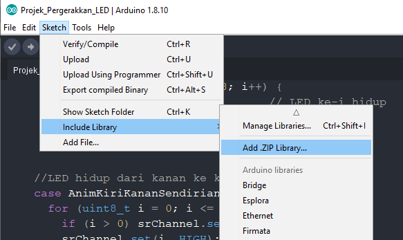

# Projek Pergerakkan LED

### Dasar Teori

#### LED \(Light Emitting Diode\)

LED \(_Light Emiting Diode_\) banyak digunakan sebagai indikator berlangsungnya proses, awal proses atau berakhirnya proses pada sistem _microcontroller_, sehingga pengguna dapat mengetahui proses yang sedang terjadi. LED memiliki polaritas plus dan minus, biasanya posisi plus tegangan ditandai dengan kaki yang lebih panjang dari yang lainnya, seperti tampak gambar di bawah ini


#### Shift Register

Seperti dijelaskan pada bagian sebelumnya. Karena keterbatasan pin NodeMCU untuk mengendalikan banyak output maka kontrol rangkaian LED melalui 2 buah IC shift registry. IC 74HC595 adalah komponen yang berfungsi untuk melakukan perubahan sinyal digital dari bentuk serial menjadi output paralel sebanyak 8 buah. IC ini sering digunakan sebagai ekspansi pin dari mikrokontroller yang memiliki pin output sedikit. Hal ini sangat menguntungkan jika anda ingin mengontrol 40 buah lampu dengan mikrokontroller yang hanya memiliki pin kurang dari itu.

Sederhananya, IC 74HC595 menerima input berupa serial yang membutuhkan 3 pin saja dan memprosesnya menjadi 8 output. Namun kita juga bisa menambahkan sejumlah IC 74HC595 secara seri sehingga kita memiliki output kelipatan 8. Misal kita berikan 3 IC maka output berjumlah 24.

Ingat pada IC ini, kita beroperasi pada listrik searah \(DC\) dan menggunakan sinyal digital. adapun penyebutan sinyal digital adalah 0 untuk mati dan 1 untuk hidup. 1 buah IC 74HC595 memberikan output sejumlah 8, oleh karena itu terdapat 8bit data output dengan masing masing adalah 1 ataupun 0.

#### Detail pinout IC 74HC595:


#### Penjelasan pin IC 74HC595: 

* VCC : Suplai tegangan + dengan tegangan 5V/3.3V 
* GND : Suplai tegangan GND 
* Q0-Q7 : Pin output dari IC 74HC595, berjumlah 8 dan dimulai dari Q0
* SRCLR/MR : untuk mengosongkan deretan output menjadi 0 \(bersifat Active Low sehingga deretan output menjadi 0 jika diberikan tegangan GND/0\)
* OE : \(Output Enable\) berfungsi untuk mematikan menghidupkan / mengaktifkan pin output \(bersifat Active Low maka jika diberikan tegangan GND pin output tetap hidup\)
* DATA/DS/SER : adalah pin data masukan untuk menentukan bit pin output.
* SRCLK/SHCP : berfungsi untuk memasukkan bit berdasarkan bit pin data.
* RCLK/STCP : berfungsi untuk mengeluarkan deretan kondisi tersebut pada pin output.

#### Alur kerja 2 fase ekseksusi didalam IC 74HC595, yaitu :

* Pemasukkan bit output
  * Yang bertugas memasukkan bit adalah pin Data dan SRCLK/SHCP 
  * Pertama pin data diberikan sinyal 0 atau 1 \(tergantung keinginan pengguna\) 
  * Kemudian pin SRCLK diberikan sinyal 1. 
  * Disaat SRCLK menerima sinyal 1 \(Hidup\), 1 bit data bernilai sinyal yang berdasarkan pin data disimpan. 
  * misalnya pin data diberikan 1 maka 1 bit data bernilai 1 tersimpan. bit tersebut tersimpan tapi belum dikeluarkan ke pin output. 
  * Terakhir kedua pin tersebut dimatikan. 
  * kemudian langkah diatas diulangi lagi untuk memasukkan bit kedua dst.
* Pengeluaran bit output ke pin output
  * pin RCLK/STCP diberikan sinyal 1, maka bit bit yang tersimpan dikeluarkan ke pin output. 
  * Misalkan bit tersimpan adalah : 0 1 maka pin Q0 tidak ada tegangan \(0\), sementara Q1 ada tegangan \(1\) 
  * pin RCLK dimatikan, Output tetap pada kondisi masing-masing.

Anda bisa berikan beban apapun pada pin keluaran 74HC595, seperti lampu LED untuk menandakan bahwa pin tersebut memiliki kondisi 1 atau 0.

> Catatan: Anda tidak perlu pusing tentang masalah shift register. Pada implementasi program akan digunakan library yang menangani hal ini. Kita cukup mengetahi bagaimana cara penggunaan shift register dalam implementasi programnya.

### Tujuan

Projek bertujuan untuk mengendalikan 9 LED, kapan hidup dan kapan mati. Dengan memainkan waktu tunda dan mengubah urutan LED aktif/mati akan menjadikan rangkaian LED tersebut seolah-olah membentuk animasi. Kontrol LED hanya dalam dua kondisi yaitu HIGH atau LOW \(hidup atau mati\).

### Rancangan


### Kode Program

Program membutuhkan library ShiftRegister74HC595 untuk memudahkan kita mengelola IC 74HC595. Instalasi library dalam IDE Arduino dapat dilakukasn dengan cara berikut: 

* Download library di [https://github.com/Simsso/ShiftRegister74HC595](https://github.com/Simsso/ShiftRegister74HC595). Kemudian file **ShiftRegister74HC595-master.zip** diinstal melalui menu **Sketch &gt; Include Library &gt; Add .ZIP library**.



* Cara lain, library ShiftRegister74HC595 dapat diinstall secara online. Buka menu **Sketch &gt; Inlcude Library &gt; Manage Libraries**. Dari textbox tuliskan kata kunci pencarian “ShiftRegister74HC595”. Dari daftar library pilih library yang dibuat oleh Timo Denk, kemudian tekan tombol **Install**.


> **Catatan**. Cara intalasi library di atas berlaku sama untuk setiap penambahan library baru ke dalam IDE Arduino untuk projek-projek berikutnya.

```c
/*-----------------------------------------------
  IoT Smart Device Development Board
  by Dodit Suprianto | DSP-TECH

  Projek: Pergerakkan LED

  Library:
  https://github.com/Simsso/ShiftRegister74HC595
  -----------------------------------------------*/

/*-------------------------------------
  Menambahkan library yang diperlukan
  -------------------------------------*/
#include <ShiftRegister74HC595.h>   // library shift register 74HC595

/*-------------------------------
  Alamat Kanal Shift Register:
  -------------------------------
  Kanal  0 = LED 1
  Kanal  1 = LED 2
  Kanal  2 = LED 3
  Kanal  3 = LED 4
  Kanal  4 = LED 5
  Kanal  5 = LED 6
  Kanal  6 = LED 7
  Kanal  7 = LED 8
  Kanal  8 = LED 9
  Kanal  9 = Buzz Piezo Speaker
  Kanal 10 = Relay
  Kanal 11 - 15 = Kanal expansi
  -------------------------------*/

/*------------------------------
  Pin Microcontroller NodeMCU
  ------------------------------*/
#define pinData       16 // pin D0
#define pinClock       2 // pin D4
#define pinLatch       0 // pin D3

/*------------------------------
  Inisialisasi instance/object &
  Deklarasi varibale global
  -------------------------------*/
// Konstruktor instance Shift register
ShiftRegister74HC595<2> srChannel(pinData, pinClock, pinLatch);

/*-----------------------------------
  Mode Running LED dengan type enum
  -----------------------------------*/
typedef enum {
  AnimKiriKanan,
  AnimKiriKananSendirian,
  AnimTengahSamping,
  AnimSampingTengah
} animLED;

void setup() {
  /*----------------------------------------------------
    Mengatur baudrate serial MCU.
    Baurate disesuaikan dengan baudrate serial monitor)
    ----------------------------------------------------*/
  Serial.begin(115200);

  /*---------------------------------------------
    Set seluruh kanal shift register menjadi OFF
    ---------------------------------------------*/
  srChannel.setAllLow();
}

void loop() {
  Serial.println("Animasi LED dari kiri ke kanan");
  runningLED(AnimKiriKanan, 100);
  delay(1000);

  Serial.println("Animasi LED dari kiri ke kanan satu per satu");
  runningLED(AnimKiriKananSendirian, 100);
  delay(1000);

  Serial.println("Animasi LED dari tengah ke samping");
  runningLED(AnimTengahSamping, 100);
  delay(1000);

  Serial.println("Animasi LED dari samping ke tengah");
  runningLED(AnimSampingTengah, 100);
  delay(1000);
}

/*----------------------
  Function Running LED
  -----------------------*/
void runningLED(animLED al, int tunda) {
  MematikanSemuaLED();
  switch (al) {
    //LED hidup dari kiri ke kanan
    case AnimKiriKanan:
      for (uint8_t i = 0; i <= 8; i++) {
        srChannel.set(i, HIGH);       // LED ke-i hidup
        delay(tunda);                 // tuda 100 ms
      }
      break;

    //LED hidup dari kanan ke kiri
    case AnimKiriKananSendirian:
      for (uint8_t i = 0; i <= 8; i++) {
        if (i > 0) srChannel.set(i - 1, LOW);
        srChannel.set(i, HIGH);
        delay(tunda);
      }
      break;

    case AnimTengahSamping:
      srChannel.set(4, HIGH);
      delay(tunda);

      srChannel.set(3, HIGH);
      srChannel.set(5, HIGH);
      delay(tunda);

      srChannel.set(2, HIGH);
      srChannel.set(6, HIGH);
      delay(tunda);

      srChannel.set(1, HIGH);
      srChannel.set(7, HIGH);
      delay(tunda);

      srChannel.set(0, HIGH);
      srChannel.set(8, HIGH);
      delay(tunda);
      break;

    //LED hidup dari samping ke tengah
    case AnimSampingTengah:
      srChannel.set(0, HIGH);
      srChannel.set(8, HIGH);
      delay(tunda);

      srChannel.set(1, HIGH);
      srChannel.set(7, HIGH);
      delay(tunda);

      srChannel.set(2, HIGH);
      srChannel.set(6, HIGH);
      delay(tunda);

      srChannel.set(3, HIGH);
      srChannel.set(5, HIGH);
      delay(tunda);

      srChannel.set(4, HIGH);
      delay(tunda);
      break;
  }

  MematikanSemuaLED();
}

/*--------------------
  Mematikan semua LED
  ---------------------*/
void MematikanSemuaLED() {
  //Set seluruh kanal LED 0 - LED 8 menjadi OFF
  for (uint8_t i = 0; i <= 8; i++) {
    srChannel.set(i, LOW);
  }
}


```

**Source Code**: [https://github.com/doditsuprianto/IoT-Development-Board-DSP-TECH/blob/main/Projek\_Pergerakkan\_LED.ino](https://github.com/doditsuprianto/IoT-Development-Board-DSP-TECH/blob/main/Projek_Pergerakkan_LED.ino)

### Video Projek





### Tugas

* Buatlah animasi LED lain yang belum pernah dibuat sebelumya

