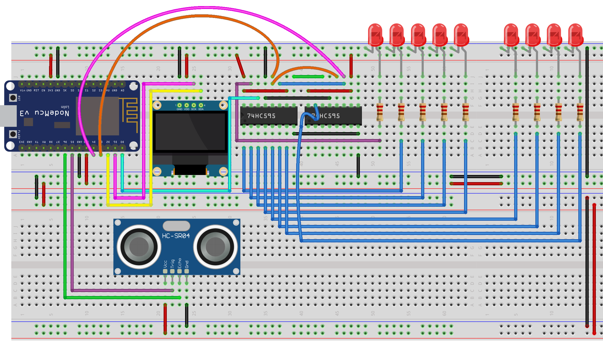
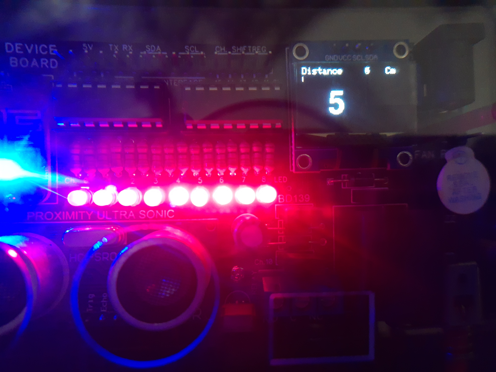

# Projek Sensor Jarak Penghalang Ultrasonic

### Dasar Teori


Sensor ultrasonic HC-SR04 bekerja dengan cara memancarkan gelombang ultrasonic pada frekwensi 40.000 Hertz yang merambat di udara. Jika ditemukan obyek penghalang dijalurnya maka gelombang tersebut akan kembali ke modul sensor ultrasonic.

Jarak sensor dan obyek penghalang dapat dihitung berdasarkan waktu tempuh dan kecepatan suara. Misalnya, jika obyek berjarak 10cm dari sensor dan kecepatan suara adalah 340m/s atau 0,034cm/μs, maka gelombang suara akan menempuh sekitar 294 μs \(mikrodetik\). Namun apa yang akan diperoleh dari pin Echo adalah dua kali lipat jumlahnya karena gelombang suara melaju ke depan dan memantul ke belakang. Jadi untuk mendapatkan jarak dalam satuan cm kita perlu mengalikan nilai waktu\(t\) perjalanan yang diterima dari pin echo sebesar 0,034 dan membaginya dengan 2.


### Tujuan

Projek yang akan dibuat bertujuan untuk:

* Menghitung berapa jarak antara sensor ultrasonic dengan benda penghalang yang berada di depannya. 
* Menampilkan jarak dalam satuan senti meter pada layar OLED. 
* Membuat gauge / progress bar dengan 9 LED, dimana semakin dekat jarak antara benda penghalang dengan sensor ultrasonic maka LED akan hidup semakin banyak dan sebaliknya.

### Rancangan



### Kode Program

Hal baru dalam projek ini adalah kita dapat mengubah font standar menjadi font lain sesuai pilihan kita. Misalnya jenis font **FreeSansBold18pt7b** atau lainnya. Untuk mengetahui library jenis-jenis font dapat dilihat dalam folder **..\Arduino\libraries\Adafruit\_GFX\_Library\Fonts**. 


Silahkan kunjungi halaman referensi font berikut [https://learn.adafruit.com/adafruit-gfx-graphics-library/using-fonts](https://learn.adafruit.com/adafruit-gfx-graphics-library/using-fonts)

```cpp
/*-----------------------------------------------
  IoT Smart Device Development Board
  by Dodit Suprianto | DSP-TECH

  Projek: Sensor Jarak Penghalang Ultrasonic

  Library:
  https://github.com/Simsso/ShiftRegister74HC595
  https://github.com/kiryanenko/SimpleTimer  
  https://github.com/adafruit/Adafruit_SSD1306
  https://github.com/adafruit/Adafruit-GFX-Library
  -----------------------------------------------*/

/*-------------------------------------
  Menambahkan library yang diperlukan
  -------------------------------------*/
// library shift register 74HC595
#include <ShiftRegister74HC595.h>

// library timer (millis)/thread
#include <SimpleTimer.h>

// library OLED & Font
#include <Adafruit_GFX.h>
#include <Adafruit_SSD1306.h>
#include <Fonts/FreeSansBold18pt7b.h>

#include <Wire.h>

/*-------------------------------
  Alamat Kanal Shift Register:
  -------------------------------
  Kanal  0 = LED 1
  Kanal  1 = LED 2
  Kanal  2 = LED 3
  Kanal  3 = LED 4
  Kanal  4 = LED 5
  Kanal  5 = LED 6
  Kanal  6 = LED 7
  Kanal  7 = LED 8
  Kanal  8 = LED 9
  Kanal  9 = Buzz Piezo Speaker
  Kanal 10 = Relay
  Kanal 11 - 15 = Kanal expansi
  -------------------------------*/

/*------------------------------
  Pin Microcontroller NodeMCU
  ------------------------------*/
// Pin Shift Register
#define pinData       16 // pin D0
#define pinClock       2 // pin D4
#define pinLatch       0 // pin D3

// Pin Sensor jarak ultrasonic HC-SR04
#define pinEcho       12 // pin D6
#define pinTrigger    14 // pin D5

/*------------------------------
  Inisialisasi instance/object &
  Deklarasi varibale global
  -------------------------------*/
// Konstruktor instance Shift register
ShiftRegister74HC595<2> srChannel(pinData, pinClock, pinLatch);

// Konstruktor instance OLED 0.96"
Adafruit_SSD1306 display(128, 64, &Wire, -1);

// Varibale simpletimer (Timer interval)
// SimpleTimer semacam thread yang membentuk session
// tanpa mengganggu session program utama
SimpleTimer TimerSR04;

void setup() {
  /*----------------------------------------------------
    Mengatur baudrate serial MCU.
    Baurate disesuaikan dengan baudrate serial monitor)
    ----------------------------------------------------*/
  Serial.begin(115200);
  Wire.begin();

  /*---------------------------------
    Mode pin sensor jarak ultrasonic
    ---------------------------------*/
  pinMode(pinTrigger, OUTPUT);
  pinMode(pinEcho, INPUT);

  /*---------------------------------------------
    Set seluruh kanal shift register menjadi OFF
    ---------------------------------------------*/
  srChannel.setAllLow();

  /*------------------------------------------
    Atur interval pembacaan sensor Ultrasonic
    interval 50 milidetik
    ------------------------------------------*/
  TimerSR04.setInterval(50);

  /*-------------------
    Inisialisasi OLED
    -------------------*/
  display.begin(SSD1306_SWITCHCAPVCC, 0x3C);
  display.setTextSize(1);
  display.setTextColor(WHITE);
  display.clearDisplay();

  /*-----------------------------------
    Menampilkan pesan OLED pertamakali
    ------------------------------------*/
  display.setCursor(0, 0);
  display.println("Selamat datang...");
  display.setCursor(0, 12);
  display.println("Projek Sensor Jarak");
  display.setCursor(0, 24);
  display.println("Ultrasonic HC-SR04");

  // menampilkan pesan string ke OLED
  display.display();

  // tunda tampilan selama 5 detik
  delay(5000);
}

void loop() {
  /*---------------------------------------
    pembacaan sensor jarak ultrasonic
    dengan interval pembacaan 50 milidetik
    ---------------------------------------*/
  if (TimerSR04.isReady()) {
    // update tampilan ke OLED setelah terjadi perubahan nilai
    updateOLED();

    // Progress bar LED
    LEDProgress();

    // timer di reset kembali ke counter 0
    TimerSR04.reset();
  }
}

/*------------------------------------------
  Fungsi menghitung jarak benda penghalang
  Dengan Sensor Ultrasonic HR-SR04
  ------------------------------------------*/
int SensorJarakUltraSonic() {

  // Membersihkan pin pinTrigger selama 2 microdetik
  digitalWrite(pinTrigger, LOW);
  delayMicroseconds(2);

  // Set pinTrigger menjadi HIGH selama 10 microdetik
  digitalWrite(pinTrigger, HIGH);
  delayMicroseconds(10);
  digitalWrite(pinTrigger, LOW);

  // Menghitng jarak berdasarkan  waktu perjalanan
  // gelombang suara dalam mikrodetik
  long Durasi = pulseIn(pinEcho, HIGH);

  // Jarak dalam satuan centimeter
  int JarakCM = Durasi * 0.034 / 2;

  // Jarak dalam satuan inch
  int JarakInch = Durasi * 0.0133 / 2;

  Serial.println("Jarak Cm=" + String(JarakCM) + " Inch=" + String(JarakInch));
  return JarakCM;
}

/*---------------------------------------
  Menampilkan data terbaru ke layar OLED
  ---------------------------------------*/
void updateOLED() {
  display.clearDisplay();
  display.setTextSize(1);
  display.setTextColor(WHITE);

  display.setCursor(0, 0);
  display.print("Distance");
  display.setCursor(75, 0);
  display.print(String(SensorJarakUltraSonic()));
  display.setCursor(100, 0);
  display.print("Cm");

  // mapping jarak menjadi gauge ke layar OLED
  // x = 0, y = 0, tinggi = 5 piksel dan
  // lebar = sesuai nilai mapping, antara 0-127 piksel
  // 450cm adalah kemampuan maksimum jarak dapat terdeteksi
  int gaugePB = map(SensorJarakUltraSonic(), 0, 450, 0, 127);
  // Menggambar kotak bar
  display.fillRect(0, 10, gaugePB, 5, SSD1306_INVERSE);
  display.display();

  // mengubah font lebih besar
  display.setFont(&FreeSansBold18pt7b);
  display.setCursor(30, 50);
  display.print(String(SensorJarakUltraSonic()));
  display.display();

  // set setting default OLED
  display.setFont();
}

/*------------------------------------------
  Gauge LED mengikuti besar kecil nilai
  jarak penghalang dengan sensor Ultrasonic
  ------------------------------------------*/
void LEDProgress() {
  // set semua LED menjadi mati (LOW)
  for (uint8_t i = 0; i <= 8; i++) {
    srChannel.set(i, LOW);
  }

  // Gauge diperhitungkan ketika benda berjarak <= 30cm
  byte validGauge;
  if (SensorJarakUltraSonic() > 30) {
    validGauge = 30;
  } else {
    validGauge = SensorJarakUltraSonic();
  }

  // Memetakan nilai jarak dari fungsi SensorJarakUltraSonic()
  // ke 9 LED (ch 0-8 shift register).
  // Pemetaan dibalik karena semakin dekat benda jumlah LED aktif semakin banyak
  int gaugeLED = map(validGauge, 30, 0, 0, 8);
  Serial.println("Distance: " + String(SensorJarakUltraSonic()));
  Serial.println("Gauge: " + String(gaugeLED));

  // Set channel shift register 0-8 sesuai nilai gauge bernilai HIGH
  for (uint8_t i = 0; i <= gaugeLED; i++) {
    // semua LED hidup
    srChannel.set(i, HIGH);
  }
}
```

**Source code**: [https://github.com/doditsuprianto/IoT-Development-Board-DSP-TECH/blob/main/Projek\_Sensor\_Jarak\_Penghalang\_Ultrasonic.ino](https://github.com/doditsuprianto/IoT-Development-Board-DSP-TECH/blob/main/Projek_Sensor_Jarak_Penghalang_Ultrasonic.ino)

### Video Projek





### Tugas

* Jadikan pengukuran jarak antara sensor dan benda penghalang menjadi satuan meter

