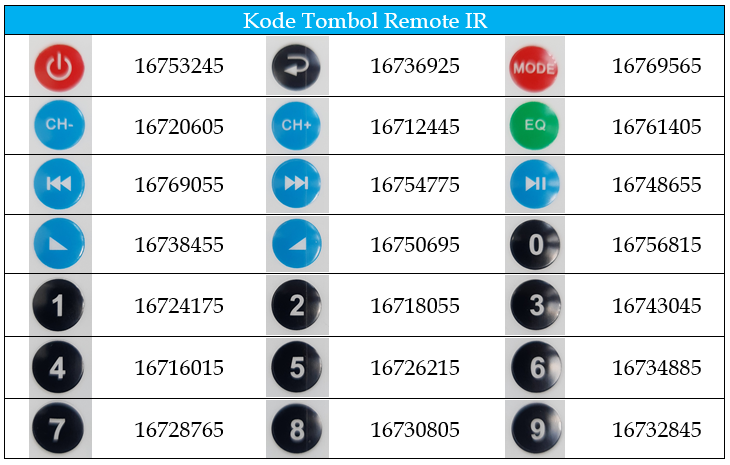

# Projek Sensor Remote IR \(Inframerah\)

## Dasar Teori

Komunikasi IR atau inframerah adalah salah satu metode komunikasi nirkabel yang paling umum karena mudah digunakan dan memiliki harga yang terjangkau. Cahaya inframerah, dengan panjang gelombang lebih panjang dari cahaya tampak, tidak berada dalam jangkauan penglihatan manusia. Itulah mengapa IR merupakan opsi yang bagus untuk komunikasi nirkabel.

Saat Anda menekan tombol pada kontrol TV, LED pada kontrol menyala dan mati secara terus menerus dan menyebabkan sinyal infra merah termodulasi dikirim dari kontrol ke TV. Perintah akan dijalankan setelah sinyal didemodulasi. Sedangkan modul penerima IR digunakan untuk menerima sinyal IR. Modul ini bekerja pada frekuensi 3, 8 KHz. Ketika sensor tidak terkena cahaya apapun pada frekuensi kerjanya, keluaran Vout memiliki nilai yang sama dengan VS \(catu daya\). Dengan mengekspos cahaya inframerah 38 kHz, keluaran ini akan menjadi nol.

Radiasi infra merah adalah bentuk cahaya yang mirip dengan cahaya yang kita lihat di sekitar kita. Satu-satunya perbedaan antara cahaya IR dan cahaya tampak adalah frekuensi dan panjang gelombangnya. Radiasi inframerah berada di luar jangkauan cahaya tampak, sehingga manusia tidak dapat melihatnya:


Karena IR adalah jenis cahaya, komunikasi IR memerlukan garis pandang langsung dari penerima ke pemancar. Oleh karena itu IR tidak dapat mengirimkan sinyal melalui dinding atau materi lain seperti WiFi atau Bluetooth.

Sistem komunikasi infra merah tipikal memerlukan pemancar IR dan penerima IR. Pemancar terlihat seperti LED standar, kecuali ia menghasilkan cahaya dalam spektrum IR, bukan spektrum tampak. Jika Anda melihat di depan remote TV, Anda akan melihat LED pemancar IR \(_transmitter_\):


Adapun jenis sensor IR penerima \(receiver\) yang akan digunakan adalah sensor IR VS1838, baik dengan atau tanpa bracket yang tampak seperti berikut ini


Berdasarkan pengalaman, tidak semua jenis remote konrol dapat terbaca oleh sensor IR VS1838. Salah satu remote yang bisa diterima adalah sebagai berikut


Setiap remote memiliki kode tombol berbeda-beda, oleh karena itu diperlukan proses decode masing-masing keypad sebelum kode tersebut digunakan sebagai parameter pegkondisian pada program. Berikut ini contoh decode keypad dari remote IR di atas



Dengan remote IR Anda dapat mengendalikan berbagai jenis aktuator, misalnya menggerakan motor robot mobil, meangkatifkan relay, membuka slot pintu, menghidupkan LED dan lain-lain sesuai kebutuhan projek.

## Tujuan

Projek bertujuan untuk memprogram MCU agar remote IR dapat mengendalikan perangkat secara jarak jauh. Dengan langkah-langkah sebagai berikut:

* Membaca kode tombol remote dan mencatatnya. Kode tombol tersebut sebagai acuan seleksi kondisi perintah berikutnya pada program, untuk melakukan tugas tertentu.
* Secara spesifik remote melakukan:
  * Mengaktifkan / menonaktifkan relay
  * Membunyikan atau mematikan speaker piezo/buzz
  * Menghidupkan sejumlah LED sesuai tombol dengan tombol angka remote yang ditekan.
  * Menampilkan ketiga status di atas pada layar OLED

## Rancangan


## Kode Program

Kode program membutuhkan library tambahan IRremoteESP8266 yang dapat di download di [https://github.com/crankyoldgit/IRremoteESP8266](https://github.com/crankyoldgit/IRremoteESP8266). Sedangkan proses instalasi library dapat di lihat di halaman 

* [https://dsp-tech.gitbook.io/internet-of-things/membangun-aplikasi-microcontroller-dengan-nodemcu/projek-pergerakkan-led\#kode-program](https://dsp-tech.gitbook.io/internet-of-things/membangun-aplikasi-microcontroller-dengan-nodemcu/projek-pergerakkan-led#kode-program)
* [https://doditsuprianto.gitbook.io/internet-of-things/membangun-aplikasi-microcontroller-dengan-nodemcu/projek-pergerakkan-led\#kode-program](https://doditsuprianto.gitbook.io/internet-of-things/membangun-aplikasi-microcontroller-dengan-nodemcu/projek-pergerakkan-led#kode-program)

Bila library IRremoteESP8266 diinstal secara online maka dari menu **Sketch &gt; Include Library &gt; Manage Libraries** akan tampak seperti berikut


```cpp
/*-----------------------------------------------
  IoT Smart Device Development Board
  by Dodit Suprianto | DSP-TECH

  Projek: Sensor Remote IR (Inframerah)

  Library:
  https://github.com/Simsso/ShiftRegister74HC595
  https://github.com/adafruit/Adafruit_SSD1306
  https://github.com/adafruit/Adafruit-GFX-Library
  https://github.com/crankyoldgit/IRremoteESP8266
  -----------------------------------------------*/

/*-------------------------------------
  Menambahkan library yang diperlukan
  -------------------------------------*/
// library shift register 74HC595
#include <ShiftRegister74HC595.h>

// library OLED
#include <Adafruit_GFX.h>
#include <Adafruit_SSD1306.h>

// library remote infrared
#include <IRremoteESP8266.h>
#include <IRrecv.h>
#include <IRutils.h>

#include <Wire.h>

/*-------------------------------
  Alamat Kanal Shift Register:
  -------------------------------
  Kanal  0 = LED 1
  Kanal  1 = LED 2
  Kanal  2 = LED 3
  Kanal  3 = LED 4
  Kanal  4 = LED 5
  Kanal  5 = LED 6
  Kanal  6 = LED 7
  Kanal  7 = LED 8
  Kanal  8 = LED 9
  Kanal  9 = Buzz Piezo Speaker
  Kanal 10 = Relay
  Kanal 11 - 15 = Kanal expansi

  /*------------------------------
  Pin Microcontroller NodeMCU
  ------------------------------*/
// Pin Shift Register
#define pinData       16 // pin D0
#define pinClock       2 // pin D4
#define pinLatch       0 // pin D3

// Pin FAN
#define pinFan        15 // pin D8

// Pin sensor IR
#define pinIR         13 // pin D7

/*----------------------------
  Alamat pin Shift Register
  ----------------------------*/
// pin Relay
#define pinRelay      10

// pin Speaker
#define pinBuzz        9

/*------------------------------
  Inisialisasi instance/object &
  Deklarasi varibale global
  -------------------------------*/
// Konstruktor instance Shift register
ShiftRegister74HC595<2> srChannel(pinData, pinClock, pinLatch);

// Konstruktor instance OLED 0.96"
Adafruit_SSD1306 display(128, 64, &Wire, -1);

// Konstruktor instance Sensor IR
IRrecv PenerimaIR(pinIR);
decode_results hasil;

// Deklarasi kode tombol remote
unsigned int KodeTombolRemote;

String strKeypad = "";

// kustom tipe
struct KontrolAktuator_t {
  boolean statusFan = false;
  boolean statusBuzz = false;
  boolean statusRelay = false;
  uint8_t qLED = 0;
} KontrolAktuator;

void setup() {
  /*----------------------------------------------------
    Mengatur baudrate serial MCU.
    Baurate disesuaikan dengan baudrate serial monitor)
    ----------------------------------------------------*/
  Serial.begin(115200);
  Wire.begin();

  // Mode pin IR & Sensor IR kondisi listen
  PenerimaIR.enableIRIn();

  // Mode pin kipas
  pinMode(pinFan, OUTPUT);

  /*---------------------------------------------
    Set seluruh kanal shift register menjadi OFF
    ---------------------------------------------*/
  srChannel.setAllLow();

  /*-------------------
    Inisialisasi OLED
    -------------------*/
  display.begin(SSD1306_SWITCHCAPVCC, 0x3C);
  display.setTextSize(1);
  display.setTextColor(WHITE);
  display.clearDisplay();

  /*--------------------------------
    Menampilkan pesan ke layar OLED
    --------------------------------*/
  display.setCursor(0, 0);
  display.println("Selamat datang...");
  display.display();
  delay(1500);

  display.setCursor(0, 12);
  display.println("Projek Kontrol");
  display.display();
  delay(1500);

  display.setCursor(0, 24);
  display.println("Remote Infrared");
  display.display();
  delay(2000);
}

void loop() {
  /*----------------------------------------------
    Jika Anda menjalankan program pertamakali,
    namun belum mengerti kode tombol remote IR.
    Tekan setiap tombol keypad yang ada, kemudian
    baca kodenya pada Serial Monitor untuk dicatat.
    -----------------------------------------------*/
  BacaKodeRemoteIR();

  // Update layar OLED
  updateOLED();
}

/*---------------------------------------
  Menampilkan data terbaru ke layar OLED
  ---------------------------------------*/
void updateOLED() {
  display.clearDisplay();
  display.setTextSize(1);
  display.setTextColor(WHITE);

  // Status LED
  display.setCursor(0, 0);
  display.print("LED Aktif");
  display.setCursor(75, 0);
  display.print(String(KontrolAktuator.qLED));
  display.setCursor(90, 0);
  display.print("LED");

  // Status RELAY
  display.setCursor(0, 14);
  display.print("Relay");
  display.setCursor(65, 14);
  //returnValue.Equals("1") ? true : false
  display.print(KontrolAktuator.statusRelay == true ? "AKTIF" : "NON AKTIF");

  // Status BUZZ
  display.setCursor(0, 28);
  display.print("Speaker");
  display.setCursor(65, 28);
  display.print(KontrolAktuator.statusBuzz == true ? "AKTIF" : "NON AKTIF");

  // Status FAN
  display.setCursor(0, 42);
  display.print("Kipas");
  display.setCursor(65, 42);
  display.print(KontrolAktuator.statusFan == true ? "AKTIF" : "NON AKTIF");

  // Status Decode Keypad
  display.setCursor(0, 56);
  display.print("Keypad");
  display.setCursor(65, 56);
  display.print(strKeypad);

  display.display();
}

/*----------------------------------------------
  Fungsi memetakan kode tombol/keypad remote IR
  berdasarkan kode yang dicatat tersebut akan
  menjadi dasar pengecekkan
  ----------------------------------------------*/
void BacaKodeRemoteIR() {
  if (PenerimaIR.decode(&hasil)) {
    // Kualitas remote yang buruk menyebabkan debouncing
    // Decode kode tombol dengan lebar 8 saja yang akan diproses.
    // Setiap remote memiliki lebar kode valid masing-masing
    // Pastikan untuk dilakukan pemetaan kode terlebih dahulu
    String ngatasiDebounce = String((int)hasil.value, (unsigned char)DEC);    
    if (ngatasiDebounce.length() == 8) {
      KodeTombolRemote = hasil.value;
      Serial.println("Kode remote: " + String(KodeTombolRemote));

      // Mengendalikan aktuator dari remote IR
      AktuatorByRemote();
    } else {
      // proses pemetaan kode tombol ditampilkan pada serial monitor
      unsigned int kodeGagal = hasil.value;
      Serial.println("Length Decode: " + String(ngatasiDebounce.length()));
      Serial.println("Kode remote tidak diproses: " + String(kodeGagal));
    }
    PenerimaIR.resume();
  }
  delay(100);
}

/*--------------------
  Mematikan semua LED
  --------------------*/
void MematikanSemuaLED() {
  //Set seluruh kanal LED 0 - LED 8 menjadi OFF
  for (uint8_t i = 0; i <= 8; i++) {
    srChannel.set(i, LOW);
  }
}

/*-----------------------------------
  Mengendalikan LED dengan Remote IR
  -----------------------------------*/
void AktuatorByRemote() {
  strKeypad = "";
  /*----------------
      KONTROL LED
    ----------------*/
  MematikanSemuaLED();
  if (KodeTombolRemote == 16724175) {
    /*------------------
      Tombol Angka 1
      hidupkan LED 1
      ------------------*/
    // Tombol 1 == hidupkan LED 1
    srChannel.set(0, HIGH);
    KontrolAktuator.qLED = 1;
  } else if (KodeTombolRemote == 16718055) {
    /*------------------
      Tombol Angka 2
      hidupkan LED 1, 2
      ------------------*/
    srChannel.set(0, HIGH);
    srChannel.set(1, HIGH);
    KontrolAktuator.qLED = 2;
  } else if (KodeTombolRemote == 16743045) {
    /*---------------------
      Tombol Angka 3
      hidupkan LED 1, 2, 3
      ---------------------*/
    srChannel.set(0, HIGH);
    srChannel.set(1, HIGH);
    srChannel.set(2, HIGH);
    KontrolAktuator.qLED = 3;
  } else if (KodeTombolRemote == 16716015) {
    /*------------------------
      Tombol Angka 4
      hidupkan LED 1, 2, 3, 4
      ------------------------*/
    srChannel.set(0, HIGH);
    srChannel.set(1, HIGH);
    srChannel.set(2, HIGH);
    srChannel.set(3, HIGH);
    KontrolAktuator.qLED = 4;
  } else if (KodeTombolRemote == 16726215) {
    /*---------------------------
      Tombol Angka 5
      hidupkan LED 1, 2, 3, 4, 5
      ---------------------------*/
    srChannel.set(0, HIGH);
    srChannel.set(1, HIGH);
    srChannel.set(2, HIGH);
    srChannel.set(3, HIGH);
    srChannel.set(4, HIGH);
    KontrolAktuator.qLED = 5;
  } else if (KodeTombolRemote == 16734885) {
    /*------------------------------
      Tombol Angka 6
      hidupkan LED 1, 2, 3, 4, 5, 6
      ------------------------------*/
    srChannel.set(0, HIGH);
    srChannel.set(1, HIGH);
    srChannel.set(2, HIGH);
    srChannel.set(3, HIGH);
    srChannel.set(4, HIGH);
    srChannel.set(5, HIGH);
    KontrolAktuator.qLED = 6;
  } else if (KodeTombolRemote == 16728765) {
    /*---------------------------------
      Tombol Angka 7
      hidupkan LED 1, 2, 3, 4, 5, 6, 7
      ---------------------------------*/
    srChannel.set(0, HIGH);
    srChannel.set(1, HIGH);
    srChannel.set(2, HIGH);
    srChannel.set(3, HIGH);
    srChannel.set(4, HIGH);
    srChannel.set(5, HIGH);
    srChannel.set(6, HIGH);
    KontrolAktuator.qLED = 7;
  } else if (KodeTombolRemote == 16730805) {
    /*------------------------------------
      Tombol Angka 8
      hidupkan LED 1, 2, 3, 4, 5, 6, 7, 8
      ------------------------------------*/
    srChannel.set(0, HIGH);
    srChannel.set(1, HIGH);
    srChannel.set(2, HIGH);
    srChannel.set(3, HIGH);
    srChannel.set(4, HIGH);
    srChannel.set(5, HIGH);
    srChannel.set(6, HIGH);
    srChannel.set(7, HIGH);
    KontrolAktuator.qLED = 8;
  } else if (KodeTombolRemote == 16732845) {
    /*---------------------------------------
      Tombol Angka 9
      hidupkan LED 1, 2, 3, 4, 5, 6, 7, 8, 9
      ---------------------------------------*/
    srChannel.set(0, HIGH);
    srChannel.set(1, HIGH);
    srChannel.set(2, HIGH);
    srChannel.set(3, HIGH);
    srChannel.set(4, HIGH);
    srChannel.set(5, HIGH);
    srChannel.set(6, HIGH);
    srChannel.set(7, HIGH);
    srChannel.set(8, HIGH);
    KontrolAktuator.qLED = 9;
  } else if (KodeTombolRemote == 16756815) {
    /*-----------------------------------
      Tombol Angka 0 - Matikan semua LED
      -----------------------------------*/
    MematikanSemuaLED();
  } else if (KodeTombolRemote == 16736925) {
    /*----------------------------
      KONTROL FAN - Tombol Return
      ----------------------------*/
    if (KontrolAktuator.statusFan == false) {
      digitalWrite(pinFan, HIGH);
      KontrolAktuator.statusFan = true;
    } else {
      digitalWrite(pinFan, LOW);
      KontrolAktuator.statusFan = false;
    }
  } else if (KodeTombolRemote == 16769565) {
    /*------------------------------
      KONTROL SPEAKER - Tombol Mode
      ------------------------------*/
    if (KontrolAktuator.statusBuzz == false) {
      srChannel.set(pinBuzz, HIGH);
      KontrolAktuator.statusBuzz = true;
    } else {
      srChannel.set(pinBuzz, LOW);
      KontrolAktuator.statusBuzz = false;
    }
  } else if (KodeTombolRemote == 16720605) {
    /*---------------------------
      KONTROL RELAY - Tombol CH-
      ---------------------------*/
    if (KontrolAktuator.statusRelay == false) {
      srChannel.set(pinRelay, HIGH);
      KontrolAktuator.statusRelay = true;
    } else {
      srChannel.set(pinRelay, LOW);
      KontrolAktuator.statusRelay = false;
    }
  }

  // kode tombol yang ditampilkan pada layar OLED
  strKeypad = String(KodeTombolRemote);  
}
```

**Source Code**: [https://github.com/doditsuprianto/IoT-Development-Board-DSP-TECH/blob/main/Projek\_Sensor\_Remote\_IR\_\_Inframerah\_.ino](https://github.com/doditsuprianto/IoT-Development-Board-DSP-TECH/blob/main/Projek_Sensor_Remote_IR__Inframerah_.ino)

Tahapan untuk memetakan kode keypad/tombol pada remote:

* Write/kompile kode program untuk menjalankan aplikasi.
* Buka window Serial Monitor melalui menu **Tools &gt; Serial Monitor**.
* Lakukan uji coba remote dengan menekan setiap tombol keypad.
* Catat kode setiap tombol keypad.
* Gunakan kode keypad tersebut sebagai filter untuk menjalankan aktuator atau kebutuhan lainnya.

Berikut contoh tampilannya:


## Video Projek


## Tugas

* Buat projek yang sama dengan sebelumnya tetapi menggunakan model remote berbeda. Misalnya menggunakan remote UseeTV milik dari TVBox Indie Home, seperti tampak di bawah ini


