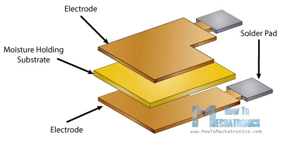
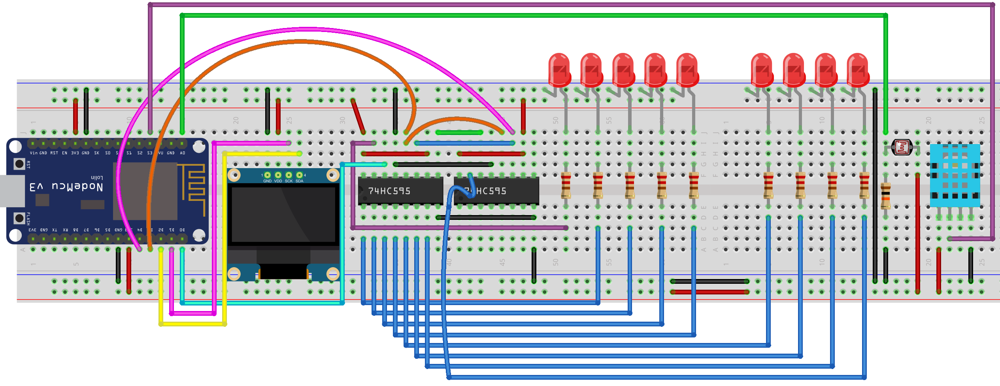

# Projek Sensor Suhu & Kelembaban

### Dasar Teori

Dalam Tutorial Arduino ini kita akan belajar bagaimana menggunakan DHT11 atau DHT22 untuk mengukur suhu dan kelembaban. Sensor ini sangat populer untuk penggemar elektronik karena harganya murah tetapi tetap memberikan kinerja yang baik.

Dari sisi harga DHT22 lebih mahal daripada DHT11 dan DHT22 memiliki spesifikasi yang lebih baik. Rentang pengukuran suhu mulai dari -40°C hingga +125°C dengan derajat akurasi ±0,5, sedangkan rentang temperatur DHT11 adalah 0°C hingga 50°C dengan derajat akurasi ±2. Sensor DHT22 memiliki rentang pengukuran kelembaban yang lebih baik, mulai dari 0% hingga 100% dengan akurasi 2-5%, sementara rentang kelembaban DHT11 adalah 20% hingga 80% dengan akurasi 5%.


Ada dua spesifikasi di mana DHT11 lebih baik daripada DHT22, yaitu laju pengambilan sampel datanya, untuk DHT11 adalah 1 Hz atau satu bacaan setiap detik, sedangkan tingkat sampling DHT22 adalah 0,5 Hz atau satu bacaan setiap dua detik dan juga DHT11 memiliki ukuran tubuh yang lebih kecil. Tegangan operasi kedua sensor adalah 3V hingga 5V, sedangkan arus maksimal yang digunakan saat mengukur adalah 2,5mA.


DHT11 dan DHT22 terdiri dari komponen penginderaan kelembaban, sensor suhu NTC \(atau termistor\) dan IC di sisi belakang sensor.


Untuk mengukur kelembaban, sensor DHT menggunakan komponen penginderaan kelembaban yang memiliki dua elektroda dengan substrat menahan kelembaban diantara dua sisi tersebut. Ketika kelembaban berubah, konduktivitas substrat berubah, atau resistensi antara elektroda-elektroda ini berubah. Perubahan resistansi ini diukur dan diproses oleh IC yang membuatnya siap dibaca oleh mikrokontroler.



Di sisi lain, untuk mengukur suhu, sensor ini menggunakan sensor suhu NTC atau termistor. Termistor adalah resistor variabel yang mengubah ketahanannya dengan perubahan suhu. Sensor ini dibuat dengan sintering \(proses pemanasan material\) bahan semikonduktif seperti keramik atau polimer untuk memberikan perubahan yang lebih besar pada hambatan hanya dengan perubahan suhu yang kecil. Istilah "NTC" negative Temperature Coeffesient berarti "Koefisien Suhu Negatif", yang berarti bahwa resistensi menurun dengan peningkatan suhu.

Projek yang akan dibuat cukup sederhana, yaitu:

* Membaca suhu dan kelembaban lingkungan yang ditangkap oleh sensor DHT11. 
* Menampilkan nilai kelembaban dan suhu pada layar LCD. 
* Jika nilai suhu mencapai rentang tertentu maka animasi LED dijalankan.

Aplikasi yang dibuat merupakan kombinasi projek animasi LED sebelumnya dengan menambahkan sensor DHT11 dan layar LCD.

### Tujuan

Projek bertujuan untuk membaca suhu dan kelembaban dari sensor DHT11 dengan menggunakan library SimpleDHT. Kemudian menampilkan suhu & kelembaban pada layar OLED. Sekaligus membuat prgress bar/ gauge untuk melihat setiap perubahan nilai yang terjadi.

Karena terkadang sensor DHT11 tidak bisa membaca dengan benar maka hanya data suhu & kelembaban yang bernilai 0 tidak ditampilkan, melainkan data lama yang digunakan.

### Rancangan



### Kode Program

Kode program membutuhkan library tambahan baru, yaitu SimpleDHT yang dapat di download di [https://github.com/winlinvip/SimpleDHT](https://github.com/winlinvip/SimpleDHT). Cara instalasi silahkan buka kembali halaman berikut [https://doditsuprianto.gitbook.io/internet-of-things/membangun-aplikasi-microcontroller-dengan-nodemcu/projek-pergerakkan-led\#kode-program](https://doditsuprianto.gitbook.io/internet-of-things/membangun-aplikasi-microcontroller-dengan-nodemcu/projek-pergerakkan-led#kode-program). 

Perhatikan pada menu Sketch &gt; Include Library &gt; Manage Libraries... seperti tampak gambar di bawah ini:


```cpp
/*-----------------------------------------------
  IoT Smart Device Development Board
  by Dodit Suprianto | DSP-TECH

  Projek: Projek Sensor Suhu & Kelembaban

  Library:
  https://github.com/Simsso/ShiftRegister74HC595
  https://github.com/kiryanenko/SimpleTimer
  https://github.com/winlinvip/SimpleDHT
  https://github.com/adafruit/Adafruit_SSD1306
  https://github.com/adafruit/Adafruit-GFX-Library
  -----------------------------------------------*/

/*-------------------------------------
  Menambahkan library yang diperlukan
  -------------------------------------*/
// library shift register 74HC595
#include <ShiftRegister74HC595.h>

// library timer (millis)/thread
#include <SimpleTimer.h>

// library OLED
#include <Adafruit_GFX.h>
#include <Adafruit_SSD1306.h>
#include <Wire.h>

// library sensor suhu & kelembaban DHT
#include <SimpleDHT.h>

/*-------------------------------
  Alamat Kanal Shift Register:
  -------------------------------
  Kanal  0 = LED 1
  Kanal  1 = LED 2
  Kanal  2 = LED 3
  Kanal  3 = LED 4
  Kanal  4 = LED 5
  Kanal  5 = LED 6
  Kanal  6 = LED 7
  Kanal  7 = LED 8
  Kanal  8 = LED 9
  Kanal  9 = Buzz Piezo Speaker
  Kanal 10 = Relay
  Kanal 11 - 15 = Kanal expansi
  -------------------------------*/

/*------------------------------
  Pin Microcontroller NodeMCU
  ------------------------------*/
#define pinData       16 // pin D0
#define pinClock       2 // pin D4
#define pinLatch       0 // pin D3
#define pinLDR        A0 // pin A0
#define pinDHT        10 // pin SDD3

/*------------------------------
  Inisialisasi instance/object &
  Deklarasi varibale global
  -------------------------------*/
// Konstruktor instance Shift register
ShiftRegister74HC595<2> srChannel(pinData, pinClock, pinLatch);

// Konstruktor instance OLED 0.96"
Adafruit_SSD1306 display(128, 64, &Wire, -1);

// Varibale simpletimer (Timer interval)
// SimpleTimer semacam thread yang membentuk session
// tanpa mengganggu session program utama
SimpleTimer TimerLDR, TimerDHT;

// Konstruktor instance Sensor DHT11
SimpleDHT11 dht11(pinDHT);

int validGauge = 0;

// Deklarasi variable suhu dan kelembaban
byte suhu, hum;
byte humValid, tempValid;

void setup() {
  /*----------------------------------------------------
    Mengatur baudrate serial MCU.
    Baurate disesuaikan dengan baudrate serial monitor)
    ----------------------------------------------------*/
  Serial.begin(115200);
  Wire.begin();

  /*---------------------------------------------
    Set seluruh kanal shift register menjadi OFF
    ---------------------------------------------*/
  srChannel.setAllLow();

  /*-----------------------------------
    Atur interval pemvacaan sensor LDR
    -----------------------------------*/
  // interval 300 mili detik
  TimerLDR.setInterval(300);

  // interval 1,5 detik
  TimerDHT.setInterval(1500);

  /*-------------------
    Inisialisasi OLED
    -------------------*/
  display.begin(SSD1306_SWITCHCAPVCC, 0x3C);
  display.setTextSize(1);
  display.setTextColor(WHITE);
  display.clearDisplay();

  /*-----------------------------------
    Menampilkan pesan OLED pertamakali
    ------------------------------------*/
  display.setCursor(0, 0);
  display.println("Selamat datang...");
  display.setCursor(0, 12);
  display.println("Projek Sensor DHT11");
  display.setCursor(0, 24);
  display.println("Suhu & Kelembaban");

  // menampilkan pesan string ke OLED
  display.display();

  // tunda tampilan selama 5 detik
  delay(5000);
}

void loop() {
  /*----------------------------------
      pembacaan sensor cahaya LDR
      sesuai interval yang ditentukan,
      yitu setiap 300 mili detik
      ---------------------------------*/
  if (TimerLDR.isReady()) {
    // update tampilan ke OLED setelah
    // membaca sensor LDR hasil perubahan nilai
    updateOLED();

    // Memanggil fungsi LEDProgress()
    // untuk memberi efek gauge gerakan LED
    LEDProgress();

    // reset counter ulang
    TimerLDR.reset();
  }

  /*------------------------------------------------
    Membaca suhu dan kelembaban dengan sensor DHT11
    sesuai interval yaitu setiap 1,5 detik.
    ------------------------------------------------*/
  if (TimerDHT.isReady()) {

    // memanggil fungsi SensorDHT()
    // untuk membaca suhu & kelembaban
    SensorDHT();

    // update tampilan ke OLED setelah terjadi perubahan nilai
    updateOLED();

    // timer di reset kembali ke counter 0
    TimerDHT.reset();
  }
}

/*-------------------------------
  Fungsi untuk membaca suhu dan
  kelembaban dengan sensor DHT11
  -------------------------------*/
void SensorDHT() {
  suhu = 0;
  hum = 0;
  int err = SimpleDHTErrSuccess;
  if ((err = dht11.read(&suhu, &hum, NULL)) != SimpleDHTErrSuccess)
  {
    Serial.print("Read DHT11 failed, err="); Serial.println(err);
    delay(100);
    return;
  }

  Serial.print("Sample OK: ");
  Serial.print((int)suhu); Serial.print(" *C, ");
  Serial.print((int)hum); Serial.println(" H");
}

/*------------------------------------------
  Fungsi untuk menghitung intensitas cahaya
  dengan sensor LDR secara analog
  ------------------------------------------*/
int SensorLDR() {
  // Membaca sensor LDR mode Analog
  // yang bernilai antara 0 sampai 1023
  int nilaiAnalogLDR = analogRead(pinLDR);

  /*--------------------------------------------------------------------------------
    Referensi perhitung Lux
    https://arduinodiy.wordpress.com/2013/11/03/measuring-light-with-an-arduino/
    https://emant.com/316002
    VOut = nilaiAnalogLDR * (3.3 / 1023) = nilaiAnalogLDR * ‭‭0.0032258064516129‬
    ----------------------------------------------------------------------------------*/
  // Konversi nilai menjadi satuan LUX
  // Perhitungan ini belum tentu valid karena
  // tidak belum dikalibrasi
  double Vout = nilaiAnalogLDR * 0.0032258064516129;
  int lux = 330 / (10 * ((3.3 - Vout) / Vout));
  Serial.println("Nilai LDR Analog = " + String(int(Vout)));

  // nilai balik lux ke fungsi SensorLDR()
  return lux;
}

/*---------------------------------------
  Menampilkan data terbaru ke layar OLED
  ---------------------------------------*/
void updateOLED() {
  display.clearDisplay();
  display.setTextSize(1);
  display.setTextColor(WHITE);

  //*******************//
  // BAGIAN SENSOR LDR //
  //*******************//
  display.setCursor(0, 0);    display.print("Light");
  display.setCursor(75, 0);   display.print(String(SensorLDR()));
  display.setCursor(100, 0);  display.print("Lux");

  // mapping LUX menjadi gauge ke layar OLED
  // x = 0, y = 0, tinggi = 5 piksel dan
  // lebar = sesuai nilai mapping gaugeOLED, maks 127 piksel
  int gaugeOLED = map(validGauge, 0, 1000, 0, 127);

  // Menggambar kotak bar
  display.fillRect(0, 10, gaugeOLED, 5, SSD1306_INVERSE);

  //*********************//
  // BAGIAN SENSOR DHT11 //
  // MEMBACA SUHU        //
  //*********************//  
  
  // Memastikan suhu dan kelembaban valid
  // bila bernilai 0 maka diambil dari nilai sebelumnya
  if (suhu != 0 || hum != 0) {
    tempValid = suhu;
    humValid = hum;
  }

  display.setCursor(0, 20);   display.print("Temperature");
  display.setCursor(75, 20);  display.print(String(tempValid));

  // Menggambar simbol derajat dengan lingkaran
  display.drawCircle(100, 19, 2, SSD1306_WHITE);
  display.setCursor(105, 20); display.print("C");

  // Memetakan suhu ke gauge bar 0-127 piksel
  gaugeOLED = map(tempValid, 0, 100, 0, 127);

  // Menggambar kotak bar
  display.fillRect(0, 30, gaugeOLED, 5, SSD1306_INVERSE);

  //*********************//
  // BAGIAN SENSOR DHT11 //
  // MEMBACA KELEMBABAN  //
  //*********************//
  display.setCursor(0, 40);   display.print("Humidity");
  display.setCursor(75, 40);  display.print(String(humValid));
  display.setCursor(100, 40); display.print("H");

  // Memetakan kelembaban ke gauge bar 0-127 piksel
  gaugeOLED = map(humValid, 0, 100, 0, 127);

  // Menggambar kotak bar
  display.fillRect(0, 50, gaugeOLED, 5, SSD1306_INVERSE);

  display.display();
}

/*--------------------------------------
  Gauge LED mengikuti besar kecil nilai
  LUX intensitas cahaya dari sensor LDR
  --------------------------------------*/
void LEDProgress() {
  // set semua LED menjadi mati (LOW)
  for (uint8_t i = 0; i <= 8; i++) {
    srChannel.set(i, LOW);
  }

  // Membatasi nilai agar gauge tidak lebih dari 1000
  if (SensorLDR() > 1000) {
    validGauge = 1000;
  } else {
    validGauge = SensorLDR();
  }

  // Memetakan nilai antara LUX dari fungsi SensorLDR()
  // dengan sejumlah 9 LED (ch 0-8 shift register)
  // kemudian menset menjadi hidup (HIGH)
  int gauge = map(validGauge, 0, 1000, 0, 8);
  Serial.println("Lux Meter: " + String(SensorLDR()));
  Serial.println("Gauge: " + String(gauge));

  // Set channel shift register 0-8 sesuai nilai gauge
  // menjadi hidup (HIGH)
  for (uint8_t i = 0; i <= gauge; i++) {
    // semua LED hidup
    srChannel.set(i, HIGH);
  }
}
```

**Source Code**: [https://github.com/doditsuprianto/IoT-Development-Board-DSP-TECH/blob/main/Projek\_Sensor\_Suhu\_\_\_Kelembaban.ino](https://github.com/doditsuprianto/IoT-Development-Board-DSP-TECH/blob/main/Projek_Sensor_Suhu___Kelembaban.ino)

### Video Projek


### Tugas

* Ubahlah gauge / progress bar 9x LED yang semula diperuntukkan sebagai indikator perubahan intensitas cahaya dari sensor LDR menjadi indikator perubahan suhu dari sensor DHT11.
* Buatlah suara beep speaker piezo/buzzer ketika kelembaban melebihi dari 60H. Untuk membuktikannya, letakkan jari pada permukaan sensor DHT11 beberapa saat maka nilai kelembaban akan meningkat. Hasil perubahan dapat dilihat pada layar OLED.
* Referensi fungsi/prosedure beep adalah sebagai berikut:

```cpp
/*-------------------------
  Fungsi suara Buzz Piezo
  --------------------------*/
void beepBuzz(unsigned char delayms) {
  srChannel.set(pinBuzz, HIGH);
  delay(delayms);
  srChannel.set(pinBuzz, LOW);
  delay(delayms);
}
```

Sedangkan alamat speaker piezo/buzz adalah 9 dari kanal shit register. Berikut pendefinisiannya:

```cpp
/*-----------------------------------------
  Mendefinisikan pin kanal shift register
  -----------------------------------------*/
#define pinBuzz        9
```

Anda tinggal memanggil fungsi di atas ketika kelembaban melebihi threshold yang ditentukan. Contoh pemganggillannya adalah sebagai berikut:

```cpp
beepBuzz(200);
beepBuzz(100);
```

