# Menyiapkan Lingkungan Pengembangan IoT Development Board

Sebelum mengembangkan aplikasi pada sisi “things” IoT \(embedded system\) maka kita harus menginstal terlebih dahulu beberapa software pendukung, antara lain:

* Arduino IDE \(Integrated Development Environment\), adalah software yang berfungsi untuk menuliskan kode program, debugger kode program, dan sebagai compiler program. Dimana file hasil compile akan di-write ke chip Arduino/NodeMCU, sehingga device dapat berfungsi secara mandiri.
* Fritzing, adalah software alat bantu untuk mem-visualisasikan rancangan, pengabelan, peletakkan komponen secara software. Berdasarkan hasil rancangan Fritzing tersebut kemudian diimplementasikan pada kondisi nyata.

### **Instalasi & Konfigurasi IDE MCU**

Untuk memprogram microcontroller NodeMCU diperlukan _integrated development environment_ Arduino \(IDE Arduino\) yang berfungsi sebagai _editor_, _debugger_ dan _writer/flasher_ program ke chipset NodeMCU ESP-12E.

#### Berikut ini langkah instalasi dan konfigurasi aplikasi IDE MCU Arduino \(IDE Arduino dapat juga digunakan sebagai aplikasi IDE NodeMCU\):

* Silahkan download file Arduino IDE dari website berikut

link berikut [https://www.arduino.cc/download\_handler.php?f=/arduino-1.8.12-windows.exe](https://www.arduino.cc/download_handler.php?f=/arduino-1.8.12-windows.exe).

* Kemudian install file **Arduino-1.8.12-windows** di komputer Anda. Nama file yang di-download tidak harus sama antara yang tertera dibuku karena tergantung dari versi yang di-download saat ini.

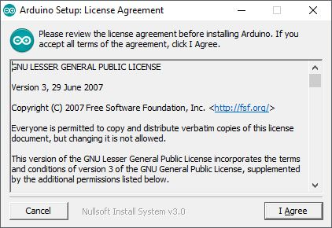

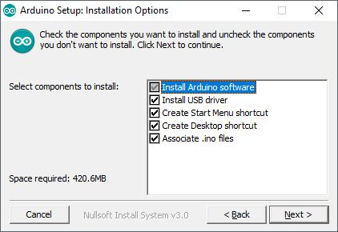

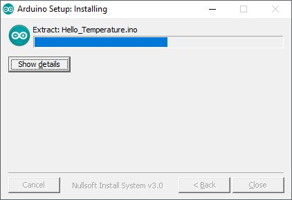

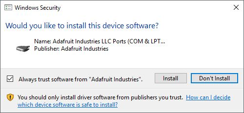

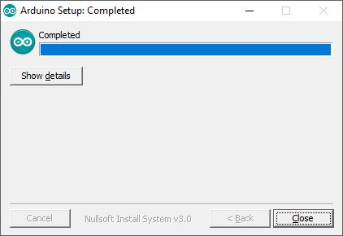

* Secara default aplikasi IDE Arduino hanya digunakan untuk memprogram board mikrokontroler Arduino sebagai target _writing_-nya, sehingga kita perlu menambahkan library board ESP8266 ke dalam IDE Arduino, agar board NodeMCU yang merupakan keluarga chipset ESP8266 dapat dikenali oleh IDE Arduino dan dapat diprogram dengan gaya bahasa C layaknya memprogram mikrokontroller Arduino.
* Untuk menambahkan library board ESP8266, jalankan aplikasi arduino IDE terlebih dahulu. Kemudian pilih menu “**File → Preferences**” pada kolom “**Additional Boards Manager URLs**”, kemudian tulis alamat website berikut ini “[https://arduino.esp8266.com/stable/package\_esp8266com\_index.json](https://arduino.esp8266.com/stable/package_esp8266com_index.json)”. Kemudian pilih tombol “**OK**”.

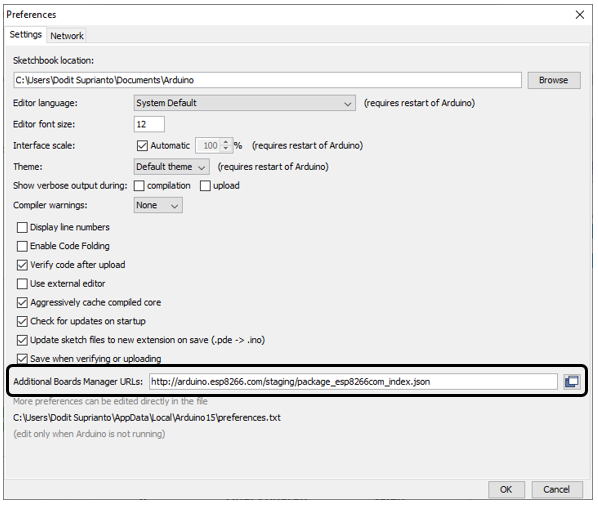

* Pilih menu “**Tools → Board → Board Manager**”. Tuliskan “**esp8266**” pada kolom pencarian. Pada daftar di bawahnya akan muncul tulisan “**esp8266 by ESP8266 Community**”, pilih dan klik tombol **Install** di sebelah kanan bawah. Pastikan saat melakukannya komputer telah terhubung dengan internet karena file pendukung akan di-download secara otomatis.

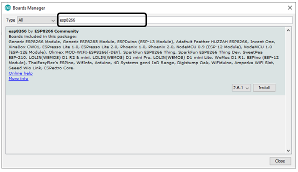

* Pilih menu **Tools → Board Manager → NodeMCU 1.0 \(ESP-12E Module\)**

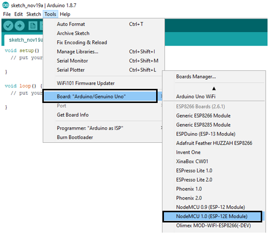

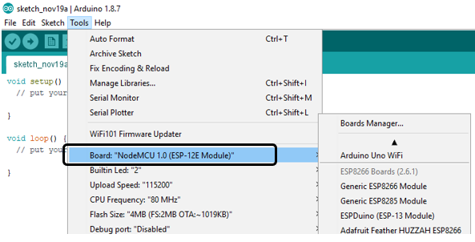

* Sekarang hubungkan board NodeMCU ke laptop melalui kabel data micro USB. Periksa apakah port USB telah aktif melalui “**Control Panel → Device Manager**”. Gambar di bawah menunjukkan _interface_ antara NodeMCU dan laptop Windows 10 yang telah terhubung melalui Port COM3 \(tidak selalu di port COM3, tergantung windows mendeteksinya\).

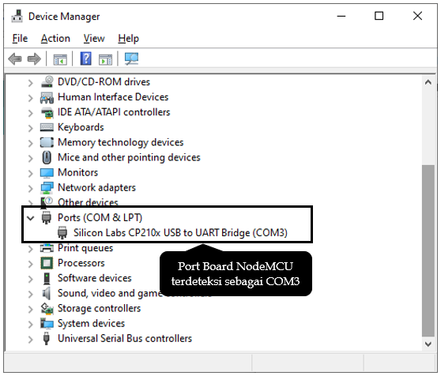

* Buka aplikasi Arduino IDE dimenu “**Tools → Port**”, sesuaikan dengan nomor port yang terbaca pada sistem, dalam hal ini adalah Port COM3.

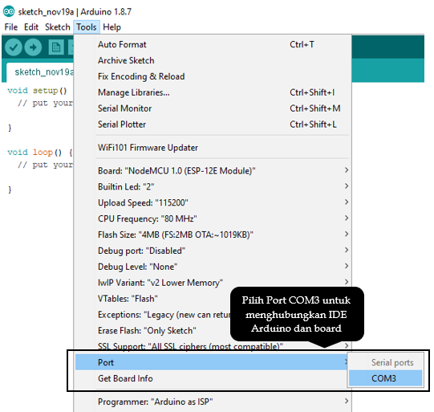

* Jalankan aplikasi dengan kode program standar seperti di bawah ini, kemudian pilih tombol centang di bagian toolbar kiri atas.

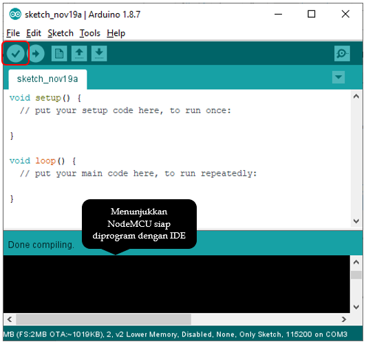

Jika tidak ada pesan kesalahan maka instalasi sukses dan NodeMCU siap untuk diprogram.

### **Instalasi Aplikasi Fritzing**

Untuk memudahkan perancangan sebuah model dan pengkabelan antar bagian, disarankan untuk menggunakan aplikasi Fritzing yang dapat di-dowload di [http://fritzing.org/download/0.8.7b/windows/fritzing.0.8.7b.pc.zip](http://fritzing.org/download/0.8.7b/windows/fritzing.0.8.7b.pc.zip).

Jika gambar komponen tidak ditemukan pada aplikasi Fritzing maka Anda dapat melakukan pencarian dan mengimpor file komponen tersebut di internet. Adapun jenis file gambar komponen fritzing ditandai dengan file berekstensi **.fzpz**.

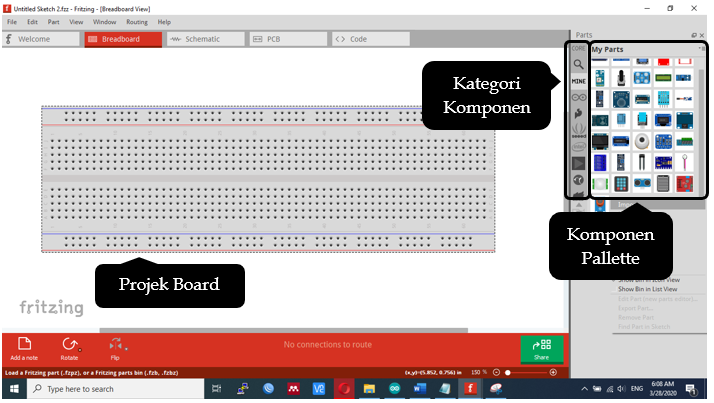

### **Projek Board**

Untuk menempatkan komponen pada projek board, Anda tinggal melakukan drag-drop dari komponen pallette ke projek board. Untuk pengkabelan dari satu titik ke titik lainnya Anda tinggal mengklik sekali dimulai dari titik awal kemudian menyeret mouse sampai ke titik tujuan. Agar tampak rapi jalur pengkabelannya saat terjadi lekukan, pilih sembarang titik disepanjang kabel, kemudian gunakan **Shift+Mouse** untuk membentuk lekukan tegak lurus, atau gunakan **Ctrl+Shift+Mouse** pada titik disepanjang kabel untuk membentuk lekukan kurva.

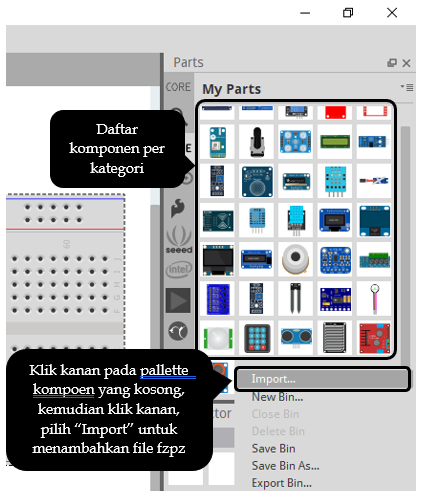

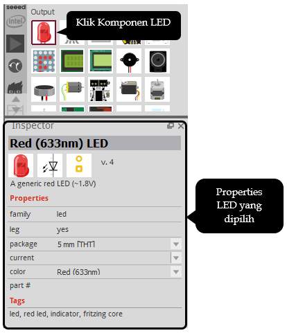

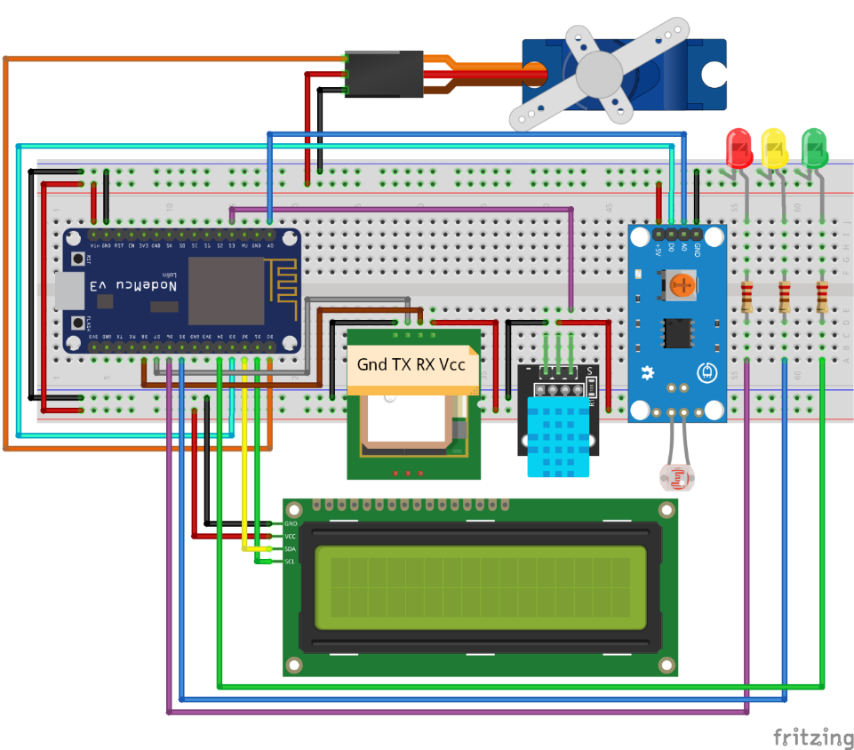

Gambar rancangan di atas merupakan ilustrasi komponen secara visual. Anda harus memperhatikan kaki komponen fisik yang Anda miliki karena urutan pin setiap bracket komponen kadang berbeda tergantung produsennya. Kesalahan memposisikan kabel akan menyebabkan komponen tidak berfungsi, bahkan mengalami kerusakan yang fatal.

#### Cara membaca jalur pada projek board adalah sebagai berikut:

* Lubang-lubang mendatar yang ditandai garis warna biru adalah terhubung semua, digunakan sebagai jalur Ground.
* Lubang-lubang mendatar yang ditandai garis warna merah adalah terhubung semua, digunakan sebagai jalur tegagan Vcc.
* Lubang-lubang yang berada ditengah membentuk kolom terhubung semua, namun tidak terhubung dengan lubang-lubang pada kolom sebelahnya.
* Ditengah projek board terdapat sekat, artinya antara blok bagian atas dan bawah tidak terhubung.

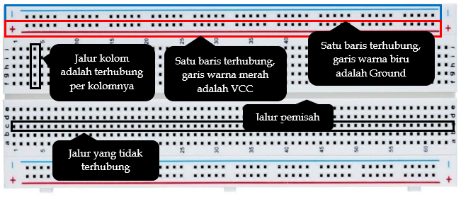

\*\*\*\*

