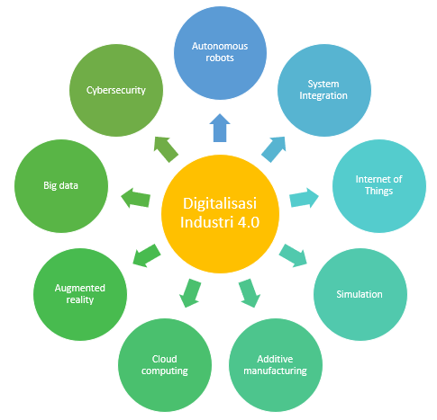
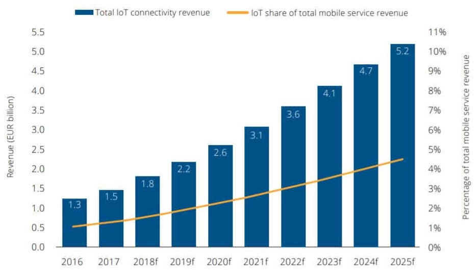
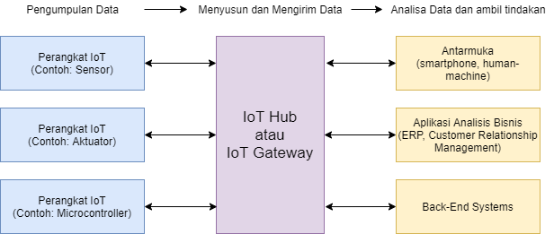

# Pengantar Internet of Things

Digitalisasi industri 4.0 yang melaju pesat, bergerak secara eksponensial berpengaruh pada semua aspek, antara lain sosial, ekonomi dan teknologi. Evolusi yang berkembang di dunia industri harus dipahami sebagai sebagai jalan untuk mencapai tujuan yang lebih penting, yaitu menciptakan kesejahteraan sosial. Revolusi industri tahap empat ditandai dengan berbagai teknologi yang menggabungkan dunia fisik, digital, dan biologis yang mempengaruhi semua disiplin ilmu, kehidupan perekonomian, aktivitas industri, dan kapasitas tenaga kerja. Adapun basis orientasi industri tahap empat adalah otomatisasi digitalisasi yang membuat proses produksi semakin efisien dengan kualitas produk lebih baik, sehingga meningkatkan kemampuan bersaing.

Beberapa teknologi yang berperan dalam industri 4.0, antara lain advanced robotic, additive manufacturing, augmented reality, simulation, horizonal/vertical integration, industrial internet, cloud, cyber security, big data dan analytics.

### **Tren Teknologi Era Evolusi Industri 4.0**

Begitu pula dengan IoT \(internet of things\) yang merupakan bagian dari teknologi digitalisasi revolusi industri empat yang sedang tren saat ini dan akan datang. IoT bersifat interdisipliner, artinya IoT dapat melibatkan berbagai bidang ilmu sekaligus, misalnya elektronika digital & analog, sistem kontrol, perangkat lunak, sistem informasi, _database_, jaringan, _cyber security_, _cyber physical system_, _sytem on chip_ dan lain-lain. Oleh karena itu, penting bagi kita untuk mempelajari IoT dengan pertimbangan berbagai tantangan dan peluang kedepan yang semakin kompleks, dimana persaingan tidak hanya dikuasai oleh orang yang hanya ahli di satu bidang. Sebagai contoh bidang elektronik atau bidang teknologi informasi saja, tetapi berbagai jenis bidang yang saling memberi kontribusi satu sama lain seperti yang dijelaskan pada bagian di atas.

Sejak dicetuskannya istilah IoT pada tahun 1999, internet of things \(IoT\) telah berubah dari sekadar visi menjadi realitas yang gamblang. Hal ini dapat dikaitkan dengan penggunaan secara luas Internet Protocol \(IP\), munculnya komputasi dimana-mana, dan kemajuan analisis data tingkat lanjut. Bahkan diperkirakan pada tahun 2025 terdapat 34,2 miliar perangkat yang terhubung ke IoT secara global dan pendapatan di bidang IoT mencapai 5,2 milyar Euro. Tentu hal ini akan menjadi peluag tersendiri bagi kita untuk turut andil dalam industri di bidang IoT.

Secara ideal internet of things atau IoT adalah sistem perangkat komputasi yang saling terkait, misalnya mesin mekanika dan digital, benda, hewan atau orang yang dilengkapi dengan pengidentifikasi unik \(UIDs – _Unique Identifier_\) yang memiliki kemampuan untuk mentransfer data melalui jaringan tanpa memerlukan interaksi manusia ke manusia atau manusia ke komputer. Penerapan “Things” dalam Internet of Things dapat berupa seseorang dengan implan monitor jantung, hewan ternak dengan transponder biochip, mobil yang memiliki sensor bawaan untuk memberitahu pengemudi ketika tekanan ban rendah atau normal atau objek buatan manusia lainnya yang dapat diberi alamat Internet Protocol \(IP\) dan dapat mentransfer data melalui jaringan.

Saat ini makin meningkat organisasi di berbagai jenis industri yang menggunakan IoT untuk mendukung efisiensi operasi, bagiamana agar lebih memahami pelanggan untuk meningkatkan layanan bagi pelanggan, membantu pengambilan keputusan dan meningkatkan nilai bisnis.

Interoperabilitas adalah salah satu aspek kunci dari IoT, berkontribusi terhadap popularitasnya yang semakin meningkat. Perangkat yang terhubung \("things" dalam IoT\) - memiliki kemampuan untuk mengumpulkan dan berbagi data dari lingkungan mereka dengan perangkat dan jaringan lain. Melalui analisis dan pemrosesan data, perangkat dapat melakukan fungsinya dengan sedikit atau tanpa perlu interaksi manusia.

Mengingat semakin banyaknya perangkat yang terhubung, IoT melanjutkan jalur evolusinya, menambahkan lapisan berbeda pada data yang sudah dibagikan dan diproses, dan memunculkan algoritma canggih yang menghasilkan peningkatan level otomatisasi. Karena beragamnya “things” yang dapat dihubungkan dengannya, IoT telah memungkinkan beragam aplikasi untuk dimanfaatkan oleh pengguna individu maupun industri.

### **Bagaimana IoT Bekerja**

Ekosistem IoT terdiri dari perangkat pintar berkemampuan web yang menggunakan sistem tertanam \(_embedded system_\), seperti prosesor, sensor, dan perangkat keras komunikasi, untuk mengumpulkan, mengirim, dan bertindak berdasarkan data yang mereka peroleh dari lingkungan mereka. Perangkat IoT berbagi data sensor yang mereka kumpulkan dengan menghubungkan ke _gateway_ IoT atau _edge device_ lainnya, dimana data dikirim ke komputer _cloud_ untuk dianalisis secara lokal. Terkadang, perangkat ini berkomunikasi dengan perangkat terkait lainnya dan bertindak berdasarkan informasi yang mereka dapatkan satu sama lain. Sebagian besar perangkat melakukan pekerjaan tanpa campur tangan manusia, meskipun orang masih dapat berinteraksi dengan perangkat tersebut, misalnya ketika saat mengkonfigurasinya, memberi mereka instruksi atau mengakses data. Konektivitas, jaringan dan protokol komunikasi yang digunakan pada perangkat yang mendukung web ini sangat tergantung pada spesifikasi aplikasi IoT yang digunakan.

IoT juga dapat menggunakan kecerdasan buatan \(_artificial intelligence_\) dan pembelajaran mesin \(_machine learning_\) untuk membantu membuat proses pengumpulan data lebih mudah dan lebih dinamis.

### **Ekosistem IoT Secara Umum**

#### Perangkat IoT mengandung komponen-komponen berikut agar dapat beroperasi dengan benar sebagai bagian dari sistem IoT. Meskipun tidak semua komponen harus terpenuhi secara keseluruhan, antara lain:

* **Sensor**

Data pertama kali dikumpulkan dari lingkungan untuk sistem IoT dan mulai diproses. Data dikumpulkan oleh sensor dalam suatu perangkat yang dapat mengukur kejadian yang dapat diamati atau adanya perubahan pada lingkungan. Jenis data yang diukur oleh perangkat tergantung fungsinya, misalnya berupa denyut nadi seseorang berkaitan dengan pelacakan kebugaran atau jarak objek terdekat pada kendaraan otonom.

* **Connection dan Identification**

Data harus dikomunikasikan dari perangkat ke seluruh sistem IoT, baik itu ke komputer atau ke perangkat lain. Agar komunikasi ini memiliki makna, perangkat harus memiliki keberadaan unik yang dapat diidentifikasi di internet, yaitu alamat IP itu sendiri.

* **Actuator**

Sebagian besar perangkat IoT mampu melakukan fungsi utama mereka tanpa interaksi fisik dengan penggunanya. Perangkat IoT mampu mengambil tindakan berdasarkan data dari sensor mereka, kemudian memberi umpan balik melalui jaringan. Contohnya bola lampu pada “_smart home_” yang menyala atas perintah penggunanya, bahkan ketika pengguna berada jauh dari lampu. Dengan cara yang sama, katup di “_smart manufacture_” secara otomatis membuka atau menutup sesuai dengan data yang dikumpulkan oleh sensor pada sepanjang jalur produksi.

* **IoT Gateway**

Gateway IoT bertindak sebagai jembatan data dari berbagai perangkat untuk mencapai komputer _cloud_. Hal ini juga membantu menerjemahkan protokol yang berbeda dari berbagai perangkat IoT menjadi hanya satu protokol standar dan menyaring data tidak perlu yang dikumpulkan oleh perangkat.

* **Komputer** _**Cloud**_

Komputer Cloud adalah tempat semua data dari berbagai perangkat dikumpulkan dan tempat perangkat lunak dapat mencapai data ini untuk diproses. Karena sebagian besar pemrosesan data terjadi di cloud.

* **User Interface**

User interface \(antarmuka aplikasi\) berkomunikasi dengan pengguna data \(yang telah dikumpulkan oleh perangkat\) sehingga memungkinkan bagi _user_ membuat perintah yang diperlukan untuk dieksekusi oleh perangkat.

#### Terdapat empat model konektivitas pada perangkat IoT:

* **Device-to-Device**

Model ini menggambarkan bagaimana dua atau lebih perangkat terhubung dan berkomunikasi secara langsung satu sama lain. Komunikasi antar perangkat biasanya dicapai melalui protokol, seperti Bluetooth, Z-Wave dan Zigbee. Model ini sering ditemukan pada perangkat _wearable_ \(perangkat yang dipakai di baju/badan, misalnya _smart watch_, _medical devices_, dan lain-lain\) dan perangkat otomasi rumah, dimana paket data yang kecil dikomunikasikan dari satu perangkat ke perangkat lainnya.

* **Device-to-Cloud**

Banyak perangkat IoT terhubung ke cloud, seringkali dengan menggunakan antarmuka jaringan Ethernet atau Wi-Fi. Menghubungkan ke cloud memungkinkan bagi pengguna dan aplikasi terkait untuk mengakses perangkat, memungkinkan untuk melakukan perintah secara jarak jauh serta melakukan _push update_ _software_ perangkat bila diperlukan.

* **Device-to-Gateway**

Sebelum terhubung ke cloud, perangkat IoT dapat berkomunikasi terlebih dahulu dengan perangkat gateway perantara. Gateway dapat menerjemahkan protokol dan menambahkan lapisan keamanan tambahan untuk seluruh sistem IoT. Dalam kasus _smart home_, misalnya, semua perangkat pintar dapat dihubungkan ke hub \(gateway\) yang membantu perangkat berbeda untuk bekerja bersama meskipun memiliki protokol koneksi yang berbeda.

* **Back-End Data-Sharing**

Adalah perpanjangan dari model _device-to-cloud_, model ini memungkinkan pengguna untuk mendapatkan akses ke dan menganalisis koleksi data dari _smart devices_ berbeda. Perusahaan, misalnya, dapat menggunakan model ini untuk mengakses informasi dari semua perangkat yang bekerja di dalam gedung perusahaan sebagaimana diatur bersama di dalam cloud. Model ini juga membantu mengurangi masalah dengan portabilitas data.

### **Mengapa IoT Penting**

Internet of Things membantu manusia hidup dan bekerja lebih cerdas, serta mendapatkan kontrol penuh atas kehidupan mereka. Selain menawarkan perangkat pintar untuk mengotomatisasi rumah, IoT sangat penting untuk bisnis. IoT memberikan bisnis waktu nyata \(_real-time_\) melihat ke dalam bagaimana sistem mereka benar-benar bekerja, memberikan wawasan tentang segala sesuatu mulai dari kinerja mesin hingga rantai pasokan dan operasi logistik. Kemampuan IoT memungkinkan perusahaan untuk mengotomatisasi proses dan mengurangi biaya tenaga kerja. Ini juga mengurangi pemborosan dan meningkatkan pengiriman layanan, membuatnya lebih murah untuk memproduksi dan mengirimkan barang, serta menawarkan transparansi dalam transaksi pelanggan. Dengan demikian, IoT adalah salah satu teknologi terpenting dalam kehidupan sehari-hari, dan IoT akan terus meningkat seiring semakin banyaknya bisnis yang menyadari potensi perangkat yang terhubung agar tetap kompetitif.

### **Keuntungan IoT Bagi Organisasi**

Internet of Things menawarkan beberapa manfaat bagi organisasi. Beberapa manfaat hanya khusus untuk industri tertentu dan beberapa lainnya berlaku untuk berbagai macam industri. 

#### Beberapa manfaat umum dari kemampuan IoT bagi bisnis antara lain:

* Memantau keseluruhan proses bisnis mereka 
* Meningkatkan pengalaman pelanggan \(customer experience\) 
* Menghemat waktu dan biaya 
* Meningkatkan produktivitas karyawan Integrasi dan adaptasi model bisnis 
* Membuat keputusan bisnis yang lebih baik 
* Menghasilkan lebih banyak pendapatan

IoT mendorong perusahaan untuk berpikir ulang bagaimana cara mereka melakukan pendekatan bisnis dan memberi alat untuk meningkatkan strategi bisnis mereka. Saat ini, IoT paling banyak diterapkan pada organisasi manufaktur, transportasi dan utilitas, tidak menutup kemungkinan untuk bidang pertanian, infrastruktur dan industri otomasi rumah, yang mana IoT telah memimpin beberapa organisasi menuju transformasi digital.

Pada kasus lain, IoT dapat menguntungkan petani di bidang pertanian \(agriculture\) karena menjadikan pekerjaan mereka lebih mudah. Dengan sensor, dapat dikumpulkan data tentang curah hujan, kelembaban, suhu, kandungan tanah, serta faktor-faktor lain yang akan membantu mengotomatiskan teknik bercocok tanam.

Kemampuan memantau operasi infrastruktur di sekitarnya juga merupakan faktor yang dapat dibantu oleh IoT. Sensor dapat digunakan untuk memantau peristiwa atau perubahan dalam bangunan struktural, jembatan dan infrastruktur lainnya. Ini akan membawa manfaat seperti penghematan biaya dan waktu, perubahan alur kerja menjadi lebih berkualitas dan alur kerja tanpa kertas.

Bisnis otomasi rumah dapat memanfaatkan IoT untuk memantau dan memanipulasi sistem mekanik dan listrik di sebuah gedung. Dalam skala yang lebih luas, kota pintar \(_smart city_\) dapat membantu warga mengurangi limbah dan konsumsi energi.

Kesimpulannya, IoT menyentuh setiap industri, termasuk bisnis di bidang kesehatan, keuangan, ritel, dan manufaktur.

### **Pro dan Kontra Teknologi IoT**

#### Beberapa keuntungan IoT meliputi:

* Kemampuan untuk mengakses informasi dari mana saja kapan saja dari perangkat apa pun. 
* Peningkatan komunikasi antar perangkat elektronik yang terhubung. 
* Mentransfer paket data melalui jaringan yang terhubung akan menghemat waktu dan biaya. 
* Mengotomasi tugas-tugas untuk membantu meningkatkan kualitas layanan bisnis dan mengurangi kebutuhan intervensi manusia.

####  Beberapa kelemahan IoT meliputi:

* Dengan meningkatnya jumlah perangkat yang terhubung dan lebih banyaknya informasi yang dibagikan antar perangkat maka potensi pencurian informasi rahasia oleh peretas juga meningkat.
* Perusahaan pada akhirnya berurusan dengan sejumlah besar - mungkin bahkan jutaan - perangkat IoT, mengumpulkan dan mengelola data dari semua perangkat tersebut akan menjadi tantangan.
* Jika terdapat _bug_ dalam sistem maka kemungkinan setiap perangkat yang terhubung akan rusak.
* Karena tidak ada standar internasional mengenai kompatibilitas IoT maka sulit bagi perangkat dari produsen berbeda untuk berkomunikasi satu sama lain.

### **Isu Berkaitan Dengan IoT**

IoT adalah teknologi yang relatif baru dan berkembang. 

#### Berikut ini adalah beberapa aspek dimana IoT terus menghadapi beberapa masalah.

* **Standar dan Regulasi**

Semakin banyaknya perangkat yang terhubung membuat standarisasi dan regulasi IoT menjadi urusan yang rumit. Masalah standardisasi dan regulasi berkisar dari masalah teknis hingga masalah hukum. Sebagai contoh, perangkat pintar berbeda dapat menggunakan berbagai protokol komunikasi nirkabel berbeda pula, misalnya Bluetooth, Wi-Fi, Zigbee, dan 5G yang menghambat komunikasi dalam sistem IoT. Di sisi lain, kurangnya regulasi yang menyoroti isu terkait internet saat ini akan menambah lapisan kerumitan lain untuk isu ini. Salah satu contoh adalah menentukan akuntabilitas: Jika ada cacat dan pelanggaran terkait penggunaan perangkat IoT, kurangnya regulasi membuat akuntabilitas sulit ditentukan. Standar dan peraturan memengaruhi kualitas layanan keseluruhan yang diberikan teknologi IoT, oleh karena itu menjadi perhatian semua pemangku kepentingan IoT, baik itu pengguna individu, produsen perangkat, atau organisasi yang mengintegrasikan teknologi ke dalam proses mereka.

* **Privasi**

Kesadaran privasi telah tumbuh seiring meningkatnya keragaman informasi pribadi yang dibagikan melalui internet. Dengan adanya IoT maka akan semakin rumit masalah ini karena luasnya jenis data yang direkam dan dibagikan melalui internet. Karena IoT bekerja lebih baik dengan mendapatkan data sedetil mungkin tentang lingkungan, terjadilah _trade-off_ \(untung rugi\) antara privasi pengguna dan kualitas layanan. Menentukan titik-titik dimana pengumpulan data harus dibatasi, atau bahkan menghentikan pengumpulan data sekaligus karena masalah privasi pengguna juga sulit dicapai, apalagi sebagian besar sistem IoT bersifat otomatis.

* **Keamanan \(Security\)**

Masalah keamanan akan selalu muncul ketika menangani data dan informasi yang terlibat. IoT menambahkan tantangan keamanannya sendiri dengan aksesnya ke berbagai informasi pribadi dan integrasinya yang erat ke dalam kegiatan individu dan organisasi. Karakteristik IoT ini menjadikan teknologi yang layak bagi penjahat cyber untuk ditarget. Selain itu, setiap pelanggaran, serangan, dan kerentanan pada satu perangkat IoT atau sistem akan melemahkan keamanan seluruh jaringan yang bersangkutan.

#### Ancaman keamanan lain yang terkait dengan teknologi IoT meliputi:

* Homogenitas perangkat pintar \(_smart devices_\) yang diproduksi secara massal, berarti penyebaran terhadap kerentanan yang mungkin sama bisa terjadi.
* Otomasi sistem IoT membuatnya lebih sulit untuk mendeteksi kerentanan dan pelanggaran karena berkurangnya campur tangan manusia pada sistem.
* Lingkungan dimana perangkat IoT dikerahkan membuat perangkat ini rentan terhadap ancaman fisik yang tidak terduga, penyerang dapat merusak perangkat secara langsung.
* Interkoneksi sistem IoT menjadikan setiap bagian dari sistem menjadi jalan pelanggaran data dan serangan cyber, yang mana dapat menyebar ke seluruh jaringan yang terkena dampak.

