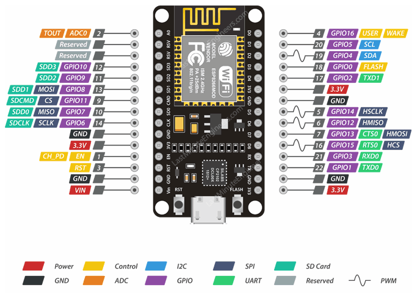
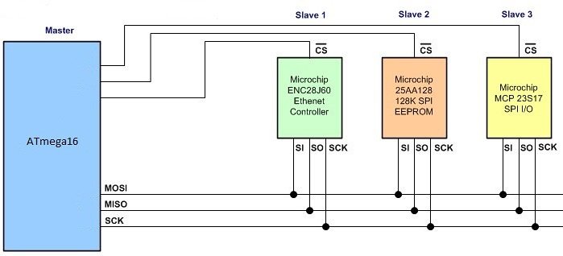

# Pengantar Microcontroller NodeMCU

Pada konsep IoT \(internet of things\) NodeMCU bertindak sebagai perangkat/device smart things. Devices atau “things” umumnya berkaitan dengan pengambilan data yang bersumber dari lingkungan secara real-time. Tugas ini umumnya diemban oleh perangkat MCU \(Microcontroller Unit - meskipun tidak selalu demikian\) yang bertindak sebagai pengendali dan pemroses data. Untuk mendapatkan data dari lingkungan luar MCU dibantu oleh sensor. Sebaliknya, MCU juga dapat mengendalikan perangkat lain yang diistilahkan sebagai aktuator.

Definisi Sensor sendiri adalah alat yang berfungsi mengubah besaran fisis menjadi besaran listrik. Besaran fisis didapatkan dari fenomena lingkungan, seperti panas, suara, intensitas cahaya, tekanan, kemiringan, magnetis, kelembaban dan gravitasi. Besaran fisis yang didapatkan oleh sensor diolah dan menghasilkan sinyal listrik berupa sinyal digital atau sinyal analog.

Sedangkan definisi Aktuator adalah alat yang berfungsi mengubah besaran listrik menjadi besaran fisis. Besaran fisis yang dimaksud adalah gerakan, cahaya, panas, tekanan atau magnetis. Aktuator menjadi bagian penting dari sistem kendali karena menentukan pergerakan dari sebuah proses. Aktuator digerakkan dengan kontrol dari mikrokontroller, komputer atau yang lainnya.

Berikut ini penjelasan singkat hubungan tiap bagian antara mikrokontroller, sensor, aktuaor dan perangkat komunikasi seperti tampak pada gambar di atas:

* Sensor adalah komponen elektronika yang berfungsi untuk mengubah besaran fisik \(mekanis, magnetis, panas, sinar, dan kimia\) menjadi besaran elektrik berupa tegangan, resistansi dan arus listrik. Data dari sensor kemdian diteruskan ke MCU untuk diproses lebih lanjut. MCU selain bertugas untuk memproses data juga melakukan konversi dari sinyal analog menjadi digital \(proses ADC – Analog to Digital Converter\).
*  Mikrokontroler adalah sebuah chip yang berfungsi sebagai pengontrol rangkaian elektronik dan umunya dapat menyimpan program di dalamnya, atau bersifat embedded system. Mikrokontroler terdiri dari CPU \(Central Processing Unit\), memori, I/O tertentu dan unit pendukung seperti Analog-to-Digital Converter \(ADC\) yang sudah terintegrasi didalamnya. Kelebihan utama dari mikrokontroler ialah tersedianya RAM dan peralatan I/O pendukung sehingga ukuran board mikrokontroler menjadi sangat ringkas.
* Aktuator adalah peralatan piranti keras yang mengubah sinyal perintah kontroler ke dalam parameter fisik yang biasanya berupa mekanik, seperti perubahan posisi atau perubahan kecepatan. Pada dasarnya aktuator adalah transduscer karena merubah satu besaran fisik misalnya arus lsitrik kedalam besaran listrik fisik yang lain misalnya kecepatan rotasi motor listrik.

### **ESP-12E Module**

Papan pengembangan melengkapi modul ESP-12E yang berisi chip ESP8266 yang memiliki mikroprosesor Tensilica Xtensa® 32-bit LX106 RISC yang beroperasi pada frekuensi clock yang dapat disesuaikan 80 hingga 160 MHz dan mendukung RTOS.

Ada juga 128 KB RAM dan 4MB memori Flash \(untuk program dan penyimpanan data\) yang cukup untuk mengatasi string besar yang membentuk halaman web, data JSON / XML, dan semua yang kami lemparkan di perangkat IoT saat ini.

ESP8266 Mengintegrasikan transceiver Wi-Fi 802.11b / g / n HT40, sehingga tidak hanya dapat terhubung ke jaringan WiFi dan berinteraksi dengan Internet, tetapi juga dapat mengatur jaringannya sendiri, memungkinkan perangkat lain untuk terhubung langsung ke saya t. Ini membuat ESP8266 NodeMCU lebih serbaguna.

### **Kebutuhan Daya**

Karena rentang tegangan operasi ESP8266 adalah 3V hingga 3,6V, papan dilengkapi dengan pengatur tegangan LDO untuk menjaga tegangan tetap stabil pada 3,3V. Ini dapat memasok dengan andal hingga 600mA, yang seharusnya lebih dari cukup ketika ESP8266 menarik sebanyak 80mA selama transmisi RF. Output dari regulator juga dipecah ke salah satu sisi papan dan diberi label sebagai 3V3. Pin ini dapat digunakan untuk menyuplai daya ke komponen eksternal.

Daya ke ESP8266 NodeMCU disuplai melalui konektor MicroB USB on-board. Sebagai alternatif, jika Anda memiliki sumber tegangan 5V yang diatur, pin VIN dapat digunakan untuk memasok ESP8266 dan periferalnya secara langsung.

> **Peringatan:** ESP8266 membutuhkan catu daya 3.3V dan level logika 3.3V untuk komunikasi. Pin GPIO tidak tahan 5V! Jika Anda ingin menghubungkan papan dengan komponen 5V \(atau lebih tinggi\), Anda perlu melakukan beberapa pergeseran level.

### **Periferal dan I / O**

ESP8266 NodeMCU memiliki total 17 pin GPIO yang dipecah ke header pin di kedua sisi papan pengembangan. Pin ini dapat digunakan untuk semua jenis tugas periferal, termasuk:

* Saluran ADC - Saluran ADC 10-bit.
* Antarmuka UART - Antarmuka UART digunakan untuk memuat kode secara serial.
* Output PWM - Pin PWM untuk meredupkan LED atau mengendalikan motor.
* Antarmuka SPI, I2C & I2S - Antarmuka SPI dan I2C untuk menghubungkan semua jenis sensor dan periferal.
* Antarmuka I2S - Antarmuka I2S jika Anda ingin menambahkan suara ke proyek Anda.

Berkat fitur multiplexing pin ESP8266 \(Beberapa periferal dibuat multipleks pada satu pin GPIO\). Artinya satu pin GPIO dapat bertindak sebagai PWM / UART / SPI.

### **Sakelar On-board & Indikator LED**

ESP8266 NodeMCU memiliki dua tombol. Salah satu yang bertanda RST yang terletak di pojok kiri atas adalah tombol Reset, yang tentu saja digunakan untuk mereset chip ESP8266. Tombol FLASH lainnya di sudut kiri bawah adalah tombol unduh yang digunakan saat memutakhirkan firmware.

Papan juga memiliki indikator LED yang dapat diprogram pengguna dan terhubung ke pin D0 papan.

### **Komunikasi Serial**

Papan tersebut mencakup CP2102 USB-to-UART Bridge Controller dari Silicon Labs, yang mengubah sinyal USB menjadi serial dan memungkinkan komputer Anda untuk memprogram dan berkomunikasi dengan chip ESP8266.

Jika Anda memiliki driver CP2102 versi lama yang diinstal pada PC Anda, kami sarankan untuk meningkatkannya sekarang.

Link Download driver CP2102: [https://www.silabs.com/developers/usb-to-uart-bridge-vcp-drivers](https://www.silabs.com/developers/usb-to-uart-bridge-vcp-drivers).

### **ESP8266 NodeMCU Pinout**

ESP8266 NodeMCU memiliki total 30 pin yang menghubungkannya ke dunia luar. Hubungannya adalah sebagai berikut:

Demi kesederhanaan, kami akan membuat grup pin dengan fungsi serupa.

Power Pins Ada empat pin daya yaitu. satu pin VIN & tiga pin 3.3V. Pin VIN dapat digunakan untuk langsung memasok ESP8266 dan periferalnya, jika Anda memiliki sumber tegangan 5V yang diatur. Pin 3.3V adalah output dari regulator tegangan on-board. Pin ini dapat digunakan untuk memasok daya ke komponen eksternal.

 GND adalah pin ground dari papan pengembangan NodeMCU ESP8266.

I2C Pins Pin I2C digunakan untuk menghubungkan semua jenis sensor dan periferal I2C dalam proyek Anda. Baik I2C Master dan I2C Slave didukung. Fungsionalitas antarmuka I2C dapat direalisasikan secara terprogram, dan frekuensi clock maksimumnya adalah 100 kHz. Perlu dicatat bahwa frekuensi clock I2C harus lebih tinggi dari frekuensi clock paling lambat dari perangkat slave.

GPIO Pins Pin GPIO ESP8266 NodeMCU memiliki 17 pin GPIO yang dapat digunakan untuk berbagai fungsi seperti I2C, I2S, UART, PWM, IR Remote Control, Lampu LED dan Tombol secara terprogram. Setiap GPIO yang mendukung digital dapat dikonfigurasi ke pull-up atau pull-down internal, atau disetel ke impedansi tinggi. Saat dikonfigurasi sebagai input, ini juga dapat diatur ke pemicu tepi atau pemicu level untuk menghasilkan interupsi CPU.

ADC Channel ADC Channel NodeMCU tertanam dengan SAR ADC presisi 10-bit. Kedua fungsi tersebut dapat diimplementasikan menggunakan ADC yaitu. Pengujian tegangan catu daya pin VDD3P3 dan pengujian tegangan input pin TOUT. Namun, mereka tidak dapat diimplementasikan pada waktu yang bersamaan.

UART Pins UART Pins ESP8266 NodeMCU memiliki 2 antarmuka UART, yaitu UART0 dan UART1, yang menyediakan komunikasi asinkron \(RS232 dan RS485\), dan dapat berkomunikasi hingga 4,5 Mbps. UART0 \(pin TXD0, RXD0, RST0 & CTS0\) dapat digunakan untuk komunikasi. Ini mendukung kontrol cairan. Namun, UART1 \(pin TXD1\) hanya menampilkan sinyal transmisi data sehingga biasanya digunakan untuk mencetak log.

SPI Pins SPI Pins ESP8266 memiliki dua SPI \(SPI dan HSPI\) dalam mode slave dan master. SPI ini juga mendukung fitur SPI tujuan umum berikut:

* Pin EN - Chip ESP8266 diaktifkan saat pin EN ditarik TINGGI. Saat ditarik LOW chip bekerja dengan daya minimum.
* Pin RST - Pin RST digunakan untuk mengatur ulang chip ESP8266.
* Pin WAKE - Pin bangun digunakan untuk membangunkan chip dari tidur nyenyak.

### **Pin Terbaik untuk Digunakan - ESP8266**

Satu hal penting untuk diperhatikan tentang ESP8266 adalah bahwa nomor GPIO tidak cocok dengan label di silkscreen papan. Misalnya, D0 sesuai dengan GPIO16 dan D1 sesuai dengan GPIO5.

Tabel berikut menunjukkan korespondensi antara label pada silkscreen dan nomor GPIO serta pin apa yang terbaik untuk digunakan dalam proyek Anda, dan mana yang perlu Anda waspadai.

Pin yang disorot dengan warna hijau dapat digunakan. Yang disorot dengan warna kuning OK untuk digunakan, tetapi Anda perlu memperhatikan karena mereka mungkin memiliki perilaku yang tidak terduga terutama saat boot. Pin yang disorot dengan warna merah tidak disarankan untuk digunakan sebagai input atau output.

| Label | GPIO | Input | Output | Notes |
| :--- | :--- | :--- | :--- | :--- |
| D0 | **GPIO16** | no interrupt | no PWM or I2C support | HIGH at boot used to wake up from deep sleep |
| D1 | **GPIO5** | OK | OK | often used as SCL \(I2C\) |
| D2 | **GPIO4** | OK | OK | often used as SDA \(I2C\) |
| D3 | **GPIO0** | pulled up | OK | connected to FLASH button, boot fails if pulled LOW |
| D4 | **GPIO2** | pulled up | OK | HIGH at boot connected to on-board LED, boot fails if pulled LOW |
| D5 | **GPIO14** | OK | OK | SPI \(SCLK\) |
| D6 | **GPIO12** | OK | OK | SPI \(MISO\) |
| D7 | **GPIO13** | OK | OK | SPI \(MOSI\) |
| D8 | **GPIO15** | pulled to GND | OK | SPI \(CS\) Boot fails if pulled HIGH |
| RX | **GPIO3** | OK | RX pin | HIGH at boot |
| TX | **GPIO1** | TX pin | OK | HIGH at boot debug output at boot, boot fails if pulled LOW |
| A0 | **ADC0** | Analog Input | X |  |

### **Antarmuka Komunikasi Microcontroller**

Istilah antarmuka \(_interfacing_\) dalam mikrokontroler merupakan pin masukan atau pin luaran yang dapat berkomunikasi dengan perangkat eksternal lainnya. Dengan _interfacing_ menjadikan mikrokontroler dapat saling bertukar data dengan sensor, aktuator, mikrokontroller, atau perangkat lainnya. Protokol komunikasi di kedua sisi tentunya harus disepakati jenisnya.

Terdapat beberapa protokol interface yang umum dipakai pada mikrokontroller, antara lain SPI \(_Serial Peripheral Interface_\), I2C \(_Inter-Integrated Circuit_\), UART \(_Universal Asynchronous Receiver-Transmitter_\) dan masih banyak lagi tentunya. Dalam buku ini kita tidak membahas secara detil spesifikasi interface tersebut, Anda dapat menggalinya lebih dalam dari sumber-sumber lain karena topik tersebut cenderung ke bidang elekronika. Kita cukup mengetahui jenis interface yang akan digunakan dan bagaimana mempraktekkannya pada platform IoT.

#### Berikut ini penjelasan singkat tentang ketiga interface tersebut:

* **SPI \(**_**Serial Peripheral Interface**_**\)**

Serial Peripheral Interface \(SPI\) adalah spesifikasi antarmuka komunikasi serial sinkron yang digunakan untuk komunikasi jarak pendek, terutama dalam sistem tertanam \(_embedded systems_\). Perangkat SPI berkomunikasi dalam mode _full-duplex_ menggunakan arsitektur master-slave dengan satu master. Perangkat master menghasilkan bingkai untuk membaca dan menulis. Beberapa perangkat budak didukung melalui pemilihan _slave select_ secara individu \(SS\), kadang-kadang disebut _chip select_ \(CS\), garis.

* **I2C \(**_**Inter-Integrated Circuit**_**\)**

I2C adalah singkatan dari Inter-Integrated Circuit, sebuah protokol komunikasi serial yang dibuat oleh Philips Semiconductor \(sekarang menjadi NXP Semiconductor\). Itu dibuat dengan tujuan komunikasi antara chip berada di Papan Sirkuit Cetak \(PCB\) yang sama. Biasanya digunakan untuk menghubungkan IC kecepatan lambat ke mikroprosesor atau mikrokontroler. Ini adalah protokol master-slave, biasanya prosesor atau mikrokontroler adalah master dan chip lain seperti RTC, Sensor Suhu, EEPROM akan menjadi budak. Kita dapat memiliki banyak master dan banyak budak di bus I2C yang sama. Oleh karena itu, I2C adalah protokol multi-master, multi-slave. I2C hanya membutuhkan dua kabel untuk bertukar data dan ground sebagai referensi, yaitu SDA \(Serial Data\), SCL \(Serial Clock\), dan GND \(Ground\).

Master adalah perangkat yang selalu memulai komunikasi dan menggerakkan Clock Line \(SCL\). Biasanya mikrokontroler atau mikroprosesor bertindak sebagai master yang perlu membaca data dari atau menulis data ke perangkat pendukung.

Perangkat Slave selalu merespon master dan tidak akan memulai komunikasi apa pun dengan sendirinya. Biasanya perangkat seperti EEPROM, LCD, RTC bertindak sebagai perangkat pendukung. Setiap perangkat slave akan memiliki alamat unik sehingga master dapat meminta data dari atau menulis data ke dalamnya.

* **UART \(**_**Universal Asynchronous Receiver-Transmitter**_**\)**

Universal Asynchronous Receiver-Transmitter adalah perangkat komunikasi serial asinkron dimana format data dan kecepatan transmisi dapat dikonfigurasi. Level dan metode pensinyalan listrik ditangani oleh sirkuit driver di luar UART. UART biasanya merupakan individu \(atau bagian dari\) sirkuit terintegrasi \(IC – integrated circuit\) yang digunakan untuk komunikasi serial melalui komputer atau port serial perangkat periferal. Satu atau lebih perangkat UART biasanya terintegrasi dalam chip mikrokontroler.

Dalam komunikasi UART, dua UART berkomunikasi secara langsung satu sama lain. UART pemancar mengubah data paralel dari perangkat pengontrol seperti CPU menjadi bentuk serial, mentransmisikannya secara serial ke UART penerima, yang kemudian mengubah data serial kembali menjadi data paralel untuk perangkat penerima. Hanya dua kabel yang dibutuhkan untuk mengirimkan data antara dua UART. Data mengalir dari pin Tx dari transmisi UART ke pin Rx dari UART penerima.

